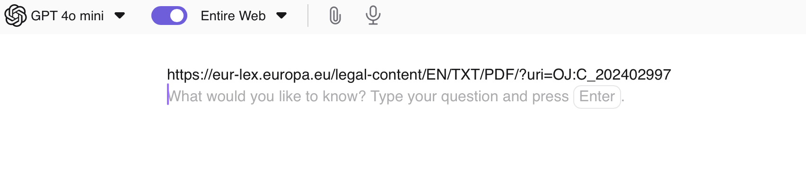

# Ask Questions about a Document or a page

You can quickly ask an LLM further questions about a search result through `⋮` and selecting *Ask questions about page*.

{data-zoomable}

Once selected a new Assistant thread will be opened where you can ask questions about the page or document.

{data-zoomable}

Then you can ask any question you like!

{data-zoomable}

Your questions do not have to be in the same language as the content of the page is.

{data-zoomable}

You can end the discussion whenever you want by closing the tab.
Since all discussions are Assistant threads, they follow the thread expiry time you have configured.
Please see [Assistant Settings](./assistant.md#threads) for further information.

