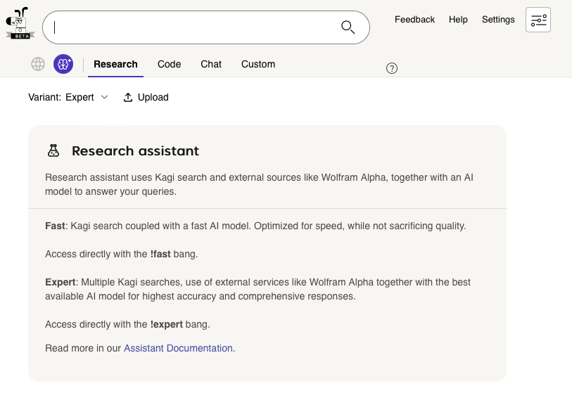
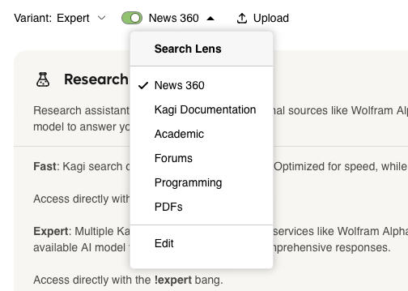
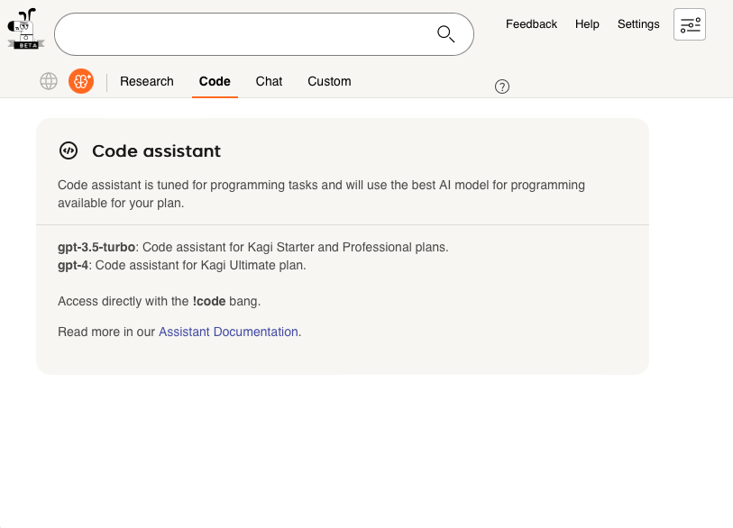
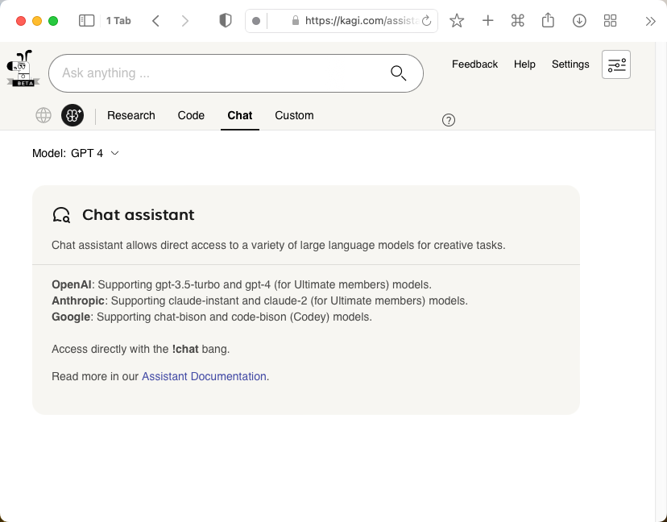
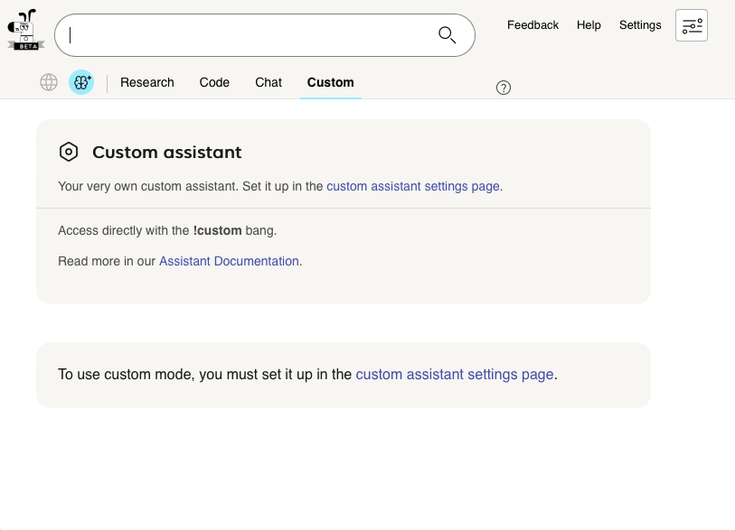

# Assistant

Kagi Assistant is a product feature backed by Kagi Search and large language models.

**Kagi Assistant is currently in open beta and available to [Ultimate plan](https://kagi.com/pricing) members.**

## Assistant Modes

### Research

Research assistant uses Kagi search and external sources like Wolfram Alpha, together with an AI model to answer your queries.
This model also allows you to upload a file (up to 16 MB) or provide a URL (article, PDF, video, podcast, etc.) to use as context.
If an image is provided it will be processed using GPT4 Vision.

{width=500px data-zoomable}

This mode is available in two variants:

- `Fast`: Kagi search coupled with a fast LLM (`Claude 3 Haiku`). Optimized for speed, while not sacrificing quality. Access directly with the `!fast` bang.
- `Expert`: Multiple Kagi searches (and external services) together with a better LLM (`Claude 3 Sonnet`) for the highest accuracy and comprehensive responses. Access directly with the `!expert` bang.

Research Assistant supports using [Lenses](../features/lenses.md) to filter the types of websites used as context to generate an answer. Lenses are predefined categories that help you focus on specific topics or sources. This allows you to restrict results to more trustworthy or relevant sites for your needs. To enable this feature, toggle the Lenses switch and select one of the available options.

{width=500px data-zoomable}

### Code

Code assistant is tuned for programming tasks and uses a powerful AI model for programming.

{width=500px data-zoomable}

For Starter and Professional members this mode uses `gpt-3.5-turbo`, and for Ultimate members it uses `gpt-4`.

Access directly with the `!code` bang.

### Chat

Chat assistant allows direct access to a variety of large language models for creative tasks.

{width=500px data-zoomable}

This mode supports the following models:

- OpenAI
  - GPT 3.5 Turbo
  - GPT 4 (for Ultimate members)
  - GPT 4 Turbo (for Ultimate members)
- Anthropic
  - Claude 3 Haiku
  - Claude 3 Sonnet
  - Claude 3 Opus (for Ultimate members)
- Google
  - Gemini Pro (for Ultimate members)
- Mistral AI
  - Mistral Small
  - Mistral Large (for Ultimate members)
 
Access directly with the `!chat` bang.

### Custom

Custom assistant allows you to further customize one of the existing modes.

{width=500px data-zoomable}

Select the base mode (and variant/model where applicable) and add your own custom instructions. Setup is detailed in the [Assistant settings help page](../settings/assistant.md#custom-assistant).

Access directly with the `!custom` bang.

## Tips and Tricks for using Kagi Assistant

- Assistant has a character limit of 16,000 for each prompt in a conversation.
- You can input math equations using the LaTeX format.
- Using the copy button will copy the response to your clipboard preserving any formatting using markdown.
- Assistant supports syntax highlighting in generated code snippets.
- For optimal results, interact with the Assistant in a natural language. For instance, "Who was Alan Turing?" will yield a better response than simply "Alan Turing".
- When using Code Assistant, it is recommended to specify the programming language you are using as part of your prompt.

## Chat Mode Scorecard Criteria

When you visit Assistant's Chat Mode landing page, you will be presented with a scorecard comparing different aspects of each model.

The Privacy column in the scorecard rates each model based on how it handles user data. The criteria are:

- 1 circle: No data retention period specified. 
- 2 circles: Data retained for more than 30 days before deletion.
- 3 circles: Data retained for 30 days or less before deletion.  
- 4 circles: No data retained.

None of the models train on user data.

## LLM Comparison

There are so many models around so felt useful to have this all in one place. Feel free to edit.

| LLM                    | Context Length | Price per input ($/M) | Price per output ($/M) |
|------------------------|----------------|-----------------------|------------------------|
| **Claude 3 Haiku**        | 200K           | 0.25                  | 1.25                   |
| **Claude 3 Sonnet**       | 200K           | 3                     | 15                     |
| **Claude 3 Opus**         | 200K           | 15                    | 75                     |
| **GPT-4-Turbo**           | 128K           | 10                    | 30                     |
| GPT-4 (8k)              | 8K             | 30                    | 60                     |
| **GPT-4 (32k)**           | 32K            | 60                    | 120                    |
| **GPT-3.5-Turbo**         | 16K            | 0.5                   | 1.5                    |
| **Gemini 1.5 Pro**        | 1M             | 7                     | 21                     |
| **Mistral Small**         | 8K             | 2                     | 6                      |
| **Mistral Medium**        | 8K             | 2.7                   | 8.1                    |
| **Mistral Large**         | 8K             | 8                     | 24                     |
| Reka Core              | 128K           | 10                    | 25                     |
| Reka Flash             | 128K           | 0.8                   | 2                      |
| Reka Edge              | 128K           | 0.4                   | 1                      |
| Cohere Command R+      | 128K           | 3                     | 15                     |
| Cohere Command R       | 128K           | 0.50                  | 1.50                   |
| Groq Llama 3 70B       | 8K             | 0.59                  | 0.79                   |
| Groq Llama 3 8B        | 8K             | 0.05                  | 0.10                   |
| Groq Mixtral 8x7B      | 32K            | 0.27                  | 0.27                   |
| Groq Gemma 7B          | 8K             | 0.10                  | 0.10                   |

**Models in bold** - Available in Kagi Assistant
