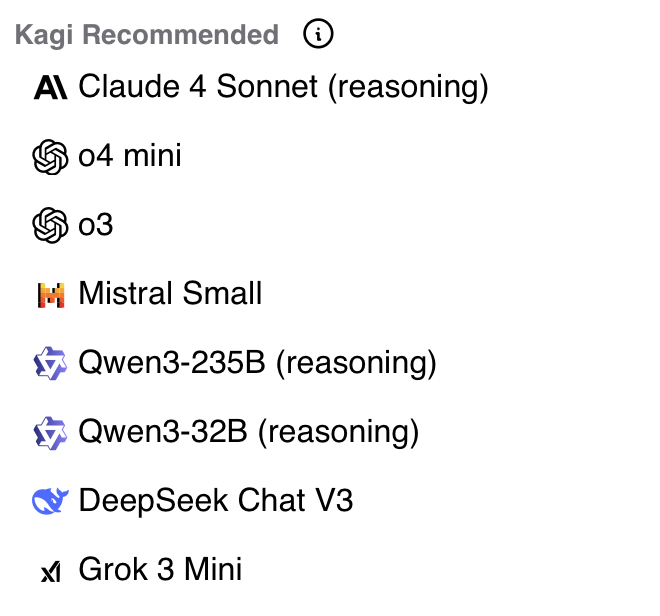
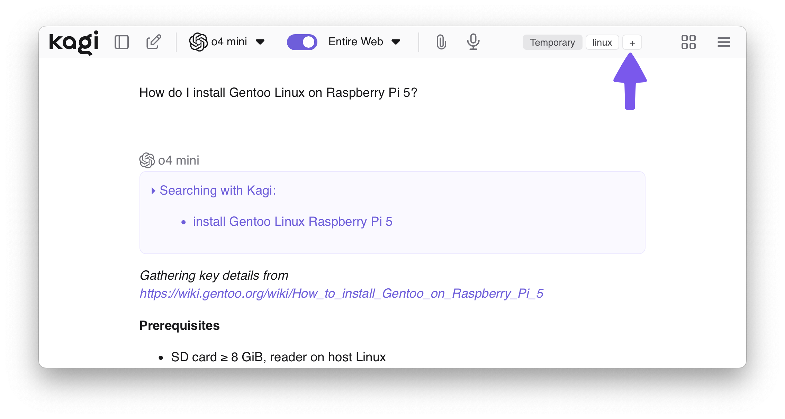
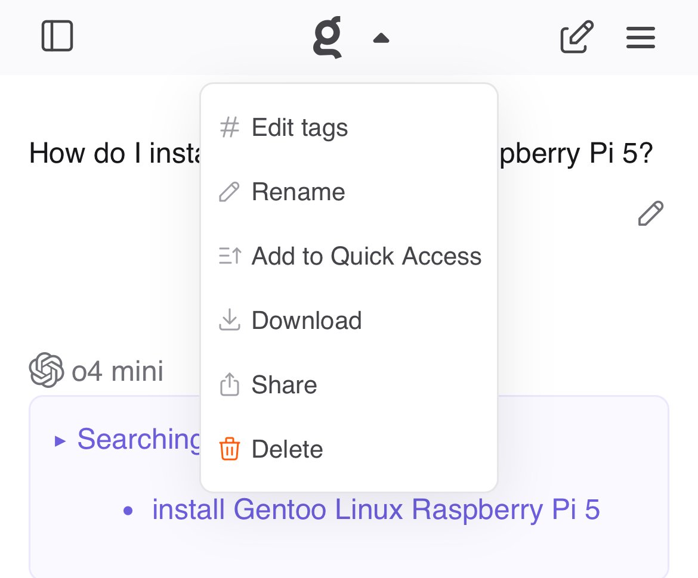
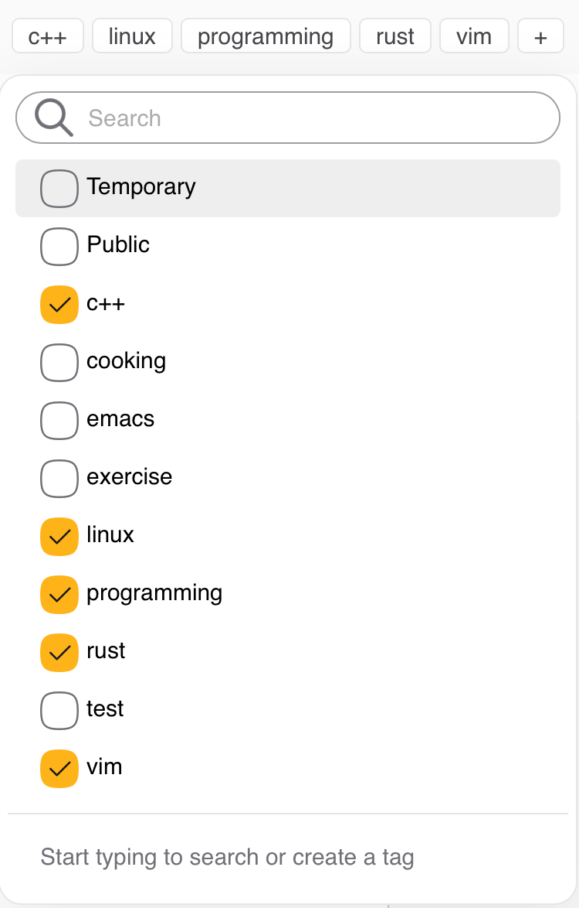
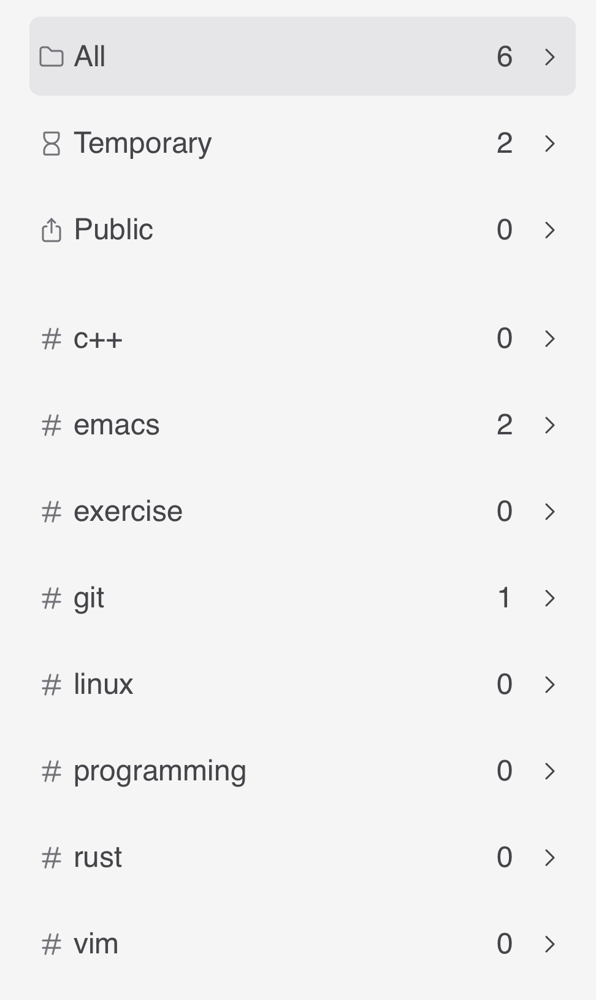

# Kagi Assistant

<br>

<video src="./media/assistant.mp4" width="720" type="video/mp4" autoplay muted loop playsinline disablepictureinpicture />

Kagi Assistant combines the top large language models (LLMs) with optional results from Kagi Search, making it the perfect companion for creative, research, and programming tasks — alongside everything else you can think of! All this is included in a single subscription!

## Features

- Access to the latest and most performant large language models from OpenAI, Anthropic, Meta, Google, Mistral, Amazon, Alibaba, and DeepSeek
- Multiple [custom assistants](#custom-assistants)
- The ability to control whether the Assistant has web access (powered by Kagi Search)
- Applying Kagi Search [Lenses](../features/lenses.md) and [Personalized Results](../features/website-info-personalized-results.md) to the Assistant searches
- Saving Assistant threads
- Uploading files to use as context
- Altering the Assistant configuration within the thread
	- For example, you can ask the initial question with web access enabled and then disable it for subsequent questions!
	- It is also possible to switch to a different LLM in the middle of a thread
- Code syntax highlighting
- [Keyboard Shortcuts](#keyboard-shortcuts)
- Export conversations to markdown
- Share threads with others using a link
- Voice input

## Privacy

When you use the Assistant by Kagi, your data is never used to train AI models (not by us or by the LLM providers), and no account information is shared with the LLM providers. By default, threads are deleted after 24 hours of inactivity. This behavior can be adjusted in the [settings](https://kagi.com/settings/assistant).

## Using the Assistant

Kagi Assistant can be accessed via the apps menu located in the top right corner of all Kagi pages or [by using bangs in search](#bangs). You can also use [this direct link](https://kagi.com/assistant).

When you first access the Assistant, you will be greeted by a familiar-looking landing page, allowing you to get right into using it.
You can either type your prompt or use voice input by pressing the microphone symbol.
You can choose which LLM you wish to use by opening the dropdown menu just below the prompt field.

The Assistant's web access can be toggled via the button below the prompt field.

## Which model to choose

There is no definite answer to the question of what the best LLM is.
As the number of competing models increases, users may find it difficult to find the right one for their task.
To aid in this, Kagi maintains a list of recommended models at the top of the LLM list.

{width=330 height=308}

*Kagi recommended models as of July 27, 2025.*

The recommendations are based on the [Kagi LLM Benchmarking Project](./llm-benchmark.md).
The benchmark tests measure model quality in various scenarios.

Another important aspect is the privacy policy of the model provider.
See our [LLM Privacy Comparison](./llms-privacy.md) for a detailed overview of how each provider handles your data.

## Threads

The Assistant supports threads, allowing you to keep your bagel topping ideas separate from your weekend projects.

The search bar enables you to search for that one elusive thread.

By default, threads are kept for 24 hours after the last message.
If keeping threads alive permanently better fits your workflow, you can adjust this setting in [Assistant Settings](https://kagi.com/settings/assistant).
Please note that the thread saving setting is applied **when the thread is created**.

Threads can be renamed, downloaded, shared, and  deleted via the `⋮` button which is displayed when you hover over the thread.
Threads can be further organized by adding tags to them.

## Tags

Tags allow you to keep your Assistant threads organized and easily accessible.
You can access the tag settings for the currently active thread at the top of the thread.

On mobile devices the tag settings can be found by tapping  at the top of the page and selecting **Edit tags**.
{width=390}

If you have configured your threads to expire after 24 hours, each thread you create will automatically have the **Temporary** tag.
You can prevent threads from expiring by removing that tag.
Please note that adding a tag does not automatically remove the **Temporary** tag.

Each thread can have up to 100 tags.
Tags can be removed in the same menu where they were added.

{width=375 height=587}

Tags appear in the Assistant sidebar which allows you to quickly access tagged threads.
The sidebar can be accessed by clicking the sidebar icon  .
Selecting a tag will show all threads that have said tag, and the most recent thread with the tag will be automatically opened.
Creating a new thread when a tag is selected will automatically apply that tag to the created thread.
{width=324}
## Uploading Files to Assistant

Kagi Assistant supports file uploads, allowing you to provide additional context or information for your queries.

This can be useful for tasks like:

- Summarizing a document
- Extracting key insights from a report
- Analyzing data in a spreadsheet
- Describing an image
- Distilling main points from an audio file

To upload a file:

1. Click the paperclip icon  in the prompt input box.
2. Select the file or image you wish to upload.
3. Provide a prompt with instructions to process the file or leave it blank to summarize it.

Important considerations for file uploads:

- **File size limit:** The maximum file size for uploads is 16MB.
- **Processing time:** Larger files may take a few moments to process.
- **Context retention:** Uploaded file content remains in the conversation context for subsequent messages.

The Assistant supports various file formats across different categories, including:

| File Type    | Supported Formats                                                                                                                                                                 |
| :----------- | :-------------------------------------------------------------------------------------------------------------------------------------------------------------------------------- |
| Text         | txt, text, md (and other text-based formats)                                                                                                                                      |
| Rich Format  | pdf, docx, pptx                                                                                                                                                                   |
| Spreadsheets | csv, tsv, xlsx, json, jsonl                                                                                                                                                       |
| Image        | jpg, jpeg, png, gif, tiff, tif, webp                                                                                                                                              |
| Audio        | 3gpp, aa, aac, aax, act, aiff, amr, ape, au, awb, dct, dss, dvf, flac, gsm, iklax, ivs, m4a, m4b, m4p, mp4, mmf, mp3, mpc, msv, ogg, opus, ra, rm, sln, tta, vox, wav, wma, wvpla |

Note: Unsupported formats may be treated as binary files.

## Fetching online content

Assistant can fetch webpages and online documents (up to 50 MB) to use them as context for your conversation.
To use this feature, simply paste the URL in your Assistant conversation (make sure the Entire Web toggle is on).

### Critique Browser Bookmarklet
1. Drag this link to your bookmarks bar: <a href="javascript:(function(){var selectedText=window.getSelection().toString().trim();window.location.href='https://kagi.com/search?q=%21ai%20Please%20Critique%3A%20'+(selectedText?encodeURIComponent(selectedText):encodeURIComponent(window.location.href));})();">Kagi Assistant Critique</a>
2. Use the bookmarklet to open a new chat with the `!ai` bang:
   - Reviewing selected text: Select text, then click bookmarklet
   - Critiquing the entire page: Click bookmarklet without selecting text

## Custom Instructions

Do you prefer a more personalized Assistant experience?
You can provide custom instructions in the [Assistant Settings](https://kagi.com/settings/assistant).
These instructions can be utilized to refine the Assistant's responses.
You can, for instance, instruct the Assistant to be more succinct or to consider your profession and location.

## Custom Assistants {#custom-assistants}

You can create Custom Assistants in the [Assistant Settings](https://kagi.com/settings/assistant).
It is possible to customize the LLM, settings (the use of web access, lenses, and personalized results), and the instructions for each Custom Assistant.

Assistant comes with a built-in **Code** Custom Assistant that is optimized for programming tasks. It uses Claude 4 Sonnet and has web access.

For more details, refer to the [Custom Assistants](./custom-assistants.md) page.

## Keyboard Shortcuts {#keyboard-shortcuts}

The following keyboard shortcuts are available in Assistant on Mac and PC.

| Mac Shortcut                | Action                  |
| :-------------------------- | :---------------------- |
| &#8984; + K                 | New Thread              |
| &#8984; + Shift + S         | Toggle Sidebar          |
| &#8984; + Shift + C         | Copy Last Response      |
| &#8984; + Shift + E         | Edit Last Message       |
| &#8984; + Shift + Backspace | Delete Current Thread   |
| &#8984; + /                 | Focus Prompt Box        |
| &#8984; + .                 | Show Keyboard Shortcuts |

| PC Shortcut              | Action                  |
| :----------------------- | :---------------------- |
| Ctrl + K                 | New Thread              |
| Ctrl + Shift + S         | Toggle Sidebar          |
| Ctrl + Shift + C         | Copy Last Response      |
| Ctrl + Shift + E         | Edit Last Message       |
| Ctrl + Shift + Backspace | Delete Current Thread   |
| Ctrl + /                 | Focus Prompt Box        |
| Ctrl + .                 | Show Keyboard Shortcuts |

## Available LLMs

| Developer     | Model                                                                                             | Plan     |
| :------------ | :------------------------------------------------------------------------------------------------ | :------- |
| Alibaba       | [Qwen 3 235B](https://kagi.com/assistant?profile=qwen-3-235b-a22b)                                | All      |
| Alibaba       | [Qwen 3 235B (reasoning)](https://kagi.com/assistant?profile=qwen-3-235b-a22b-thinking)           | All      |
| Alibaba       | [Qwen 3 Coder](https://kagi.com/assistant?profile=qwen-3-coder)                                   | All      |
| Anthropic     | [Claude 4.5 Haiku](https://kagi.com/assistant?profile=claude-4-haiku)                             | Ultimate |
| Anthropic     | [Claude 4.5 Sonnet](https://kagi.com/assistant?profile=claude-4-sonnet)                           | Ultimate |
| Anthropic     | [Claude 4.1 Opus](https://kagi.com/assistant?profile=claude-4-opus)                               | Ultimate |
| Anthropic     | [Claude 4.5 Sonnet (Reasoning)](https://kagi.com/assistant?profile=claude-4-sonnet-thinking)      | Ultimate |
| Anthropic     | [Claude 4.1 Opus (Reasoning)](https://kagi.com/assistant?profile=claude-4-opus-thinking)          | Ultimate |
| Anthropic     | [Claude 4.5 Haiku (Reasoning)](https://kagi.com/assistant?profile=claude-4-haiku-thinking)        | Ultimate |
| Deepseek      | [DeepSeek Chat V3.1 Terminus](https://kagi.com/assistant?profile=deepseek)                        | All      |
| Deepseek      | [DeepSeek R1](https://kagi.com/assistant?profile=deepseek-r1)                                     | Ultimate |
| Google        | [Gemini 2.5 Flash](https://kagi.com/assistant?profile=gemini-2-5-flash)                           | All      |
| Google        | [Gemini 2.5 Flash Lite](https://kagi.com/assistant?profile=gemini-2-5-flash-lite)                 | All      |
| Google        | [Gemini 2.5 Pro](https://kagi.com/assistant?profile=gemini-2-5-pro)                               | Ultimate |
| Meta          | [Llama 4 Maverick](https://kagi.com/assistant?profile=llama-4-maverick)                           | All      |
| Mistral AI    | [Mistral Small](https://kagi.com/assistant?profile=mistral-small)                                 | All      |
| Mistral AI    | [Mistral Medium](https://kagi.com/assistant?profile=mistral-medium)                               | All      |
| Mistral AI    | [Mistral Large](https://kagi.com/assistant?profile=mistral-large)                                 | Ultimate |
| Moonshot AI   | [Kimi K2](https://kagi.com/assistant?profile=kimi-k2)                                             | All      |
| Nous Research | [Hermes-4-405B](https://kagi.com/assistant?profile=hermes-4-405b)                                 | All      |
| Nous Research | [Hermes-4-405B (reasoning)](https://kagi.com/assistant?profile=hermes-4-405b-thinking)            | All      |
| OpenAI        | [GPT 5 Mini](https://kagi.com/assistant?profile=gpt-5-mini)                                       | All      |
| OpenAI        | [GPT 5 Nano](https://kagi.com/assistant?profile=gpt-5-nano)                                       | All      |
| OpenAI        | [GPT OSS 120B](https://kagi.com/assistant?profile=gpt-oss-120b)                                   | All      |
| OpenAI        | [GPT OSS 20B](https://kagi.com/assistant?profile=gpt-oss-20b)                                     | All      |
| OpenAI        | [GPT 4.1 mini](https://kagi.com/assistant?profile=gpt-4-1-mini)                                   | All      |
| OpenAI        | [GPT 4.1 nano](https://kagi.com/assistant?profile=gpt-4-1-nano)                                   | All      |
| OpenAI        | [GPT 4.1](https://kagi.com/assistant?profile=gpt-4-1)                                             | Ultimate |
| OpenAI        | [GPT 5](https://kagi.com/assistant?profile=gpt-5)                                                 | Ultimate |
| OpenAI        | [GPT 5 Codex](https://kagi.com/assistant?profile=gpt-5-codex)                                     | Ultimate |
| OpenAI        | [o4 mini](https://kagi.com/assistant?profile=o4-mini)                                             | Ultimate |
| OpenAI        | [o3](https://kagi.com/assistant?profile=o3)                                                       | Ultimate |
| OpenAI        | [o3 pro](https://kagi.com/assistant?profile=o3-pro)                                               | Ultimate |
| OpenAI        | [ChatGPT](https://kagi.com/assistant?profile=chatgpt-4o)                                          | Ultimate |
| xAI           | [Grok Code Fast 1](https://kagi.com/assistant?profile=grok-code-fast)                             | All      |
| xAI           | [Grok 4 Fast](https://kagi.com/assistant?profile=grok-4-fast)                                     | All      |
| xAI           | [Grok 4 Fast (Reasoning)](https://kagi.com/assistant?profile=grok-4-fast-thinking)                | All      |
| xAI           | [Grok 4](https://kagi.com/assistant?profile=grok-4)                                               | Ultimate |
| Z.ai          | [GLM-4.6 (preview)](https://kagi.com/assistant?profile=glm-4-6)                                   | All      |
| Z.ai          | [GLM-4.6 (reasoning) (preview)](https://kagi.com/assistant?profile=glm-4-6-thinking)              | All      |


You can learn more about how these models compare in the [Kagi LLM Benchmarking Project](./llm-benchmark.md) page.

For more information about each model and its privacy practices, including details about providers, see our [LLM Privacy](./llms-privacy) page.


## Bangs

You can quickly access Assistant using the following [bangs](../features/bangs.md):

- `!ai`, `!as`, `!assistant`, `!research`, `!answer`, `!discuss`, `!expert`, `!llm`, `!custom`, and `!asst`: These bangs direct you to the general Assistant interface for various types of queries.

- `!chat`: This bang accesses Assistant with internet access turned off.

- `!code`: Use this bang to access the built-in **Code** Custom Assistant, which is tailored for coding-related queries.

- `!ki`: This bang accesses Assistant with the Ki profile, providing a specialized interaction.

Each bang is designed to optimize your search experience by directing you to the most appropriate version of Assistant for your needs.

## URL Parameters

You can specify a particular model in the Assistant's URL by including a `profile` parameter.
`https://kagi.com/assistant?profile=gpt-5`
The available model names can be found in the table above.

This can also be used with custom assistants, as described on the [custom assistant documentation](./custom-assistants.md#url-parameters).

The `internet` parameter can be used to turn on and off internet access, set to `true` to enable, anything else to disable. This overrides the internet setting of the profile used.

The `lens` parameter can be used to set the lens if internet access is enabled. The value of this is the lowercase format of the lens name, for example, `https://kagi.com/assistant?lens=programming` will use the Programming lens.

The `q` parameter can be used to submit a prompt immediately after the page loads. The `qvalue` parameter can be used to prefill the prompt box without submitting it.

Here is an example of a URL that enables internet access, uses the **Claude 4 Sonnet** model, applies the **Recipes lens**, and submits a prompt immediately. You might use it as a target for a custom bang.
```https://kagi.com/assistant?profile=claude-4-sonnet&internet=true&lens=recipes&q=%s```

## Availability

Assistant is available to all members. However, premium models are only available in our Ultimate plan.
If you are on a different plan and you need access to these models, you can upgrade from the [Billing Settings](https://kagi.com/settings/billing_plan) page.

We also offer an Ultimate upgrade for Family Plans. You can upgrade from the [Family Management](https://kagi.com/settings/account_members) page.

## Usage Limits

### Context window limit

There's no fixed limit on conversation length. We automatically optimize lengthy chats behind the scenes to maintain performance.

### Input limitations

#### Text input

- **Maximum 100,000 characters** per message
- Text exceeding this limit will be automatically truncated

#### File uploads

- **Maximum total size: 16 MB** (applies to single or multiple files)
- **URL content: 50 MB** maximum retrievable size

### Custom Instructions

- **Maximum 20,000 characters** for custom Assistant instructions

### Fair Use Policy

We use a value-based usage system to maintain high-quality service for all users:

- Your monthly plan determines your token usage allowance.
    - For example, a **$25 monthly plan** provides up to **$25 worth of token usage** across all models.
- For yearly plans, you get access to the full year's worth of token usage at the start of the plan.
    - For instance, the **Ultimate yearly plan** allows up to **$270 worth of token usage for the entire year**.
- A **20% margin markup** is included in token usage cost calculations to cover search queries, infrastructure, and development costs.
    - For example, **$25 token usage** consists of **$20 for raw token costs** and **$5 for operational costs**.
- Users will receive an in-app reminder as they near their usage limit. If the limit is exceeded, new AI interactions will be disabled until they either renew their plan early or the next billing cycle begins.
    - **Note:** We will soon introduce the option to purchase top-up credits, allowing you to extend Assistant usage beyond fair-use limits with an amount of your choice. These credits can then also be used for other Kagi products such as the API.

For additional questions about these limitations or policies, please contact our support team.

### Tips to reduce token usage

Here are some suggestions to reduce token usage:

1. Use less expensive models for simple tasks like summarization or basic information extraction. Our [LLM Benchmarking project](https://help.kagi.com/kagi/ai/llm-benchmark.html) page contains cost information for the different models.
2. Create new threads for unrelated questions rather than continuing in the same conversation.
3. Be specific and concise in your prompts to get more focused responses.
4. Use the "Edit Prompt” feature (pencil icon) to refine your question instead of sending multiple clarifications.
5. Disable web access when you don't need internet information.
6. Limit file uploads to only what's necessary for your query.
7. Break complex tasks into smaller, focused questions across multiple threads.
8. Use custom instructions to request consistently concise responses.
9. Leverage specialized custom assistants optimized for specific tasks.
10. Download and delete completed threads to avoid accidentally continuing old conversations.

## FAQ

**Q**: What is Kagi’s stance about using LLMs in search?\
**A**: We continue to relentlessly focus on the core search experience and build thoughtfully integrated features on top of it. Read more about it in our [AI Integration Philosophy](../why-kagi/ai-philosophy.md) page.
