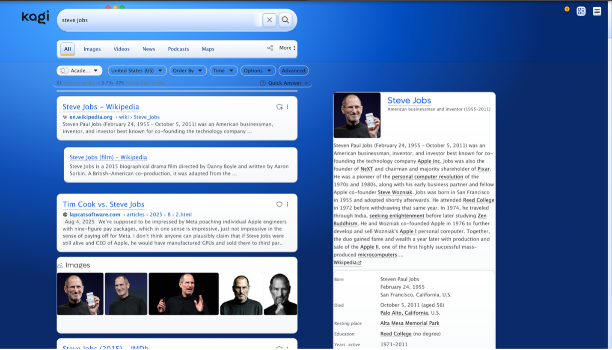
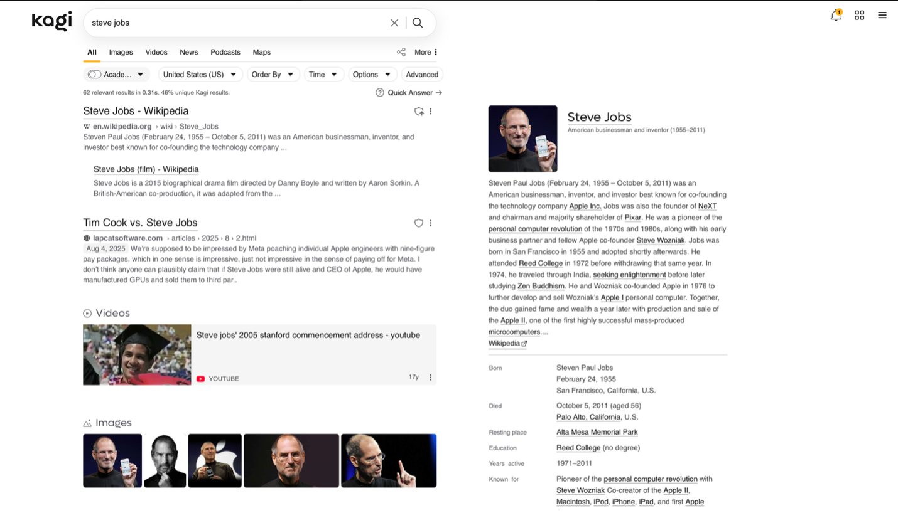
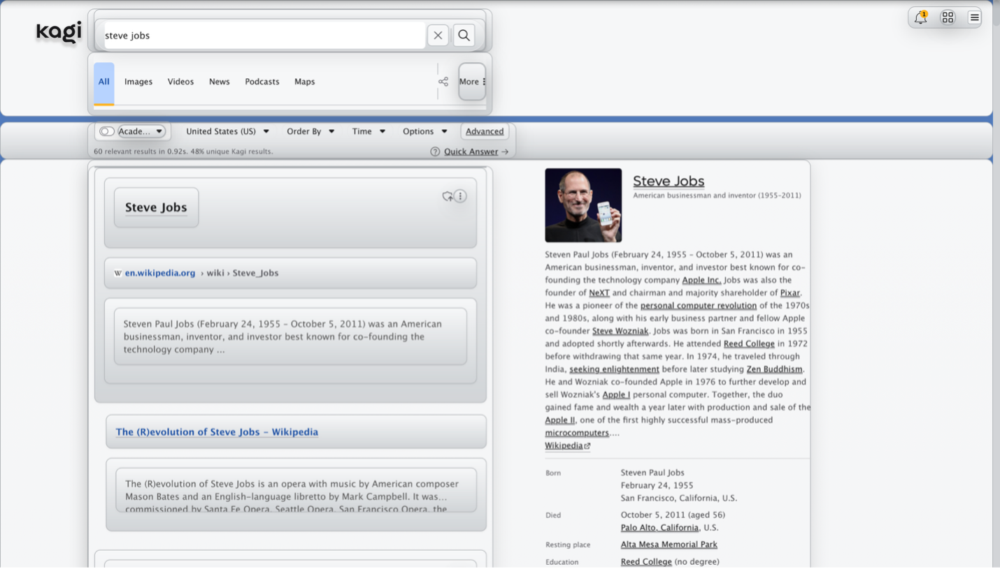
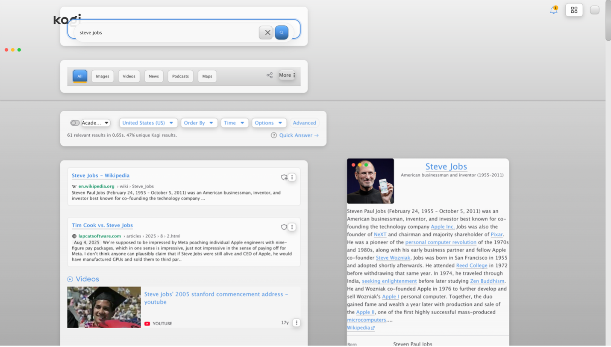
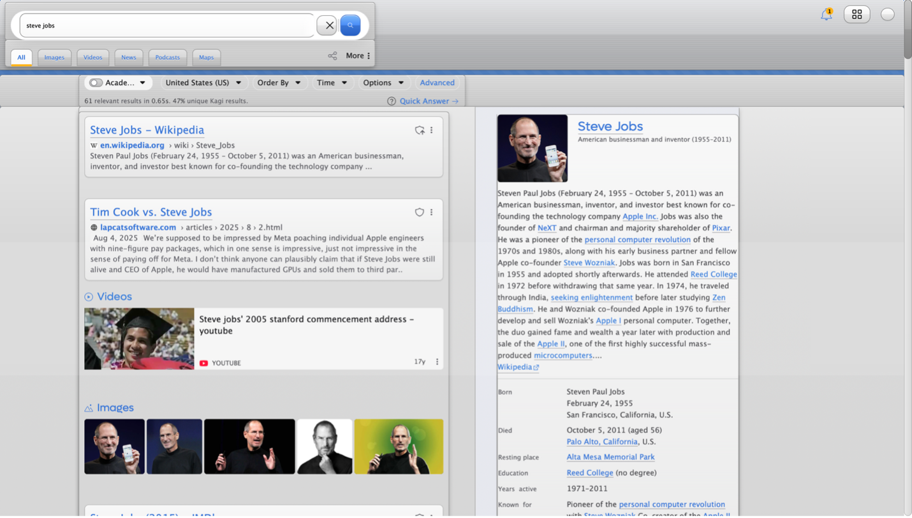
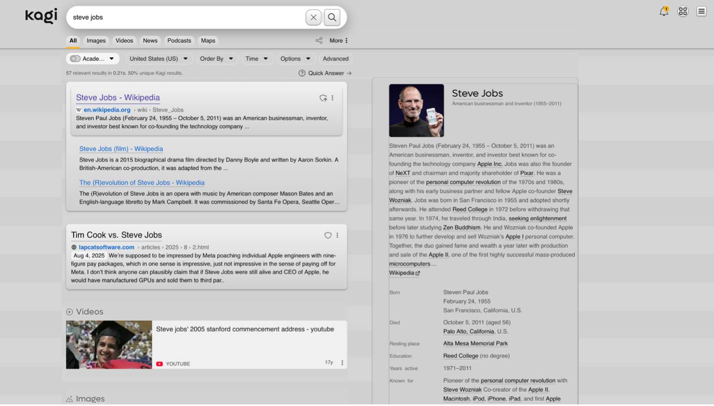

# Community CSS Benchmark

The Community CSS Benchmark is a benchmark for testing how LLMs handle novel problems. In this case, we told each LLM to write a CSS file that makes Kagi mimik OSX 10.4 Tiger. We gave it Kagi's html, an amazing example CSS [Kagi Catppuccin Mocha](https://repo.jcrabapple.com/jcrabapple/82208449e52b434a8e695c8124fa3f79), and the images below to give it context on the problem. 

{data-zoomable}{style="height:300px"}
{data-zoomable}{style="height:300px"}

<details>
<summary>Click to see the prompt used for the benchmark</summary>

Create a custom CSS theme for Kagi that will bring the look and feel of brushed metal interface of OSX 10.4 Tiger.
 
Here is an example CSS Theme
```css
/* Catppuccin Theme for Kagi - With Theme Class Support */
/* Core variables - Light theme (Latte) is default */
:root {
  /* Catppuccin Latte colors */
  --rosewater: #dc8a78; --flamingo: #dd7878; --pink: #ea76cb; --mauve: #8839ef;
  --red: #d20f39; --maroon: #e64553; --peach: #fe640b; --yellow: #df8e1d;
  --green: #40a02b; --teal: #179299; --sky: #04a5e5; --sapphire: #209fb5;
  --blue: #1e66f5; --lavender: #7287fd; --text: #4c4f69; --subtext1: #5c5f77;
  --subtext0: #6c6f85; --overlay2: #7c7f93; --overlay1: #8c8fa1; --overlay0: #9ca0b0;
  --surface2: #acb0be; --surface1: #bcc0cc; --surface0: #ccd0da; --base: #eff1f5;
  --mantle: #e6e9ef; --crust: #dce0e8;
  /* Set light mode scheme and core UI variables */
  --color-scheme: light;
  --app-bg: var(--base); --app-text: var(--text); --header-bg: var(--crust);
  --app-frame-bg: var(--app-bg); --landing-bg: var(--app-bg);
  --app-bg-opac: rgba(30, 30, 46, 0); --bottom-bar-bg: var(--yellow);
  --white: var(--text);
   
  /* Derived color mappings */
  --graphite: var(--base); --graphite-25: var(--overlay2); --graphite-50: var(--flamingo);
  --graphite-70: var(--pink); --graphite-100: var(--mauve); --graphite-200: var(--red);
  --graphite-300: var(--maroon); --graphite-400: var(--peach); --graphite-500: var(--yellow);
  --graphite-600: var(--green); --graphite-700: var(--teal); --graphite-800: var(--sky);
  --graphite-850: var(--sapphire); --graphite-900: var(--blue); --graphite-950: var(--lavender);
  --graphite-1000: var(--text);
 
  /* Chrome palette */
  --chrome-25: var(--rosewater); --chrome-50: var(--flamingo); --chrome-70: var(--pink);
  --chrome-100: var(--mauve); --chrome-200: var(--red); --chrome-300: var(--maroon);
  --chrome-400: var(--peach); --chrome-500: var(--yellow); --chrome-600: var(--green);
  --chrome-700: var(--teal); --chrome-800: var(--sky); --chrome-850: var(--sapphire);
  --chrome-900: var(--blue); --chrome-950: var(--lavender); --chrome-1000: var(--text);
 
  /* Purple palette */
  --purple-300: var(--lavender); --purple-400: var(--blue); --purple-500: var(--sapphire);
  --purple-600: var(--sky); --purple-800: var(--teal); --purple-900: var(--green);
 
  /* Primary palette (mirrors graphite) */
  --primary: var(--text); --primary-25: var(--overlay2); --primary-50: var(--flamingo);
  --primary-70: var(--pink); --primary-100: var(--mauve); --primary-200: var(--red);
  --primary-300: var(--maroon); --primary-400: var(--peach); --primary-500: var(--yellow);
  --primary-600: var(--green); --primary-700: var(--teal); --primary-800: var(--sky);
  --primary-850: var(--sapphire); --primary-900: var(--blue); --primary-950: var(--lavender);
  --primary-1000: var(--text); --primary-g: var(--text); --primary-g-2: var(--red);
  --primary-g-6: var(--green); --primary-g-8: var(--sky); --primary-300-solid: var(--maroon);
 
  /* Functional colors */
  --warning: var(--peach); --info: var(--sky); --danger: var(--red); --success: var(--green);
  --calm: var(--surface0); --link: var(--purple-600); --primary-hover: var(--purple-600);
  --primary-hover-hover: var(--purple-500); --primary-visited: var(--teal);
 
  /* UI Elements */
  --kagi-highlight: var(--yellow); --beta-tag-bg: var(--yellow); --beta-tag-text: var(--base);
  --beta-tag-inside-corners: var(--maroon); --kagi-light-cream: var(--rosewater);
  --kagi-accent: var(--surface1); --kagi-sky: var(--sky); --kagi-sky-b: var(--sapphire);
  --kagi-sky-i: var(--sky); --kagi-orange: var(--maroon);
  --resultsummary-highlight: var(--surface2); --resultsummary-highlight_text: var(--text);
  --kagi-graphite: var(--text); --kagi-graphite-s: var(--overlay2);
  --kagi-graphite-text: var(--base); --kagi-graphite-ia: var(--text);
  --kagi-graphite-ia-color: var(--base);
 
  /* Shadows */
  --inner-shadow: rgba(0, 0, 0, .05); --settings-app-inner-bg: var(--app-bg);
  --box-shadow: rgba(0, 0, 0, .09); --box-shadow-15: rgba(0, 0, 0, .15);
  --ranked-box-shadow: rgba(0, 0, 0, .25);
 
  /* Inputs and buttons */
  --color-search-input-border: var(--mauve); --color-search-input: var(--base);
  --color-search-input-opac: var(--app-bg-opac); --color-danger: var(--red);
  --input-bg: var(--app-bg); --btn-primary-bg: var(--mauve); --btn-primary-text: var(--crust);
  --btn-primary-color: var(--base); --btn-group-bg: var(--base);
 
  /* Navigation */
  --nav_n_se_line: var(--yellow); --nav_n_im_line: var(--blue); --nav_n_vi_line: var(--red);
  --nav_n_ne_line: var(--mauve); --nav_n_ma_line: var(--green);
 
  /* Sidebar */
  --secondary: var(--base); --app-sidebar-item-border: rgba(255, 255, 255, .2);
  --app-sidebar-link: rgba(255, 255, 255, .6); --app-sidebar-nav-item-bg_hover: var(--yellow);
  --app-sidebar-nav-item-icon_hover: var(--base);
 
  /* Search results */
  --result-item-title-border: var(--peach); --result-item-title-border_hover: var(--primary-hover);
  --result-item-title-visited-border: var(--pink); --result-rank-icon-stroke_promoted: var(--text);
  --result-item-highlight: var(--sky); --search-result-content-text: var(--text);
  --search-result-url-link: var(--green); --search-result-title: var(--text);
  --search-result-title-hover: var(--primary-hover); --search-result-date-bg: var(--surface0);
  --search-result-date-new-bg: var(--base); --search-result-date-new: var(--sky);
 
  /* Domain ratings */
  --domain-rank-icon-color-ban: var(--red); --domain-rank-icon-color-lower: var(--red);
  --domain-rank-icon-color-normal: var(--red); --domain-rank-icon-color-higher: var(--red);
  --domain-rank-icon-color-boosted: var(--red); --domain-rank-icon-color-trackers: var(--peach);
  --domain-rank-icon-color-trackers-hover: var(--maroon); --domain-rank-icon-color-scam: var(--peach);
  --domain-rank-icon-color-scam-hover: var(--maroon); --ranked-box-connection-secure: var(--green);
  --ranked-box-connection-insecure: var(--red); --ranked-box-tracker-desc-danger: var(--red);
  --ranked-box-tracker-desc-clear: var(--green);
 
  /* Inline content */
  --inline-header-title: var(--text); --inline-widget-bg: var(--surface0);
  --inline-widget-hover-bg: var(--surface1); --inline-header-border: var(--red);
  --inline-domain-tag-bg: var(--pink); --related-item-bg: var(--surface0);
  --related-item-hover-bg: var(--surface1); --video-item-bg: var(--surface0);
  --auto-sugg-bg_hover: var(--surface0);
 
  /* Provider breakdown */
  --provider-breakdown_server: var(--sky); --provider-breakdown_client: var(--peach);
  --provider-breakdown_speed1: var(--yellow); --provider-breakdown_speed2: var(--red);
  --provider-breakdown_speed3: var(--red); --widget-progress_bar: var(--text);
  --translate-fc_icon: var(--text); --rating-star_background: var(--surface1);
  --wiki-content-links: var(--text); --m_sri_gap_color: var(--surface1);
 
  /* AI chat */
  --ai_chat_buble_a_bg: var(--kagi-accent); --ai_chat_buble_q_bg: var(--app-bg);
  --ai_chat_buble_dd_q_bg: var(--kagi-accent); --ai_chat_buble_dd_a_bg: var(--surface1);
  --ai_chat_buble_a_text: var(--app-text); --ai_chat_buble_q_text: var(--app-text);
  --ai_chat_input_text: var(--app-text); --ai_chat_input_button: var(--teal);
 
  /* Misc UI elements */
  --doggo-color-1: var(--text); --doggo-bg-color: var(--app-bg); --doggo-stroke-color: var(--maroon);
  --landing-page-clouds-opacity: 1; --quick-search-bg: var(--text); --quick-search-icon: var(--base);
  --app-logo: var(--text); --app-logo-bg: var(--yellow); --filters-clear-btn-icon: var(--maroon);
  --filter-dd-bg: var(--surface2); --k-tooltip-bg: var(--background-color-sky);
  --k-tooltip-text: var(--text); --dd-hover-bg: var(--mauve); --dd-hover-color: var(--text);
  --dd-list-input-bg: var(--input-bg); --not-found-bubble-bg: var(--surface1);
  --site_info_bg: var(--app-bg); --site_info_bottom_bg: var(--kagi-accent);
 
  /* Code syntax highlighting */
  --code-bg: var(--base); --code-border: var(--overlay0); --code-k: var(--mauve);
  --code-s: var(--green); --code-cm-c1: var(--maroon); --code-n: var(--mauve);
  --code-p: var(--text); --background-color-sky: var(--sky);
 
  /* Form elements */
  --checkbox-bg: var(--mauve); --checkbox-check: var(--crust); --as-dd-border: var(--app-bg);
  --dd-list-input-bg: var(--base); --icon-purple: var(--sky);
 
  /* Onboarding elements */
  --onboarding_theme_options_dark_visibility: none; --onboarding_theme_options_light_visibility: flex;
  --onb_theme_light_preview_box: flex; --onb_theme_calm_blue_preview_box: none;
  --onb_theme_royal_blue_preview_box: none; --onb_theme_moon_dark_preview_box: none;
  --image_brightness: 100%;
}
@media (prefers-color-scheme: dark) {
  .theme_moon_dark_conditional, .theme_moon_dark, .theme_dark {
    /* Catppuccin Mocha colors */
    --rosewater: #f5e0dc; --flamingo: #f2cdcd; --pink: #f5c2e7; --mauve: #cba6f7;
    --red: #f38ba8; --maroon: #eba0ac; --peach: #fab387; --yellow: #f9e2af;
    --green: #a6e3a1; --teal: #94e2d5; --sky: #89dceb; --sapphire: #74c7ec;
    --blue: #89b4fa; --lavender: #b4befe; --text: #cdd6f4; --subtext1: #bac2de;
    --subtext0: #a6adc8; --overlay2: #9399b2; --overlay1: #7f849c; --overlay0: #6c7086;
    --surface2: #585b70; --surface1: #45475a; --surface0: #313244; --base: #1e1e2e;
    --mantle: #181825; --crust: #11111b;
  /* Dark mode adjustments */
    --color-scheme: dark; --app-bg: var(--base); --app-text: var(--text);
    --header-bg: var(--app-bg); --inline-widget-bg: var(--surface0);
    --inline-widget-hover-bg: var(--surface1); --btn-primary-bg: var(--text);
    --btn-primary-text: var(--base); --checkbox-bg: var(--yellow); --checkbox-check: var(--base);
    --onboarding_theme_options_dark_visibility: flex; --onboarding_theme_options_light_visibility: none;
    --onb_theme_light_preview_box: none; --onb_theme_moon_dark_preview_box: flex;
    --k-tooltip-bg: var(--background-color-sky); --k-tooltip-text: var(--text);
  }
  .k_ui_toggle_switch input:checked~.k_ui_toggle_switch_bar:after {
    background-color: var(--surface0);
    border-color: var(--surface1);
}
  .k_ui_toggle_switch input:checked~.k_ui_toggle_switch_bar {
    background: var(--green);
    border-color: var(--primary-25);
}
.tag-selector:hover {
    background: var(--surface1);
}
.advanced-search-modal-backdrop:before {
    background-color: unset;
}
.advanced-search-modal {
    background-color: var(--crust);
}
@media all and (min-device-width: 766px) {
  form#form {
    margin: 0;
    border: 1px var(--peach) solid;
    border-radius: 35px;
    padding: 12px 20px;
}
}
}
/* Base styles */
body { font-family: Poppins, sans-serif !important; }
/* Dropdowns */
.k_ui_dropdown_data_list .list_items > ._0_k_ui_dropdown_li:hover { background-color: var(--surface2) !important; }
.dropdown .dd-list ._0_list_items li:hover { color: var(--overlay0) !important; }
.sidebar-filter-nav-form .sidebar-filter-nav > .filter-item .dd-list li:hover { color: var(--overlay0) !important; }
.k_ui_dropdown_data_list .list_items > div:hover { background-color: unset !important; color: unset !important; outline: none; text-decoration: none; }
/* Domain badges & tags */
span.domain, #chat_box .chat_bubble .sources .domain {
  background-color: var(--surface0) !important; color: var(--text) !important;
  padding: 2px 4px !important; border-radius: 3px !important;
}
span.__domain-name, .widget-simple .__domain-name, .bg-p-50 { background-color: var(--surface0) !important; }
/* Toggle switches */
.k_ui_toggle_switch.--enabled .k_ui_toggle_switch_bar { background: var(--primary-g-6); }
.k_ui_toggle_switch.--mini .k_ui_toggle_switch_bar { --border-color: var(--primary-g-6); }
/* Tooltips and focus states */
.k-tooltip { background-color: var(--primary-100); }
:focus-visible { border-radius: 5px; outline: 2px solid var(--peach); }
/* Sidebar */
div.sidebar-box { background-color: var(--mantle) !important; }
.thread-list > li:is(.active, :hover, :focus-within) { background-color: var(--surface1) !important; }
#thread-sidebar-collapse:hover { color: var(--crust); }
.threads-pane .header { background: none !important; }
.sidebar-box>.tags-pane { background: none !important; }
.tag-selector:has(:checked) { background: var(--surface1) !important; }
/* Header & Navigation */
header { background: var(--crust) !important; }
header .header-btn:hover { color: var(--crust); }
.landing-category-select .landing_cat_buttons > button.--active {
  align-items: center; border: 1px solid var(--primary-400); border-radius: 999px;
  color: var(--primary-500); display: flex; flex-shrink: 0; gap: 4px;
  padding: 8px 16px; background-color: var(--surface0); font-weight: 700;
}
.landing-category-select .landing_cat_buttons > button {
  border-bottom: 2px solid transparent; color: var(--primary);
  font-size: .875rem; height: 47px; margin: 0; min-width: unset !important;
  padding: 0 8px; position: relative;
}
/* Navigation button highlights */
.landing-category-select .landing_cat_buttons > button.n_se.--active,
.landing-category-select .landing_cat_buttons > button.n_se:hover { border-bottom: 2px solid var(--nav_n_ma_line) !important; }
.landing-category-select .landing_cat_buttons > button.n_im.--active,
.landing-category-select .landing_cat_buttons > button.n_im:hover { border-bottom: 2px solid var(--nav_n_vi_line) !important; }
.landing-category-select .landing_cat_buttons > button.n_vi.--active,
.landing-category-select .landing_cat_buttons > button.n_vi:hover { border-bottom: 2px solid var(--nav_n_vi_line) !important; }
.landing-category-select .landing_cat_buttons > button.n_ne.--active,
.landing-category-select .landing_cat_buttons > button.n_ne:hover { border-bottom: 2px solid var(--nav_n_ne_line) !important; }
.landing-category-select .landing_cat_buttons > button.n_ma.--active,
.landing-category-select .landing_cat_buttons > button.n_ma:hover { border-bottom: 2px solid var(--nav_n_ma_line) !important; }
.landing_cat_buttons {
  border-bottom: 1px solid var(--primary-200); display: flex;
  justify-content: space-between; width: 100%; padding-bottom: 10px;
}
#adv_search_btn:checked + #mainContent .search-form .landing-category-select { top: 65px; }
/* Prompt & Chat styles */
.prompt-options button:hover, .prompt-options label:hover,
.promptOptionsSelector .custom-assistants li.option:hover,
.promptOptionsSelector .default-assistants li.option.focus,
.promptOptionsSelector .default-assistants li.option:hover,
.promptOptionsSelector .custom-assistants span a:hover,
.promptOptionsSelector .custom-assistants li.option.focus,
.prompt-options label:hover, .prompt-options button:hover { background-color: unset !important; }
.promptOptionsSelector .custom-assistants li.option,
.promptOptionsSelector .default-assistants li.option { color: var(--text); }
/* Chat box styling */
#chat_box > div:nth-child(1), [aria-label="You said:"] {
  background-color: var(--surface0) !important; padding: 20px !important;
  border: 2px solid var(--overlay0) !important; border-radius: 25px !important;
}
.chat_bubble {
  padding-block: 32px; position: relative; border: 2px solid var(--overlay0);
  border-radius: 25px; margin-top: 25px; margin-bottom: 10px; padding: 20px; background-color: var(--crust);
}
.chat_bubble:focus-within:before, .chat_bubble:hover:before { background-color: unset !important; }
.chat_bubble .actions { display: inline-flex !important; gap: 8px !important; flex-direction: row !important; }
#chat_box .chat_bubble .actions [data-action]:is(a,button):hover { background: var(--surface1); }
#chat_box .chat_bubble .content sup {
  background-color: var(--surface1); color: var(--text);
}
#chat_box .chat_bubble .content sup:hover { background-color: var(--surface2); }
.message-info li .value {
  background-color: var(--surface0); color: var(--text);
  padding: 2px 5px; border-radius: 4px;
}
#prompt-box:before { border-top: 2px solid var(--peach); }
#dictation-button:hover { color: var(--crust); }
/* Form elements */
input[type="date"] { color: var(--primary-600) !important; }
._0_filters-clear-btn { color: var(--crust) !important; }
._0_filters-clear-btn i svg { color: var(--base) !important; }
._0_copied_tooltip { left: -45px; }
/* Upload items */
#uploadedItems .item .type, #uploadedItems .item .icon, #uploadedItems .item .name { color: var(--crust); }
#form .uploadLabel:hover { color: var(--crust); }
.POI-item-back .text { color: var(--crust); }
#popover-privacy > p:nth-child(3) > span > i { color: var(--crust) !important; }
/* Search results */
.search-result, .sri-group { border-bottom: unset !important; }
.inline-content+.search-result, .inline-content+.sri-group { border-top: unset !important; }
.s-f-w.--active .search_area { padding: 10px !important; }
.main-center-box>* {
  margin-inline: auto; max-width: 850px;
  padding-inline: 16px; width: 100%;
}
/* Optional: disable underline on title links */
.__sri-title .__sri_title_link { border-bottom: none; }
#thread-sidebar-visible:checked~#sidebar-backdrop, .quick-settings, .quick-settings-footer, .promptOptionsSelector, .promptOptionsSelector .search-bar, .k_ui_dropdown_data_list, ._0_more_search_box, .dropdown .dd-list, .chat_bubble .actions, .citation, .message-info, .thread-more-menu, .threads-pane {
background-color: var(--crust) !important;
}
.team_badge {
  color: var(--crust);
}
/* Desktop / Widescreen styles */
@media (min-width: 1280px) {
:root {
    --sidebar-width: 550px;
  }
  .sidebar-box > .threads-pane {
    min-width: 350px;
  }
}
/* Mobile styles */
@media all and (max-device-width: 766px) {
  .bg-p-50 { background-color: var(--surface0); }
 
  .landing-category-select .landing_cat_buttons > button.--active {
    align-items: center; border: 1px solid var(--primary-400); border-radius: 999px;
    color: var(--primary-500); display: flex; flex-shrink: 0; gap: 4px;
    padding: 8px 16px; background-color: var(--surface0); font-weight: 700;
  }
  .landing-category-select .landing_cat_buttons > button {
    border: none; color: var(--primary); font-size: .875rem; height: 47px;
    margin: 0; min-width: unset !important; padding: 0 8px; position: relative;
  }
  #thread-sidebar-visible:checked~#sidebar-backdrop {
    background-color: unset !important;
  }
 
  /* Navigation styles for mobile */
  .landing_cat_buttons {
    border-bottom: none !important; display: flex;
    justify-content: space-between; width: 100%;
  }
 
  #adv_search_btn:checked + #mainContent .search-form .landing-category-select { top: 85px; }
}
```
</details>

## Kagi Ki
Model Date: Not provided, but it is currently based on Anthropic Claude Sonnet 4 as of August 7th.   
Note: Since there are two versions of Kagi Ki, based on what plan you have, it is important to note that this is Ki available with the Ultimate plan.
{data-zoomable}

## OpenAI GPT-5 High
Model Date: August 7th, 2025  
{data-zoomable}

## OpenAI GPT-5 Medium
Model Date: August 7th, 2025  
{data-zoomable}

## OpenAI GPT-5 Low
Model Date: August 7th, 2025  
{data-zoomable}

## OpenAI GPT-5 Mini
Model Date: August 7th, 2025  
{data-zoomable}

## OpenAI GPT-5 Nano
Model Date: August 7th, 2025  
Note: There was no visible change to the CSS despite having written a file.
{data-zoomable}

## OpenAI GPT-4.1
Model Date: April 14th, 2025  
{data-zoomable}

## OpenAI o4 mini
Model Date: April 16th, 2025  
Note: o4 mini instantly times out despite multiple attempts running this benchmark.

## OpenAI o3 pro
Model Date: June 10th, 2025  
{data-zoomable}

## Anthropic Claude 4 Sonnet Reasoning
Model Date: May 14th, 2025  
{data-zoomable}

## Anthropic Claude 4.1 Opus Reasoning
Model Date: August 5th, 2025  
{data-zoomable}

## Google Gemini 2.5 Flash
Model Date: June 17th, 2025  
Note: Initial CSS was too large so it was given two opportunities to get within 20,000 characters. First it was prompted to get below 20,000 characters, then it was prompted to get below 20,000 characters including spaces.
{data-zoomable}

## Google Gemini 2.5 Flash Lite
Model Date: July 22nd, 2025  
{data-zoomable}

## Google Gemini 2.5 Pro
Model Date: June 17th, 2025  
{data-zoomable}

## xAI Grok 3 Mini
Model Date: February 17th, 2025  
Note: The given prompt reached the model output limit and it was unable to complete the CSS file.

## xAI Grok 4
Model Date: Via grok.com, no specific date provided  
Note: Kagi gave an error that no output was available for this query so it was tested on grok.com. Keep in mind that it is not using Kagi's system prompt. Grok also exceeded the character limit so it was given an opportunity to get within 20,000 characters.
{data-zoomable}
