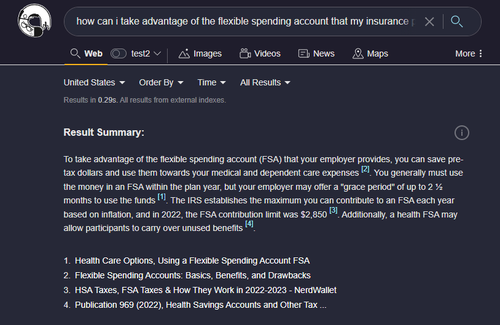
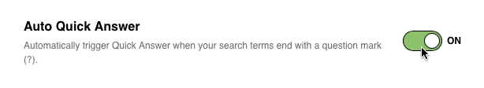

# Quick Answer

Even with an engine as powerful as Kagi you may not be interested in reading every resulting page and want a synthesis of the information as well as references to important pages in the search result. Kagi's Quick Answer quickly produces a summary of the results across the pages returned and provides references to the pages that are used. This functionality allows you to quickly consume the desired information from the search while giving you the pointers to dive deeper into the information if desired.

Once you have search results returned you can select **Quick Answer** to quickly transform the information on the page into the easier to digest format. Additionally, if you add a question mark at the end of your query ("?") Quick Answers will trigger automatically, making it even more convenient to get to the information you need swiftly. You can also trigger Quick Answer by pressing 'q' on your keyboard, after the results have loaded.

{data-zoomable}

The Kagi AI Quick Answer will quickly produce a summary of the results below the search bar.

{data-zoomable}

Kagi AI Quick Answer benefits from constant feedback, be sure to use the feedback option to help tune the model for your specific needs.

{data-zoomable}

## Disabling Auto Quick Answer

If you prefer to just browse through search results instead of getting instant answers to queries ending with a question mark, you can now disable Auto Quick Answer. Simply go to the [Search Settings](https://kagi.com/settings?p=ai) page, and turn off the Auto Quick Answer toggle.

{data-zoomable}
