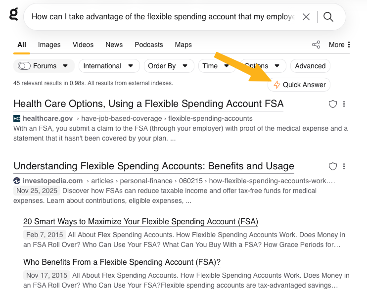
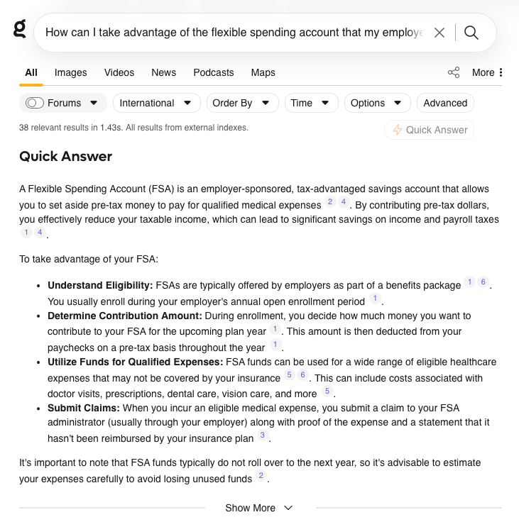

# Quick Answer

Kagi's Quick Answer quickly produces a summary of the results across the pages returned and provides references to the pages that are used. This functionality allows you to quickly consume the desired information from the search while giving you the pointers to dive deeper into the information if desired.

Once you have search results returned you can select **Quick Answer** to quickly transform the information on the page into the easier to digest format:

{data-zoomable}

:::info Tip
If you add a question mark at the end of your query ("?") Quick Answer will trigger automatically, making it even more convenient to get to the information you need. You can also trigger Quick Answer by pressing 'q' on your keyboard after the results have loaded.
:::

Quick Answer will quickly produce a summary of the results below the search bar:

{data-zoomable}

## Disabling Auto Quick Answer

If you prefer to just browse through search results instead of getting instant answers to queries ending with a question mark, you can disable Auto Quick Answer. Simply go to the [Search AI Settings](https://kagi.com/settings/ai) page and turn off the Auto Quick Answer toggle.

{data-zoomable}
