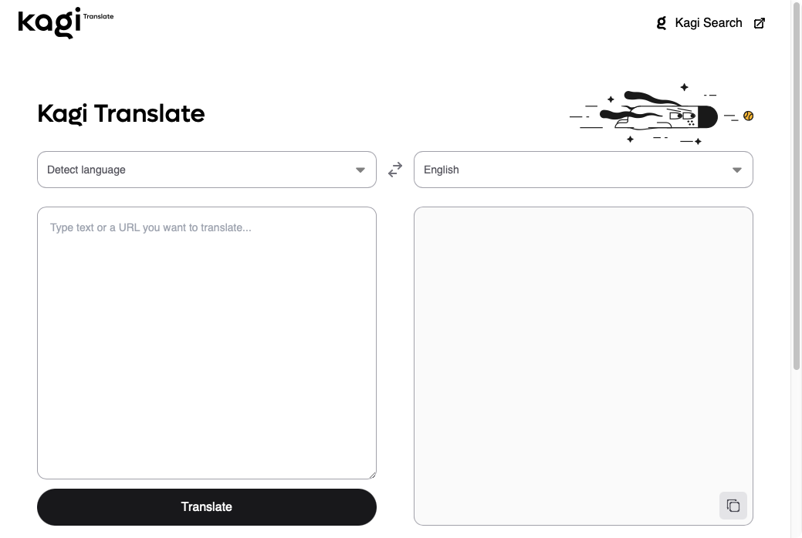

# Kagi Translate

{width=700px data-zoomable}

[Kagi Translate](https://translate.kagi.com) is a powerful language translation tool that supports 244 languages. It combines advanced language models to deliver accurate, context-aware translations while maintaining privacy.

## Key features
- **Comprehensive language support**: Translate between 244 languages
- **Context-aware translation**: Preserves meaning, tone, and style of original text
- **Translation options**: 
  - Web page translation
  - Text translation
- **Privacy-focused**: Your translations are processed securely without storing personal data

## Benefits
- **Accuracy**: Advanced language models ensure precise translations
- **Natural results**: Localizes idioms and cultural references appropriately
- **Versatility**: Handles everything from short phrases to entire web pages
- **Privacy**: Your translation data remains secure and private

## How to use

### Text translation
1. Select source language or choose "Detected" to identify automatically
2. Select target language
3. Type or copy and paste the text to translate
4. Click the "Translate" button
5. Translated text will appear in the output box. You can click the copy button to copy the translated text to your clipboard

### Web page translation
Option 1:
1. Open [Kagi Translate](https://translate.kagi.com)
2. Paste the website URL in the input box
3. Select your target language
4. Click Translate

Option 2:
- Add ```translate.kagi.com/``` before any URL in your browser
  Example: ```translate.kagi.com/example.com```

### Browser bookmarklet
1. Drag this link to your bookmarks bar: <a href="javascript:(function(){var%20selectedText=window.getSelection().toString().trim();window.location.href='https://translate.kagi.com/'+(selectedText?'?text='+encodeURIComponent(selectedText):encodeURIComponent(window.location.href));})();">Kagi Translate</a>
2. Use the bookmarklet for:
   - Translating selected text: Select text, then click bookmarklet
   - Translating entire page: Click bookmarklet without selecting text

### URL Parameters

If you want to create custom [Bangs](../features/bangs.md), integrate it into your favorite launcher, or any other automation, you can use the following URL parameter format:

```
https://translate.kagi.com/?text=%s&source=Japanese&target=English
```
