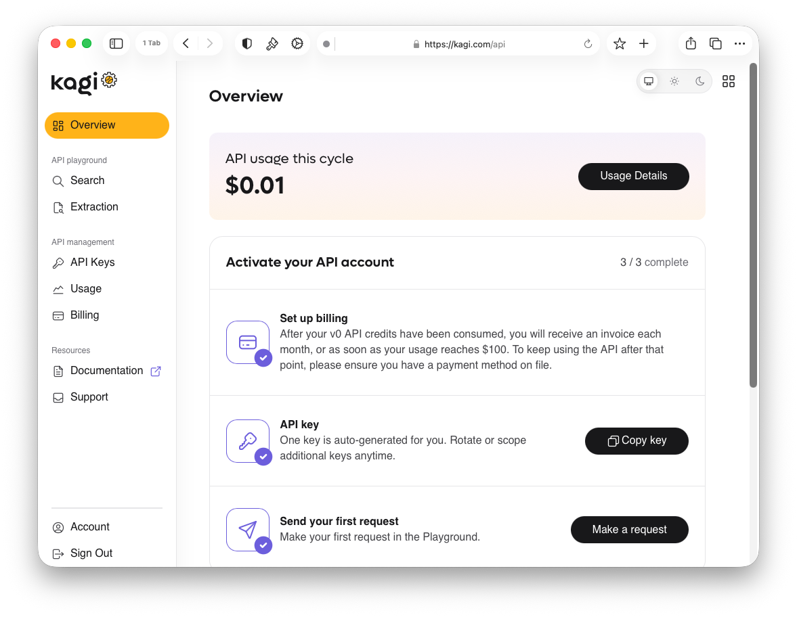
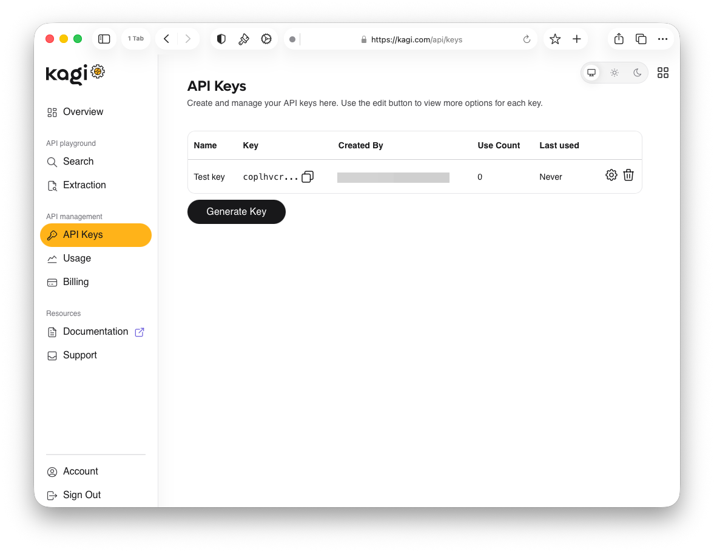
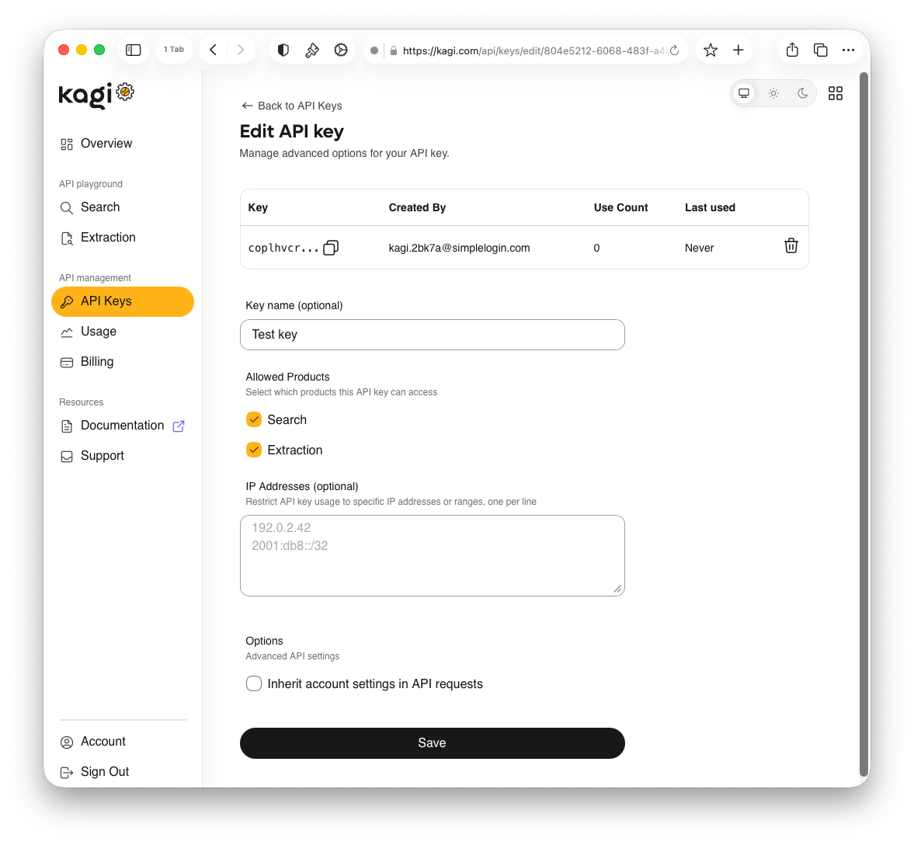
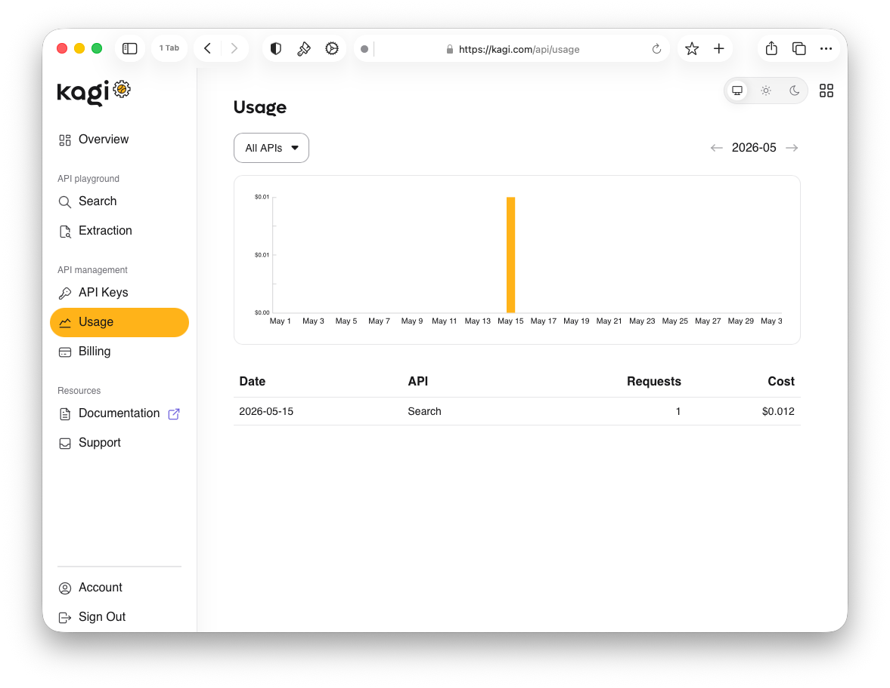
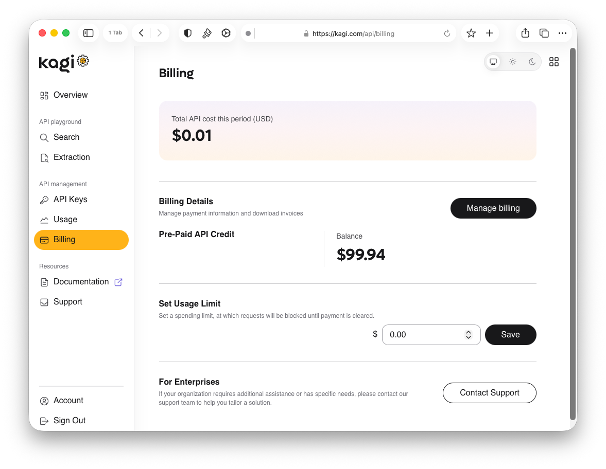

# API Portal

The Kagi API Portal is where you manage your API keys, monitor usage, handle billing and top up your API credit, and try out requests in the API playground.

> [!NOTE]
> On Family and Team plans, only the account owner can access the API portal. If you are not the account owner, you can ask your admin to generate an API key for you, or create a separate Kagi account.

## Available APIs

### Commercial

- **[Search API](search.md)**: Kagi's premium search results
- **[Enrichment API](enrich.md)**: Kagi's own Teclis (web) and TinyGem (news) indexes
- **[Universal Summarizer API](summarizer.md)**: Summarize any content in any format
- **[FastGPT API](fastgpt.md)**: LLM-powered answers with live web search

### Free

- **[Kagi Small Web RSS Feed](smallweb.md)**: Recent content from the non-commercial web

## Overview

{data-zoomable}

The Overview page is your API dashboard home. It shows your API usage and a checklist to help you get set up.

## API Playground

Try out API requests directly in your browser without writing any code.

### Search

Run live search queries and inspect the full JSON response.

### Extraction

Test content extraction requests against any URL and preview the returned data.

## API Management

### API Keys

{data-zoomable}

Create and manage your API keys. Each key displays the following:

- **Name**: A label for the key
- **Key**: The token value, truncated with a copy button
- **Created By**: The email address of the account that generated the key
- **Use Count**: Total number of requests made with the key
- **Last Used**: When the key was last used to make a request

Use the `Generate Key` button to create a new key. Each key has a settings button to configure it and a delete button to revoke it.

#### Edit API Key

{data-zoomable}

Clicking the settings button on a key opens the edit page with the following options:

- **Key name (optional)**: A human-readable label for the key
- **Allowed Products**: Select which products the key can access
- **IP Addresses (optional)**: Restrict usage to specific IP addresses or ranges, one per line
- **Options**: Check `Inherit account settings in API requests` to apply your account settings to requests made with this key

Click `Save` to apply changes.

### Usage

{data-zoomable}

The Usage page shows a bar chart of your spending over the current billing cycle, along with a detailed breakdown table. Use the `All APIs` dropdown to filter by a specific API type, and the month arrows to navigate between billing cycles.

The table shows the following columns:

- **Date**: When the requests were made
- **API**: Which API was used
- **Requests**: Number of requests made on that date
- **Cost**: Total cost in USD for those requests

### Billing

{data-zoomable}

The Billing page shows your `Total API cost this period (USD)` and the following sections:

- **Billing Details**: Manage payment information and download invoices. Click `Manage billing` to update your payment method or access billing settings
- **Pre-Paid API Credit**: Shows your current prepaid balance, top up at any time to keep using the API
- **Set Usage Limit**: Set a spending cap in USD

The API uses a pay-per-use model. You are invoiced when your usage reaches $100 (or your custom limit) or at the end of each monthly billing cycle, whichever comes first.

## Migrating from the Beta API

v0 API users can switch to v1 and continue using any remaining v0 API credit. 

v1 runs on a pay-per-use model, once your v0 credits are exhausted, you will need a payment method on file to continue using the API.

> [!NOTE]
> The summarizer endpoint is not yet available in v1. It will be available in the next few weeks.

## Pricing

For up-to-date pricing, see [kagi.com/api/pricing](https://kagi.com/api/pricing).

You can add funds to your API balance from the [API Billing panel](https://kagi.com/api/keys).

## Custom Terms

For custom pricing or to discuss specific needs, contact us at [support@kagi.com](mailto:support@kagi.com).

## MCP Server

A [Kagi MCP server](https://github.com/kagisearch/kagimcp/tree/rehan/v1-api#prerelease-instructions) is available for use with MCP-compatible clients.

> [!NOTE]
> The MCP server docs include Summarize and FastGPT tools, but these tools are expected to error in this preview. They will be available in a later release.

## Client Libraries

- **[Python](https://github.com/kagisearch/kagi-api-python)**
- **[Go](https://github.com/kagisearch/kagi-api-golang)**
- **[Rust](https://github.com/kagisearch/kagi-api-rust)**
- **[TypeScript](https://github.com/kagisearch/kagi-api-typescript)**
- **[OpenAPI Spec](https://kagi.redocly.app/_spec/openapi.yaml)**

## GitHub Discussions

This is the preferred venue for bug reports and feature requests.

- **[Bug Reports](https://github.com/kagisearch/kagi-docs/issues/new/choose)**
- **[Q&A Forum](https://github.com/kagisearch/kagi-docs/discussions/categories/q-a?discussions_q=category%3AQ%26A+label%3Aproduct%3Akagi_search_api)**
- **[API Feature Requests](https://github.com/kagisearch/kagi-docs/discussions/categories/kagi-search-api-feature-requests-ideas)**

### Discord

Join our **[Discord](https://kagi.com/discord)** for quick questions and to share what you've built with our APIs.
