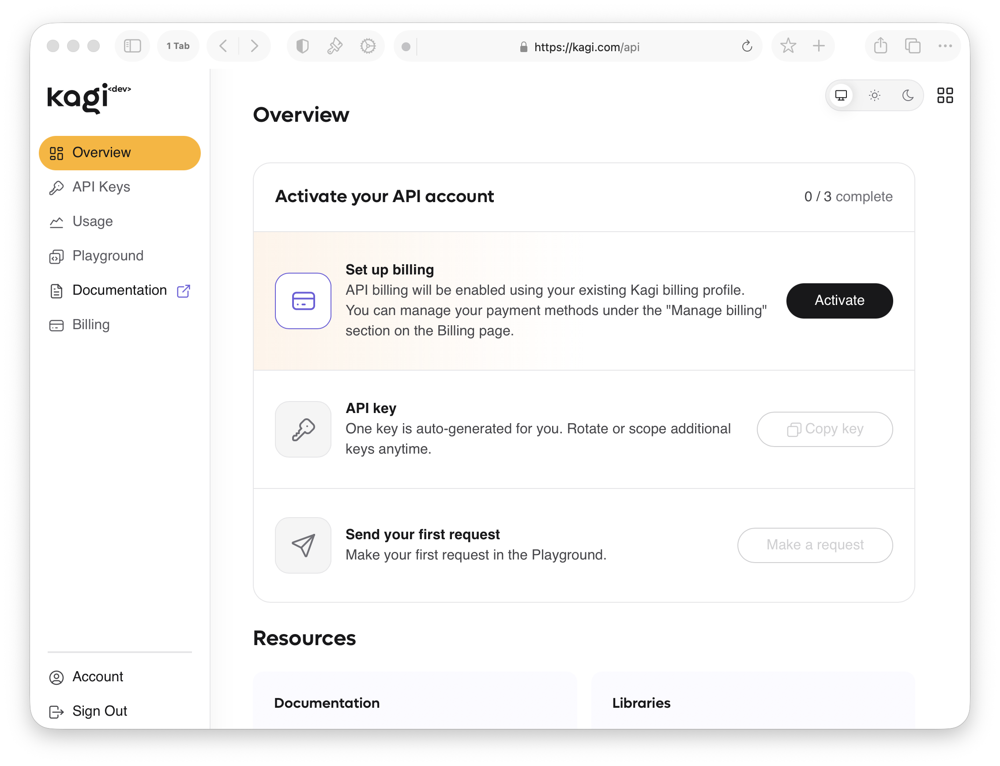

# Quick Start

Get up and running with the Kagi API in a few minutes.

## Step 1: Create a Kagi Account

[Sign up for a Kagi account](https://kagi.com/signup?plan_id=trial) if you don't have one already. A Kagi account is required to access the API portal and generate API keys.

## Step 2: Set Up Your Account

{data-zoomable}

Go to `Settings → API`, or navigate directly to [kagi.com/api](https://kagi.com/api).

### Step 2.1: Add a Payment Method

API usage is billed separately from a Kagi subscription. You can add a payment method from the [API Billing panel](https://kagi.com/api/billing).

### Step 2.2: Copy Your API Key

An API key is automatically generated for you. Click `Copy key` in the portal and store it somewhere safe.

### Step 2.3 (Optional): Test Your Key in the Playground

The API portal includes a built-in playground where you can run test queries directly in your browser without writing any code. It's a quick way to verify your key is working before integrating.

## Step 3: Make Your First API Call

Try a search request with your API key using `curl`:

```shell
curl -i -X POST \
  https://kagi.redocly.app/_mock/openapi/search \
  -H 'Authorization: Bearer <YOUR_TOKEN_HERE>' \
  -H 'Content-Type: application/json' \
  -d '{
    "query": "steve jobs",
    "workflow": "search"
  }'
```

See the [API reference](https://kagi.redocly.app) for the full endpoint reference.

## Client Libraries

Jump right in to building with one of our pre-made client libraries.

- [Python](https://github.com/kagisearch/kagi-api-python)
- [Go](https://github.com/kagisearch/kagi-api-golang)
- [Rust](https://github.com/kagisearch/kagi-api-rust)
- [TypeScript](https://github.com/kagisearch/kagi-api-typescript)
- [OpenAPI Spec](https://kagi.redocly.app/_spec/openapi.yaml)
