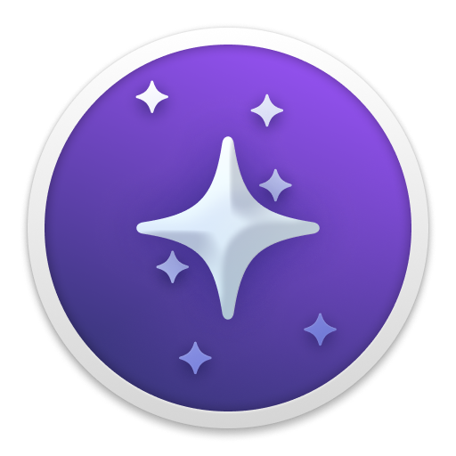

---
next:
  text: 'Products'
  link: '/kagi/company/products'
---

# About

Kagi Inc. is a company created with the mission to humanize the web. Our goal is to amplify the web of human knowledge, creativity, and self-expression.

Kagi was founded in 2018 by [Vladimir Prelovac](https://vladimir.prelovac.com/) in Palo Alto, CA (USA). Kagi's advisory board consists of [Raghu Murthi](https://www.linkedin.com/in/raghumurthi) and [Dr. Norman Winarsky](https://en.wikipedia.org/wiki/Norman_Winarsky). Our team is a fully remote team operating on all continents.

Kagi has been bootstrapped by the founder from 2018 to 2023. In 2023, [Kagi raised $670K](https://blog.kagi.com/safe-round) from Kagi members in its first external fundraise.

Kagi Inc. currently has two products: [Kagi Search](https://kagi.com), a fast, private search engine, and [Orion Browser](https://browser.kagi.com/), a fast, zero-telemetry browser.

Want to learn more? Read about  [Kagi's origin story](https://dkb.io/post/DEPR_kagi-interview) and "[The Age of Pagerank is Over](https://blog.kagi.com/age-pagerank-over)" which basically functions as our manifesto.

Our company headquarters are in Palo Alto, CA.

Contact:

Kagi Inc.\
Palo Alto, CA, USA\
Email: vlad@kagi.com\
Phone: 650 535-2700

We hope that our work impacts people's lives in some small way for the better. Thank you for your interest in being a part of this!

> "With Kagi and Orion, we’re striving to build better ways to experience the web, ways that are safe yet fun for everyone, including my own kids."
>
> —Vladimir Prelovac

## What Does "Kagi" Mean?

The word "kagi" means "key" in Japanese.

Kagi is pronounced as kah-gee. You can [listen to the pronunciation](https://www.youtube.com/watch?v=ig4VTr0rt4Q).

## Kagi Search Logo

More Kagi assets are available on the [Kagi Assets](https://kagi.com/assets) page.

People sometimes ask: why does Kagi have a "g" logo in the Google ballpark rather than a "k"?

Our designer insisted the Kagi logo is "anchored" in the letter "g," and we had to agree. Besides, we can't let Google own the letter "g" too, can we? ;)

## Orion Browser Logo

More Orion assets are available on the [Orion Press Kit](https://browser.kagi.com/press-kit/) page.

## Who is Kagi's Mascot?

We simply call him ”Doggo” for now. He's adorable!

