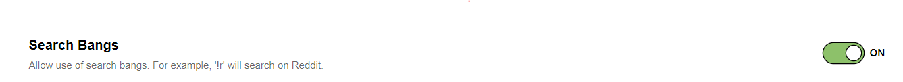
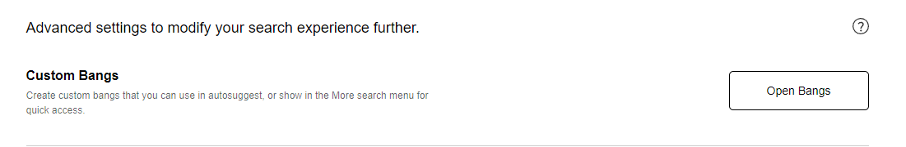
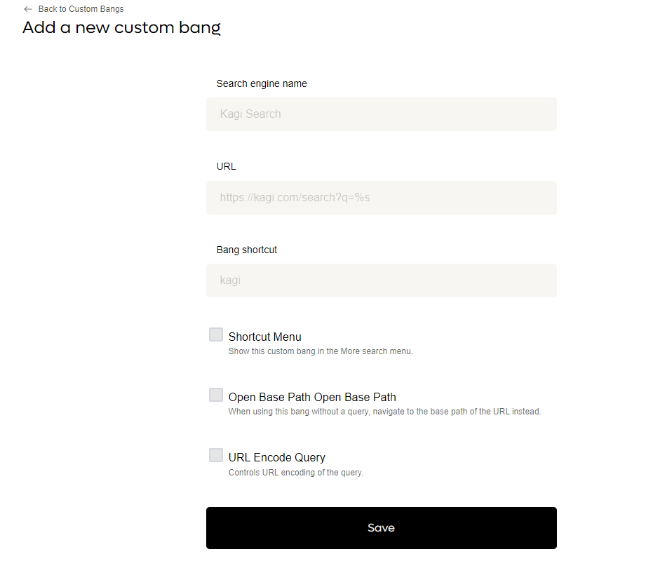
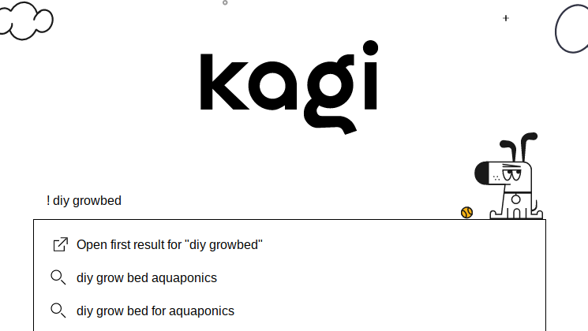

# Bangs

Bangs are shortcuts starting with exclamation points (!) that quickly take you to search results on other sites. For example, searching Kagi for **!w Monty Python** will search Wikipedia directly for "Monty Python" and take you to that Wikipedia search result. Bangs that perform searches on external sites are [never counted as searches](../plans/plan-types.md#how-searches-are-counted) for the purpose of billing/usage.

{data-zoomable}

To take advantage of Bangs make sure you have enabled Bangs in your [Search](https://kagi.com/settings?p=search) settings. You can also set up Quick Bangs and Custom Bangs, continue reading to learn more.

{data-zoomable}

You can use the community-created [Kagi Bangs Explorer](https://kbe.smaertness.net) to find bangs for your favorite sites.

## Bang Examples

Some of the more popular search bangs include:

- **!help** \<query> to search this knowledge base for information about Kagi Search. Try "!help search operators" in Kagi.
- **!i** \<query> for Kagi Images
- **!m** \<query> for Kagi Maps
- **!n** \<query> for Kagi News
- **!v** \<query> for Kagi Videos
- **!** \<query> to go directly to the first result for your query in Kagi Search

### Regional bangs

You can quickly search in another region than your default by using a bang with that region's country code.

For example:

- `!de` to search in Germany
- `!nl` to search in Netherlands
- `!int` to search with the International setting

This will load search results with that region already selected in the region filter, instead of needing to perform a search first.

See the full list of Regional Bangs

Bang | Region
-----|-------
int  | International
at   | Austria
be   | Belgium (en)
be_fr| Belgium (fr)
bj   | Benin
by   | Belarus
bz   | Belize
ca   | Canada (en)
ca_fr| Canada (fr)
cf   | Central African Republic
ch   | Switzerland (de)
ch_fr| Switzerland (fr)
cn   | China
co   | Colombia
cx   | Christmas Island
cy   | Cyprus
de   | Germany
dk   | Denmark
es   | Spain (es)
es_ca| Spain (ca)
fr   | France
gb   | United Kingdom
hr   | Croatia
hu   | Hungary
il   | Israel
im   | Isle of Man
in   | India
iq   | Iraq
ir   | Iran
it   | Italy
jp   | Japan
ke   | Kenya
ki   | Kiribati
kw   | Kuwait
ky   | Cayman Islands
kz   | Kazakhstan
lr   | Liberia
ly   | Libya
mg   | Madagascar
my   | Malaysia
nl   | Netherlands
no   | Norway
nz   | New Zealand
om   | Oman
pl   | Poland
pt   | Portugal
qa   | Qatar
re   | Réunion
rs   | Serbia
si   | Slovenia
tg   | Togo
th   | Thailand
tk   | Tokelau
to   | Tonga
ua   | Ukraine
us   | United States
uy   | Uruguay
uz   | Uzbekistan
vi   | U.S. Virgin Islands
vn   | Vietnam
vu   | Vanuatu
ye   | Yemen
za   | South Africa
zm   | Zambia

### AI related bangs

- **!sum** \<url> - Summarize the page in [Universal Summarizer](../ai/summarize-page.md) using the default setting (currently key moments)
- **!sumk** \<url> -  Key moments of the page in [Universal Summarizer](../ai/summarize-page.md)
- **!summ** \<url> -  Summary of the page in [Universal Summarizer](../ai/summarize-page.md)
- **!discussdoc** \<url> - Discuss Document chat
- **!fgpt** \<query> - Invoke FastGPT with the query
- **!quick** \<search terms> - Search & open "Quick Answer"

### Kagi Assistant bangs

> **Note:** Kagi Assistant is currently in open beta and available to Ultimate plan members. If you are not part of the beta, these bangs will not work as described below.

- **!fast** \<query> - Fast Assistant. Kagi search coupled with a fast AI model. Optimized for speed, while not sacrificing quality.
- **!expert** \<query> - Expert Assistant. Multiple Kagi searches (and external services) together with the best available AI model for the highest accuracy and comprehensive responses.
- **!code** \<query> - Code Assistant. Tuned for programming tasks and uses a powerful AI model for programming.
- **!chat** \<query> - Chat Assistant. Allows direct access to a variety of large language models for creative tasks.
- **!custom** \<query> - Custom Assistant. Allows you to further customize one of the existing modes.

### Search on external websites

- **!yt** \<query> for [YouTube](https://youtube.com)
- **!r** \<query> for [Reddit](https://www.reddit.com)
- **!u** \<query> for [Urban Dictionary](https://www.urbandictionary.com)
- **!imd** \<query> for the [Internet Movie Database](https://www.imdb.com/)

And many more! You can use the community-created [Kagi Bangs Explorer](https://kbe.smaertness.net) to find bangs for your favorite sites.

## Contributing Bangs

The [Kagi Bangs repository](https://github.com/kagisearch/bangs) is open source. You can refine the accuracy of existing bangs or introduce new ones for everyone to enjoy on Kagi Search. Your contributions will enhance the search experience for users worldwide.

## Supported Bang Syntaxes

For convenience, Kagi supports placing the bang trigger elsewhere in your query.

Here is the full list of patterns that we support:

- `!g query`
- `g! query`
- `query !g`
- `query g!`

## Quick Bangs

For convenience, Kagi allows you to customize Quick Bangs which do not require an exclamation (!).

Configure Quick Bangs under [Search](https://kagi.com/settings?p=search) in the Kagi Settings.

{data-zoomable}

## Custom Bangs

You can also create your own Custom Bangs in [Advanced Settings](https://kagi.com/settings?p=advanced).

{data-zoomable}

Once you "Open Bangs" you will see any existing custom bangs.

{data-zoomable}

From here you can "Add Bang" to define new custom bangs.

{data-zoomable}

You can create your own Custom Bangs in Kagi using the [Search Shortcuts menu](search-shortcuts.md).

## Watch a Demo

You can see a full demo of using bangs - default, new and custom - by watching the video below.

<iframe width="560" height="315" src="https://www.youtube.com/embed/4Cy8PHrVs5Y" title="YouTube video player" frameborder="0" allow="accelerometer; autoplay; clipboard-write; encrypted-media; gyroscope; picture-in-picture" allowfullscreen></iframe>

## Feeling Lucky

Sometimes, you just know the first result will be what you want.
Or, you could be "feeling lucky" enough to take the chance!

When you start your query with `!(space)query`, Kagi will redirect you to the first search result.

{data-zoomable}

Here is the full list of "feeling lucky" patterns that we support:

- `! query`
- `query !`
- `\query`
