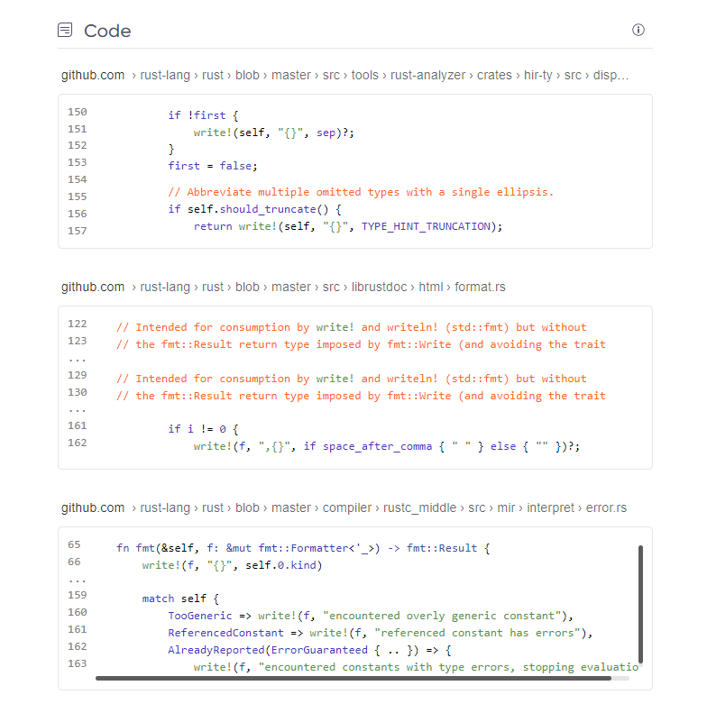

# Code Searching

Kagi supports developers with code samples in response to search results.

For example, consider searching for <i>write!</i>

{data-zoomable}

The results are not relevant to a developer, however we can further refine our search by applying the "Programming" lens.

{data-zoomable}

Now the results are significantly more relevant to a developer AND now feature code samples.

{data-zoomable}

With Kagi Code Search you can find the code samples you are looking for, even in the depths of GitHub!

{data-zoomable}

Remember to apply the correct lens, or create your own, to help refine your code searches.
