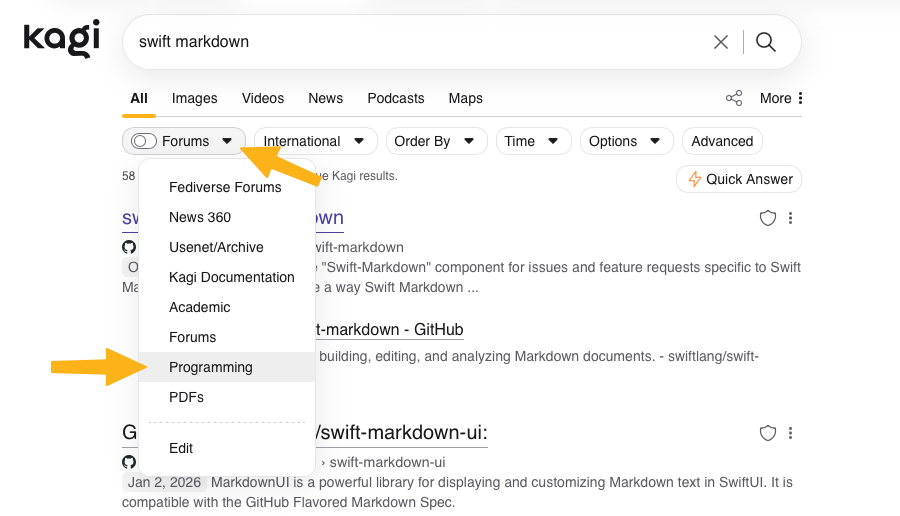
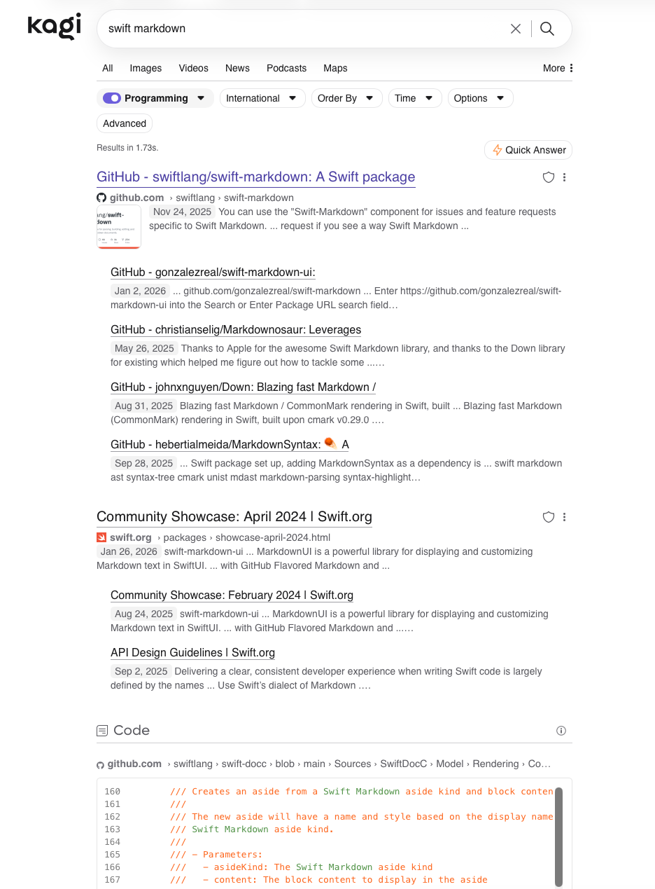
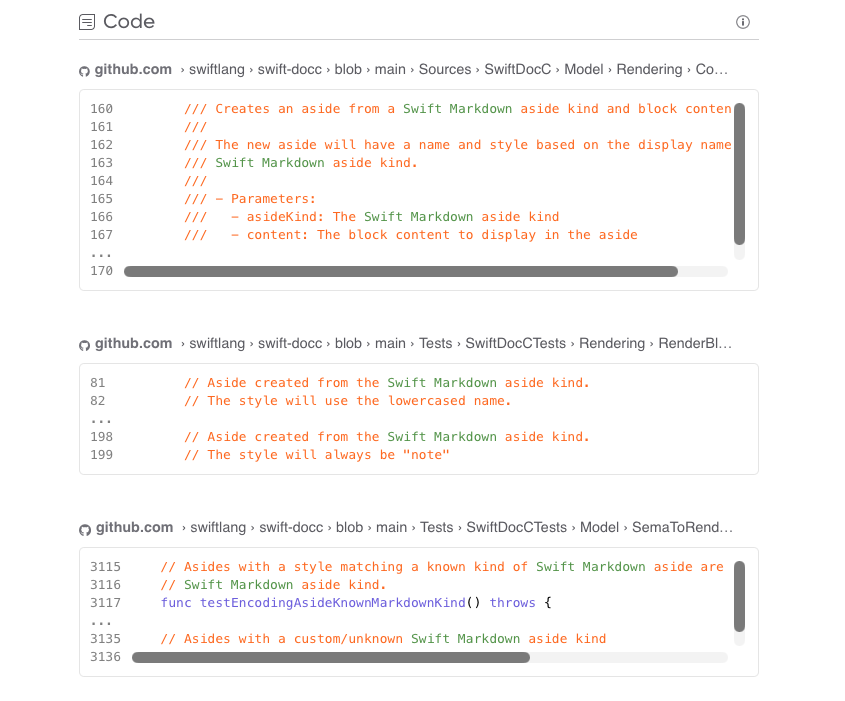

# Code Searching

Kagi supports developers with code samples in response to search results.

For example, lets search for ```swift markdown```:

{data-zoomable}

The results can be useful to a developer, however we can further refine our search by applying the ```Programming``` lens:

{data-zoomable}

Now the results are significantly more relevant to a developer **and** now have code samples:

{data-zoomable}

With Kagi Code Search you can find the code samples you are looking for, even in the depths of GitHub!

{data-zoomable}
