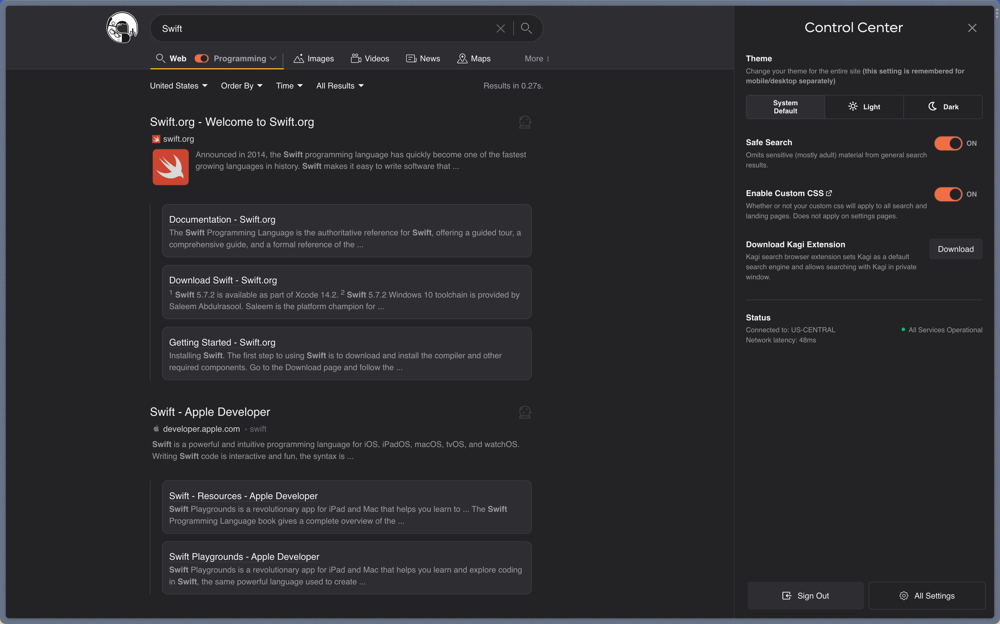
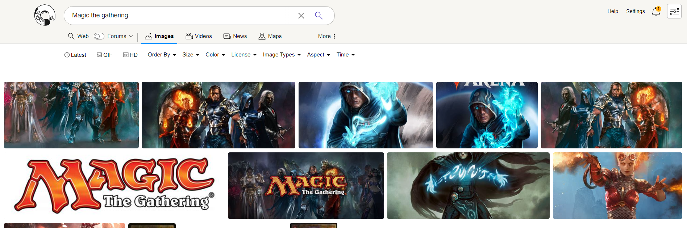

# Customizing Kagi CSS

[Cascading Style Sheets](https://en.wikipedia.org/wiki/CSS) (CSS) is a language used to stylize HTML elements in web pages. Using CSS, you can fully customize Kagi's search and landing pages from your [Appearance settings](https://kagi.com/settings?p=custom_css).

> Custom CSS does not apply to Settings pages, and is limited to 10,000 characters.

Use the `no_css` query parameter (for example, `kagi.com/search?q=test&no_css`) to disable your custom CSS if something horribly breaks!

## User Themes

Our users have built and shared the following themes:

- [Brave Theme](https://gist.github.com/httpjamesm/a9c6b3b115cb09c483e53ad5f5ec9b99) by [http.james](https://httpjames.space/)
- [Cozy Theme](https://gist.github.com/jamesjlyons/26682982319ca84b7bee991eb158ce49) by [James Lyons](https://jameslyons.design)
- [Minimal Fav Color](https://github.com/MattRangel/kagi-search-custom-css) by [Matt Rangel](https://github.com/MattRangel)
- <details><summary>Familiar Dark Theme by 🅻uci</summary>

    User 🅻uci shared a Familiar Dark Theme in the  [Kagi Discord](https://kagi.com/discord) server **\#appearance** channel.

    

    The following only works when you have applied the Dark Theme in your appearance.

    

    You will also need to make sure the Default Dark Theme is set to "Moon Dark".

    

    To use this theme apply the following custom CSS in your [Appearance settings](https://kagi.com/settings?p=custom_css).

    ```
    body, html, * {
      font-family: -apple-system, BlinkMacSystemFont, "Segoe UI", "Noto Sans", Helvetica, Arial, sans-serif, "Apple Color Emoji", "Segoe UI Emoji";
    }

    .theme_moon_dark {
      --background-color: #202124;
      --header-bg: var(--background-color);
      --control-center-bg: var(--background-color);
      --filter-dd-bg: var(--background-color);
      --result-item-title-border: var(--background-color);
      --result-item-title-visited-border: var(--background-color);
      --result-item-title-border_hover: var(--search-result-title);
      --search-result-date-bg: rgba(255, 255, 255, 0.15);
      --search-result-date-new-bg: rgba(255, 255, 255, 0.15);
      --cheatsh_background: rgba(255, 255, 255, 0.1);
      --kagi-accent: rgba(255, 255, 255, 0.1);
      --tabs-round-bg: rgba(255, 255, 255, 0.1);
      --dd-hover-bg: rgba(255, 255, 255, 0.1);
      --inline-widget-bg: var(--color-secondary-dim_6);
      --dd-list-input-bg: rgba(255, 255, 255, 0.1);
      --control-center-dd-list-bg_hover: rgba(255, 255, 255, 0.1);
      --related-item-bg: rgba(255, 255, 255, 0.1);
      --btn-group-bg: rgba(255, 255, 255, 0.1);
      --video-item-bg: rgba(255, 255, 255, 0.1);
      --search-result-title: #8ab4f8;
      --color_link: var(--search-result-title);
      --color-primary_visited: #c58af9;
      --search-result-title-hover: var(--search-result-title);
      --color-primary_hover: var(--search-result-title-hover);
      --footer-bg: #171717;
      --m_sri_gap_color: var(--background-color);
      --site_info_bottom_bg: transparent;
      --site_info_bg: var(--background-color);
      --search-result-gap: 32px;
    }
    .theme_moon_dark ._0_more_search_box {
      border-radius: inherit;
    }
    .theme_moon_dark ._0_more_search_user_bangs_list {
      padding-bottom: 0;
    }
    .theme_moon_dark ._0_more_search_box_share_button {
      margin-bottom: 0;
    }
    .theme_moon_dark .k_ui_dropdown_data_list {
      padding: 0;
      border-radius: 12px;
      top: 28px !important;
    }
    .theme_moon_dark .k_ui_dropdown_data_list .list_items {
      border-radius: 12px;
      margin-bottom: 0;
    }
    .theme_moon_dark .k_ui_dropdown_data_list .list_items > a {
      padding: 6px 25px !important;
      border-radius: 0;
    }
    .theme_moon_dark .k_ui_dropdown_data_list .list_items > a:hover {
      border-radius: unset !important;
    }
    .theme_moon_dark .k_ui_dropdown_data_list hr {
      margin: 0;
    }
    .theme_moon_dark .box:hover {
      outline: 2px solid var(--color-primary_hover);
    }
    .theme_moon_dark .videoResultItem, .theme_moon_dark ._0_img-results .item, .theme_moon_dark .newsResultItem .newsResultBody .newsResultImage img {
      border-radius: 12px;
    }
    .theme_moon_dark ._0_img-results .item .imageInfo > div.b {
      background: linear-gradient(360deg, rgba(0, 0, 0, 0.6) 0, rgba(0, 0, 0, 0) 100%);
    }
    .theme_moon_dark ._0_img-results .item .imageInfo > div.t {
      background: linear-gradient(360deg, rgba(0, 0, 0, 0) 0, rgba(0, 0, 0, 0.6) 100%);
    }
    .theme_moon_dark .clipboardCopy ._0_copied_tooltip {
      background-color: rgba(13, 13, 14, 0.9);
    }
    .theme_moon_dark .sri-group .__dl {
      padding-bottom: 0;
    }
    .theme_moon_dark ._0_img-results .item img {
      object-fit: cover;
    }
    .theme_moon_dark .main-footer {
      padding-bottom: 2rem;
    }
    .theme_moon_dark ._0_queryInfo {
      padding: 0;
    }
    .theme_moon_dark .__sri-title .__sri_title_link, .theme_moon_dark .__srgi-title {
      font-weight: 600;
    }
    .theme_moon_dark .__sri-title .__sri_title_link b, .theme_moon_dark .__srgi-title b {
      font-weight: 800;
    }
    .theme_moon_dark ._0_page-seperator {
      border-bottom: 1px dashed var(--color-primary-dim_1);
    }
    .theme_moon_dark .related-searches:empty {
      margin-top: 30px;
    }
    .theme_moon_dark .mob .auto_item {
      padding: 6px 10px;
    }
    .theme_moon_dark .mob #m_wiki {
      color: var(--color-secondary-dim_6);
    }
    .theme_moon_dark .mob #m_wiki .collapse-icon {
      color: var(--color-primary);
    }
    .theme_moon_dark .mob #m_wiki .wiki-content a {
      text-decoration: underline;
    }
    .theme_moon_dark .auto_suggestions .auto_suggestions_lenses {
      border-top: none;
    }
    ```

  </details>
- <details><summary>Enhanced Dark Theme by El Dude</summary>

    User El_Dude shared an Enhanced Dark Theme in the  [Kagi Discord](https://kagi.com/discord) server **\#appearance** channel.

    

    The following only works when you have applied the Dark Theme in your appearance.

    

    You will also need to make sure the Default Dark Theme is set to "Royal Blue".

    

    To use this theme apply the following custom CSS in your [Appearance settings](https://kagi.com/settings?p=custom_css).

    ```css

    @import url('https://fonts.googleapis.com/css2?family=Space+Grotesk:wght@300;400;500;600;700&display=swap');
    .theme_dark {
      --k-accent: #f16d43;
      --k-accent-alt: #62a09d;
      --k-accent-hover: #dd633d;
      --k-accent-background: rgba(241, 109, 67, 0.2);
      /* CONTEXT COLORS */
      --k-background-primary: #232326;
      --k-surface-primary: #2e2e32;
      --k-surface-secondary: #3e3e44;
      --k-surface-tertiary: #5f5f68;
      --k-border: #3d3d43;
      /* TEXT COLORS */
      --k-foreground-primary: #f4f2f4;
      --k-foreground-secondary: #dcdbdd;
      --k-foreground-tertiary: #a09fa6;
      --k-foreground-quaternary: #6d6c74;
      --k-foreground-quinary: #4d4c52;
      --cheatsh_background: var(--k-surface-primary);
      --cheatsh_ef186: #d7d787;
      --cheatsh_ef15: #fdf6e3;
      --cheatsh_ef148: #afd700;
      --cheatsh_ef81: #5fd7ff;
      --color-scheme: dark;
      --background-color: var(--k-background-primary);
      --background-color_opac: rgba(38, 40, 55, 0);
      --page-text-color: var(--k-foreground-tertiary);
      --beta-tag-bg: #4835bc;
      --beta-tag-text: #f2f0e7;
      --beta-tag-inside-corners: #9debfe;
      --login_page_bg: var(--k-background-primary);
      --login_page_divider_strap: var(--k-border);
      --login_page_input_bg: var(--k-background-primary);
      --color-primary: var(--k-foreground-primary);
      --color-secondary: var(--k-foreground-secondary);
      --color_link: var(--accent);
      --color-primary_hover: var(--accent-hover);
      --color-primary_visited: var(--accent-hover);
      --input-bg: var(--k-background-primary);
      --bangs_tag_bg: var(--color-primary);
      --doggo-color-1: #e5e5e5;
      --doggo-bg-color: var(--k-surface-secondary);
      --landing-page-clouds-opacity: 0.8;
      --quick-search-bg: var(--k-surface-primary);
      --quick-search-icon: #4835bc;
      --tabs-round-bg: var(--k-surface-primary);
      --tabs-round-active-bg: var(--k-surface-secondary);
      --color_cat_buttons: var(--color-primary-dim_7);
      --color_cat_buttons_active: var(--color-secondary);
      --color_cat_buttons_bg: var(--color-primary);
      --color_cat_buttons_border: var(--color-primary-dim_2);
      --color_cat_buttons_border_hover: var(--color-primary-dim_5);
      --header-bg: var(--k-surface-primary);
      --header-border: var(--k-border);
      --app-logo: var(--k-surface-secondary);
      --app-logo-bg: #ffb319;
      --footer-bg: var(--k-surface-primary);
      --control-center-dd-bg: var(--k-surface-primary);
      --control-center-dd-bg_hover: var(--k-surface-secondary);
      --control-center-dd-list: var(--k-surface-primary);
      --control-center-dd-list-bg_hover: var(--k-surface-secondary);
      --control-center-bg: var(--k-background-primary);
      --control-center-dd-border: #43465b;
      --filter-dd-bg: var(--k-background-primary);
      --cc-filters-active-bg: var(--k-border);
      --k-tooltip-bg: var(--k-surface-secondary);
      --k-tooltip-text: var(--k-foreground-tertiary);
      --dd-hover-bg: var(--k-surface-secondary);
      --dd-list-input-bg: var(--k-background-primary);
      --not-found-bubble-bg: var(--k-surface-secondary);
      --app-sidebar-bg: var(--k-surface-primary);
      --app-sidebar-item-border: var(--k-border);
      --app-sidebar-link: var(--k-foreground-secondary);
      --app-sidebar-nav-item-bg_hover: var(--k-surface-secondary);
      --app-sidebar-nav-item-link_hover: var(--k-foreground-primary);
      --app-sidebar-nav-item-icon_hover: var(--k-accent);
      --app-sidebar-lense-link: var(--k-foreground-tertiary);
      --app-sidebar-lense-link_hover: var(--k-foreground-primary);
      --ranked-box-overlay-bg: rgba(18, 18, 18, 0.9);
      --ranked-box-wrapper-bg: var(--k-surface-primary);
      --ranked-box-connection-secure: #60aa55;
      --ranked-box-connection-insecure: #fd6820;
      --ranked-box-icon-normal-bg: var(--ranked-box-wrapper-bg);
      --ranked-box-tracker-no-info: var(--k-foreground-tertiary);
      --ranked-box-toggle-switch-ch1-text: var(--color-primary);
      --ranked-box-toggle-switch-ch3-svg-bg: var(--color-secondary);
      --ranked-box-settings-btn-bg: var(--ranked-box-wrapper-bg);
      --rank-icon-shard-color: #a1a1a1;
      --rank_icon_boosted: #ffb319;
      --btn-group-bg: var(--k-background-primary);
      --result-item-title-border: var(--k-border);
      --result-item-title-border_hover: var(--k-border);
      --result-rank-icon-stroke_promoted: var(--background-color);
      --k-tooltip-tracker_bg: var(--k-surface-secondary);
      --result-item-highlight: #9debfe;
      --search-result-content-text: var(--color-primary-dim_6);
      --search-result-group-item-link: var(--color-primary-dim_9);
      --search-result-url-link: var(--color-primary-dim_9);
      --search-result-title: var(--k-foreground-primary);
      --search-result-date-bg: var(--k-foreground-quaternary);
      --search-result-date-new-bg: var(--k-surface-tertiary);
      --search-result-date-new: var(--k-foreground-tertiary);
      --inline-header-title: var(--k-foreground-primary);
      --inline-widget-bg: var(--k-surface-primary);
      --inline-header-border: var(--k-border);
      --inline-domain-tag-bg: var(--k-surface-secondary);
      --related-item-bg: var(--k-surface-primary);
      --username-button-bg: var(--k-surface-secondary);
      --ranked-tabs-border: var(--k-border);
      --video-item-bg: var(--k-surface-primary);
      --auto-sugg-bg_hover: var(--k-surface-secondary);
      --widget-progress_bar: #e5e5e5;
      --translate-fc_icon: var(--k-foreground-quaternary);
      --rating-star_background: var(--k-surface-secondary);
      --wiki-title: var(--k-foreground-primary);
      --wiki-content-links: var(--k-foreground-primary);
      --toggle-switch-knob-bg: var(--k-surface-secondary);
      --m_sri_gap_color: var(--k-border);
      --image_brightness: 85%;
      --onboarding_theme_options_dark_visibility: flex;
      --onboarding_theme_options_light_visibility: none;
      --onb_theme_light_preview_box: none;
      --maps-highlight: var(--k-surface-primary);
      --search-result-date-bg: var(--k-surface-tertiary);
    }
    body, html {
      color: var(--k-foreground-tertiary);
    }
    .sidebar-filter-nav-form .sidebar-filter-nav > .filter-item .dd-list {
      background-color: hsla(240, 4%, 19%, 0.9);
      backdrop-filter: blur(5px);
      border-radius: 8px;
      border: 1px solid var(--k-border);
    }
    /* TITLEEEEEEE */
    .__sri-title .__sri_title_link {
      position: relative;
    }
    .__sri-title .__sri_title_link:hover {
      color: var(--k-accent);
    }
    .__sri-title .__sri_title_link {
      color: var(--k-foreground-primary);
      border-bottom: 1px solid hsl(255, 0%, 50%, 0);
      font-size: 1.25rem;
      font-family: 'Space Grotesk', sans-serif;
    }
    .__sri-title .__sri_title_link:visited {
      color: var(--k-foreground-quaternary);
      border-bottom: 1px solid var(--k-accent-background);
    }
    /* VISITED LINKIES */
    .__sri_title_link:visited::before {
      content: '';
      aspect-ratio: 1/1;
      width: 10px;
      background: var(--k-accent);
      position: absolute;
      left: -24px;
      border-radius: 50%;
      top: 12px;
    }
    .__sri-time {
      background-color: var(--k-border);
      border-radius: 5px;
      padding: 0 6px;
      display: inline-block;
    }
    .related-items {
      display: grid;
      margin-top: 0;
      padding-right: 0;
      grid-template-columns: 1fr 1fr;
      gap: 0.6em;
    }
    .related-items a {
      background-color: var(--k-surface-primary);
      border-radius: 5px;
      color: var(--color-primary);
      display: flex;
      margin-bottom: 0;
      width: auto;
    }
    .related-items a:hover {
      background-color: var(--k-surface-secondary);
      color: var(--color-secondary);
    }
    .related-items a:nth-child(odd) {
      margin-right: 0;
    }
    .related-items a:nth-child(even) {
      margin-left: 0;
    }
    .btn.--primary:hover {
      color: var(--k-foreground-primary);
      background-color: var(--k-surface-secondary);
    }
    .btn.--primary,
    .ranked-item-tab-links a.--primary {
      color: var(--k-foreground-primary);
      background-color: var(--k-surface-primary);
    }
    .btn.--secondary,
    .ranked-item-tab-links a {
      color: var(--k-foreground-primary);
      border: 1px solid var(--k-border);
    }
    .btn.--secondary:hover,
    .ranked-item-tab-links a:hover {
      border: 1px solid var(--k-border);
      color: var(--k-foreground-primary);
      background-color: var(--k-surface-primary);
    }
    ._0_app_theme_switch_box button.checked ._0_active_theme_name,
    ._0_app_theme_switch_box button > input:checked + ._0_active_theme_name {
      background-color: var(--k-surface-primary);
      color: var(--k-foreground-primary);
    }
    ._0_app_theme_switch_box button {
      border: 1px solid var(--k-border);
    }
    .k_ui_toggle_switch {
      --bg-color: transparent;
      --active-bg-color: var(--k-accent);
      --border-color: var(--k-border);
      --active-border-color: var(--k-border);
    }
    .quick-settings .quick-settings-separator {
      border-top: 1px solid var(--k-border);
    }
    ._0_d_info_ranking.k_ui_btn_group input:checked + .box.k_ui_btn,
    ._0_sri-w-highlight .box.searchResultAnswer,
    .box.--active,
    .box._0_sri-w-highlight,
    .box:hover {
      outline: 3px solid var(--k-accent);
    }
    .__sri-url .path {
      color: var(--k-foreground-quaternary);
    }
    /* SUB RESULT CARD */
    .sri-group .__dl {
      padding-bottom: 5px;
      display: grid;
      grid-template-columns: repeat(2, 1fr);
      gap: 1rem;
    }
    .sri-group .__dl .__srgi {
      margin-top: unset;
      width: auto;
      margin-bottom: 0;
      padding-right: 0.7em;
    }
    .__srgi {
      display: block;
      padding: 0.7em;
      background: var(--k-surface-primary);
      border-radius: 10px;
      border: 1px solid var(--k-border);
      width: auto;
      min-width: -webkit-fill-available;
    }
    .sri-group .sr-group:has(.__srgi) {
      margin-top: 20px;
      margin-bottom: 40px;
      border-left: 1px solid var(--k-border);
    }
    .land_tooltip_message {
      border: 1px solid var(--k-border);
      background-color: var(--k-surface-secondary);
    }
    .k_ui_btn_group {
      background-color: var(--btn-group-bg);
      border: 1px solid var(--color-primary-dim_3);
      border-radius: 8px;
      display: flex;
      font-size: 0.875rem;
    }
    ._0_d_info_ranking.k_ui_btn_group input:checked + .k_ui_btn,
    ._0_sri-w-highlight .k_ui_btn_group .k_ui_btn.searchResultAnswer,
    .k_ui_btn_group ._0_sri-w-highlight .k_ui_btn.searchResultAnswer,
    .k_ui_btn_group .k_ui_btn.--active,
    .k_ui_btn_group .k_ui_btn._0_sri-w-highlight.box,
    .k_ui_btn_group .k_ui_btn:hover {
      background-color: var(--color-primary-dim_3);
      color: var(--color-primary);
    }
    .k_ui_dropdown_data_list {
      padding: 0.6em 0;
      background-color: var(--k-surface-primary);
      border-radius: 10px;
      border: 1px solid var(--k-border);
      min-width: 160px;
    }
    .k_ui_dropdown_data_list .list_items > ._0_k_ui_dropdown_li,
    .k_ui_dropdown_data_list .list_items > a {
      color: var(--k-foreground-primary);
      padding: 0.4em 2em 0.4em 0.8em;
      border-radius: 0 !important;
    }
    .k_ui_dropdown_data_list .list_items>._0_k_ui_dropdown_li .icon_check, .k_ui_dropdown_data_list .list_items>a .icon_check {
      left: auto;
      right: 10px;
    }
    ._0_lenses .k_ui_dropdown hr {
      border-top: 1px solid var(--k-border);
    }
    .widget_codeblock {
      border: 1px solid var(--k-border);
      background-color: var(--k-surface-primary);
    }
    .widget_codeblock .lines a:hover {
      background: var(--k-surface-secondary);
      color: inherit;
      border-radius: 5px;
    }
    ._0_page-seperator {
      position: relative;
      margin-bottom: 50px;
      margin-top: 10px;
      border-bottom: 1px solid var(--k-border);
    }
    .searchResultAnswers {
      padding-top: 12px;
      margin-bottom: 1em;
    }
    .searchResultAnswers .widgetItems .searchResultAnswer {
      transition: background-color 150ms ease-in-out;
      border-radius: 5px;
      background-color: var(--k-surface-primary);
      border: 1px solid var(--k-border);
    }
    .searchResultAnswers .widgetItems .searchResultAnswer:hover {
      transition: background-color 150ms ease-in-out;
      background-color: var(--k-background-primary);
      border: 1px solid var(--k-border);
    }
    .searchResultAnswers .widgetItems .searchResultAnswer:hover .searchResultAnswerDate {
      color: var(--k-foreground-secondary);
    }
    .searchResultAnswers .widgetItems .searchResultAnswer:hover .searchResultAnswerUpvotes {
      color: var(--k-foreground-secondary);
    }
    .searchResultAnswers .widgetItems .searchResultAnswer:hover .searchResultAnswerUpvotes i {
      color: var(--k-accent);
    }
    .ranked-box-wrapper {
      background-color: var(--k-surface-primary);
      border-radius: 5px;
      box-shadow: 0 0 20px var(--ranked-box-shadow);
    }
    .d-info-body {
      flex-wrap: wrap;
      background-color: var(--k-surface-secondary);
      border-radius: 5px;
    }
    .widgetContent .widgetItems .widgetItem {
        border: 1px solid var(--k-border);
    }
    .widgetContent .widgetItems .widgetItem:hover {
      background-color: var(--k-background-primary)
    }
    .wikipediaRelatedSection .wikipediaRelatedItems {
      display: grid;
      grid-template-columns: repeat(3, 1fr);
      gap: 0.5rem;
      height: auto;
      align-content: stretch;
    }
    .wikipediaRelatedSection .wikipediaRelatedItems .wikipediaRelatedArticle {
      margin-bottom: 0;
    }
    .wikipediaRelatedSection .wikipediaRelatedItems .wikipediaRelatedArticle div:first-child {
      width: 100%;
      height: 100%;
    }
    .wikipediaRelatedSection .wikipediaRelatedItems .wikipediaRelatedArticle a {
      display: flex;
      flex-direction: column;
      border-bottom: unset;
      text-align: left;
      gap: 0.5em;
      padding: 0.6em;
      border-radius: 10px;
      background-color: var(--k-surface-primary);
      height: 100%;
      border: 1px solid var(--k-border);
    }
    .wikipediaRelatedSection .wikipediaRelatedItems .wikipediaRelatedArticle img {
      width: 100%;
      border-radius: 5px;
      object-fit: cover;
      aspect-ratio: 3/4;
      height: 100%;
      max-width: 100%;
      max-height: 100%;
      height: 100%;
    }
    .wikipediaRelatedSection .wikipediaRelatedItems .wikipediaRelatedArticle h4 {
      font-size: .875rem;
      margin: 0;
      font-weight: 400;
      line-height: 1.375rem;
      display: -webkit-box;
      -webkit-box-orient: vertical;
      -webkit-line-clamp: 2;
      overflow: hidden;
    }
    .freeScroller {
      padding: 4px 4px 12px 4px;
    }
    .widgetContent .widgetItems .widgetNews .widgetItemBody {
      margin-top: 0.6em;
    }
    .widgetContent .widgetItems .widgetItem .widgetItemBody {
      padding: 0 0.6em;
      margin-bottom: 0.6em;
    }
    .widgetContent .widgetItems .widgetItem {
      border-radius: 10px;
    }
    .widget-header {
      padding: 0 10px;
      border-radius: 0;
      order: 3;
      border-top: 1px solid var(--k-border);
    }
    .auto_suggestions {
      background-color: var(--k-surface-primary);
      border: 1px solid var(--k-border);
      top: 97%;
    }
    .auto_suggestions .auto_item {
      margin-left: 0;
      ma: 0;
      margin-right: 0;
      border-radius: 7px;
      padding: 5px;
    }
    .search-form .search-input-container {
      border: 1px solid var(--k-border);
      border-radius: 24px;
      background-color: var(--k-background-primary);
      position: relative;
      z-index: 60;
    }
    .search-form .search-input {
      border-radius: 0;
      background-color: transparent;
      border-radius: 24px 0 0 24px;
    }
    .search-form .search-form-icons {
      border-radius: 0 24px 24px 0;
      background-color: transparent;
      padding-right: 9px;
    }
    .auto_suggestions {
      position: absolute;
      background-color: var(--k-surface-primary);
      border: 1px solid var(--k-border);
      transform-origin: top;
      transition: transform 150ms ease-in-out;
      transform: scaleY(0);
    }
    .auto_suggestions .auto_suggestions_lenses {
      padding: 10px 15px 10px 55px;
      border-top: 1px solid var(--k-border);
      margin-top: 0;
    }
    .search-form .search-input-container:has(+ .auto_suggestions.--visible) {
      border-radius: 24px 24px 0 0;
    }
    .search-form:has(.search-input-container):has(.autosugg-landing > .auto_suggestions.--visible) .search-input-container {
      border-radius: 24px 24px 0 0;
    }
    .cheatsh.hnd .h-template-title {
      color: var(--k-foreground-primary);
    }
    .cheatsh.hnd .h-template-table {
      border: 1px solid var(--k-border);
      border-radius: 10px;
      margin-top: 5px;
      margin-bottom: 1.5em;
    }
    .cheatsh .cheatsh_content {
      max-height: 710px;
    }
    .cheatsh .cheatsh_show_more_box {
      z-index: 4;
    }
    .cheatsh .cheatsh_show_more_box span {
      z-index: 6;
      padding: 0.6em;
      background: var(--k-surface-primary);
      border-radius: 5px;
      transition: background-color .15s ease-out;
    }
    .cheatsh .cheatsh_show_more_box span:hover {
      background-color: var(--k-surface-secondary);
    }
    .__sri-time.--new {
      color: var(--k-accent);
      background-color: var(--k-accent-background);
    }
    .wikipediaRelatedSection .wikipediaRelatedItems .wikipediaRelatedArticle h4 {
      width: auto;
    }
    .wikipediaRelatedSection .wikipediaRelatedItems .wikipediaRelatedArticle div:first-child {
      width: auto;
      height: auto;
      display: block;
    }
    .wikipediaTable {
      border-top: 1px solid var(--k-border);
    }
    .box {
      border-radius: 10px;
    }
    .box:hover {
      outline: 2px solid var(--k-accent);
    }
    ._0_img-results .images-wrapper {
      gap: 0.6em;
    }
    ._0_img-results .item img {
      height: 120px;
      border-radius: 10px;
      border: none;
      background: var(--k-background-primary);
    }
    ._0_more_search_user_bang_item ._0_more_search_user_bang_item_grabber {
      color: var(--k-foreground-quaternary);
    }
    ._0_more_search_bangs_list_add_box:hover {
      background-color: var(--k-surface-secondary);
    }
    ._0_more_search_user_bang_item._0__active, ._0_more_search_user_bang_item:hover {
        background-color: var(--k-surface-secondary);
    }
    ._0_more_search_bangs_list_add_box {
      border-bottom: 1px solid var(--k-border);
    }
    ._0_more_search_box_title {
      border-bottom: 1px solid var(--k-border);
    }
    ._0_more_search_box_customize_button {
      border-bottom: 1px solid var(--k-border);
    }
    ._0_more_search_box_share_button:hover {
      background-color: var(--k-surface-secondary);
    }
    ._0_more_search_box {
      background-color: var(--k-surface-primary);
      border: 1px solid var(--k-border);
      border-radius: 10px;
    }
    ._0_more_search_box_customize_button:hover {
      background-color: var(--k-surface-secondary);
    }
    .dropdown .dd-list .list_filter_wrpr {
      padding: 0.6em;
    }
    .dropdown .dd-list ._0_list_items {
      max-height: 360px;
    }
    .k_ui_dropdown_data_list .list_items {
      margin-bottom: 0;
    }
    .k_ui_toggle_switch.--mini .k_ui_toggle_switch_bar {
      --border-color: var(--k-background-primary);
    }
    .btn.--yellow, .ranked-item-tab-links a.--yellow {
      color: var(--k-background-primary);
      border: 1px solid var(--k-accent);
      background-color: var(--k-accent);
    }
    .k_ui_toggle_switch.--mini .k_ui_toggle_switch_bar {
      --border-color: var(--k-border);
    }
    .k_ui_toggle_switch.--enabled .k_ui_toggle_switch_bar {
      background-color: var(--k-accent);
    }
    .k_ui_toggle_switch.--mini .k_ui_toggle_switch_bar {
      --border-color: var(--k-border);
      --bg-color: var(--k-background-primary);
    }
    .search-form .search-submit-wrapper {
      margin-top: 1em;
    }
    .search-form .search-input {
      color: var(--k-foreground-primary);
    }
    .search-form .doggo-sit {
      bottom: -1px;
      opacity: 1;
    }
    .search-form .auto_suggestions {
      border-radius: 0 0 24px 24px;
      border: 1px solid var(--k-border);
      padding-top: 0
    }
    .k_ui_dropdown.__transparent .k_ui_dropdown_data_list {
      background-color: var(--k-surface-primary);
    }
    .k_ui_dropdown_data_sort_list_wrpr {
      padding: .6em;
    }
    .k_ui_dropdown_data_list .list_items .line_sep {
      border-bottom: 1px dashed var(--k-border);
      margin: 0 0.6em 0.6em 0.6em;
    }
    .landing_cat_buttons {
      background-color: var(--k-background-primary);
    }
    #adv_search_btn:checked~.landing-category-select {
      display: flex;
      flex-direction: column;
      align-items: center;
    }
    .auto_suggestions .auto_suggestions_in {
      border-top: 1px solid var(--k-border);
      padding-top: 12px;
      margin-bottom: 0;
      padding: 0.4em;
    }
    .land_adv_search_btn {
      display: none;
    }

    ```
    css```

  </details>
- <details><summary>Slimmed Down Theme by rasti</summary>

    User rasti shared a Slimmed Down Theme in the [Kagi Discord](https://kagi.com/discord) server **\#appearance** channel. This theme removes some of the visual components that are present in Kagi Search, compare

    

    with the following slimmed down page:

    

    As another example consider

    

    as compared with the following slimmed down page:

    

    To use this theme apply the following custom CSS in your [Appearance settings](https://kagi.com/settings?p=custom_css).

    ```css
    ._0_lenses .k_ui_dropdown {
      display: none;
    }
    ._0_lenses {
      display: none;
    }
    .serp_nav_end .k_ui_dropdown, .serp_nav_end .k_ui_dropdown_data_list {
      display: none;
    }
    .sri_more_menu_box .sri_more_menu {
      display: none;
    }
    .sidebar-filter-nav-form .sidebar-filter-nav {
      display: none;
    }
    ._0_queryInfo {
      display: none;
    }
    .top-panel {
    display: none;
    }
    ._0_item.n_ma{
    display: none;
    }
    .serp-nav{
    margin-left: 4px;
    }
    .search-result, .sri-group {
        margin-left: -17px;
        margin-right: -17px;
        padding: 15px;
        margin-bottom: 0px;
    border-bottom: 0px;
    }
    ._0_item.n_ne {
    display: none;
    }
    .m-h {
        padding: 0 10px;
        border-bottom: 0px solid var(--color-primary-dim_2);
    }

    .m-h .search-form-icons {
        display: none;
    }
    .theme_moon_dark {
    --search-result-title: #a0c5ff;
    --result-item-title-border: #141414;
    --background-color: #141414;
    --site_info_bottom_bg: #141414;
    }
    .theme_dark {
    --search-result-title: #a0c5ff;
    --result-item-title-border: #141414;
    --background-color: #141414;
    --site_info_bottom_bg: #141414;
    }
    .theme_calm_blue {
    --background-color: #f2f2f6
    }
    .sri-url .sri_url_path_box {
    }
    .sri-url .path {
        display: none;
    }
    .domain-favicon {
      display: none;
    }
    .m-h .m-h-i {
        height: 65px;
    }
    .crisp-edges {
        image-rendering: optimizespeed;
        image-rendering: crisp_edges;
    }
    .sri-desc {
        font-size: .88rem;
        line-height: 1.4;
    }

    .rewrite_icon {
        margin-left: 0px;
    }
    .m-image-domain {
        display: none;
    }
    .m-image-res {
        display: none;
    }
    .btn.--secondary-s, .ranked-item-tab-links a.--secondary-s {
        display: none;
    }
    .m-image-preview-buttons a i {
        display: none;
    }
    .m-image-preview-data-box span:first-child {
        display: none;
    }
    ._0_img-results .item img.fade {
        opacity: 0;
        transition: none;
    }
    .quick-search-btn {
        transition: transform .4s ease-in-out;
    }
    .d-info-box-title-header {
        height: 164px;
    }
    .videoResultItem .videoResultRight .videoResultDesc {
        display: none;
    }
    .instant-answer .ia-body .ia-title>div {
        display: none;
    }
    .inline-content+.search-result, .inline-content+.sri-group {
        border-top: 0px solid #a0c5ff
    }
    .instant-answer {
        padding-bottom: 13px;
        padding-top: 13px;
        border-top: 1px solid #a0c5ff;
        border-bottom: 1px solid #a0c5ff;
    }
    ```

  </details>

You can collaborate on themes in the **\#appearance** channel on the [Kagi Discord](https://kagi.com/discord) server or the community-managed [subreddit](https://www.reddit.com/r/KagiUserCSS/).

## Learn

If you want to learn more about how to customize your Kagi Search CSS, below is a video tutorial. The video features a slightly older design of Kagi Search, but the CSS principles are the same.

<iframe width="560" height="315" src="https://www.youtube-nocookie.com/embed/Xpk5TAhGasc" title="YouTube video player" frameborder="0" allow="accelerometer; autoplay; clipboard-write; encrypted-media; gyroscope; picture-in-picture" allowfullscreen></iframe>

Also, here are some web resources about how to use CSS in general:

- [MDN Web Docs](https://developer.mozilla.org/en-US/docs/Learn/CSS/First_steps)
- [W3Schools](https://www.w3schools.com/css/css_intro.asp)
- [Khan Academy](https://www.khanacademy.org/computing/computer-programming/html-css/intro-to-css/pt/css-basics)
- [freeCodeCamp](https://www.freecodecamp.org/news/get-started-with-css-in-5-minutes-e0804813fc3e/)
