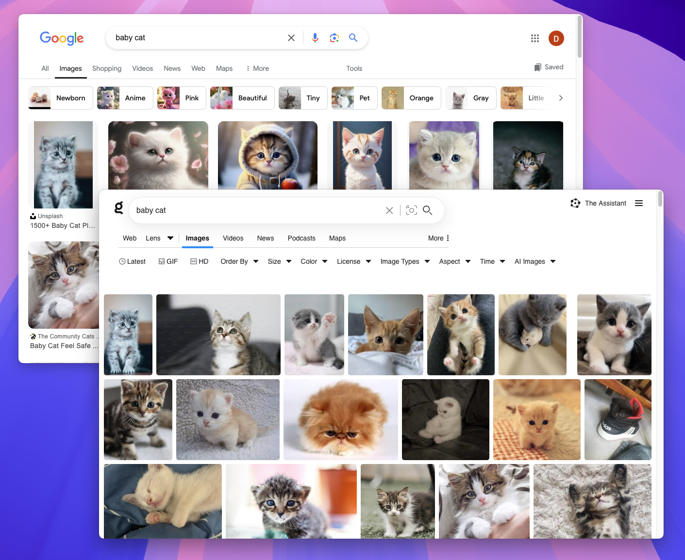

# Exclude AI-Generated Images

[Kagi Image Search](https://kagi.com/images) automatically downranks images from websites with a high proportion of AI-generated content.

{width=500px data-zoomable}

If you prefer to completely exclude websites with AI-generated images from your search results, you can use the **AI Images** filter.

Note that, since there is currently no reliable way to automatically identify AI-generated images, this feature relies on the website's reputation rather than analyzing individual images. As a result, some AI-generated content may still appear in the results.

## Our Approach to AI-Generated Images

Our decision to offer this feature aligns with our [philosophy on AI integration](../why-kagi/ai-philosophy.md) and stems from several key considerations:

1. **Factual accuracy**: AI-generated images, like text-based AI content, can sometimes be misleading or inaccurate. By allowing users to filter out AI-generated images, we help prioritize content that is more likely to be grounded in real-world information and human creativity.

2. **Authenticity and emotional resonance**: While AI-generated images can be impressive, they often lack the depth, creativity, and emotional connection of human-created art. This feature aims to surface more authentic and meaningful images that reflect genuine human experiences and perspectives.

3. **Responsible AI use**: We believe in using AI tools responsibly without overly relying on them. By offering the option to exclude AI-generated content from external sources, we support access to information that aligns with preferences for human-created content.

4. **User empowerment**: By offering this option, we're enabling our users to make informed decisions about the content they consume, while also encouraging a web ecosystem that values human creativity and authenticity.

We acknowledge that our current method of filtering based on website reputation isn't perfect. However, it represents our pragmatic approach to addressing a complex issue.
