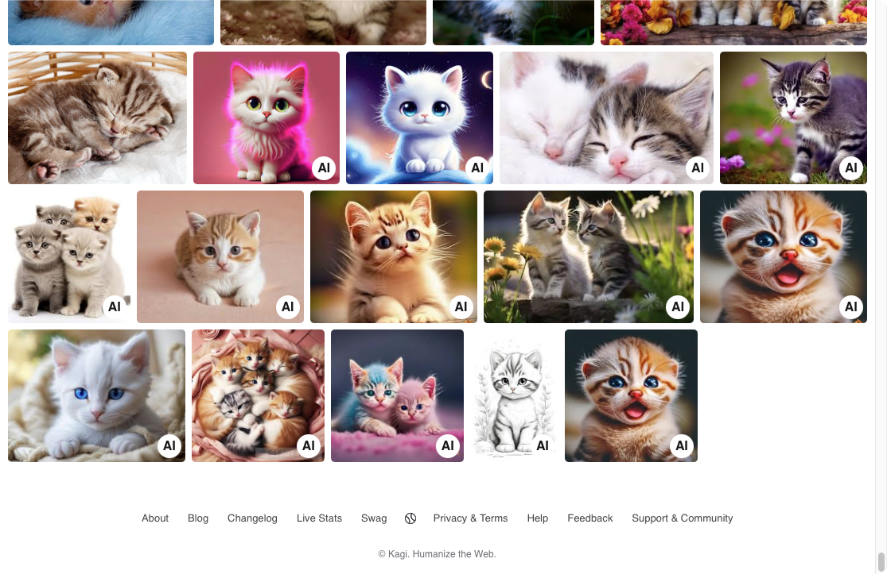
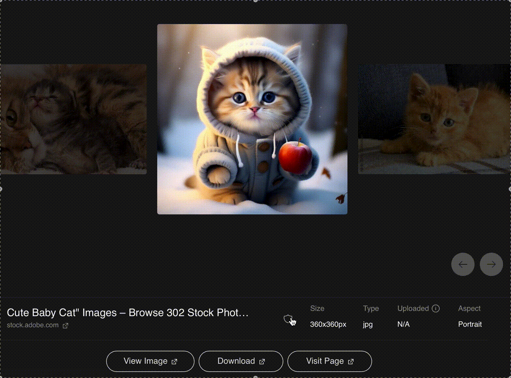

# AI Image Filter for Search Results

As AI-generated images become increasingly prevalent across the web, many users find their image search results cluttered with artificial content. This can be particularly frustrating when searching for authentic, human-created images or specific real-world references.

At Kagi, we understand the importance of delivering high-quality, relevant search results. Our AI Image Filter feature is designed to address this challenge, giving users more control over the content they see and prioritizing authentic imagery in search results.

## Downranking AI-generated images

By default, [Kagi Image Search](https://kagi.com/images) downranks images from websites with a high proportion of AI-generated content. 

{width=720px data-zoomable}

## Labeling AI-generated images

In addition to our downranking, we have implemented an AI image labeling system. This feature adds a small badge or icon to thumbnails that are likely to be AI-generated content. The label helps users quickly identify potential AI images without completely removing them from search results. 

{width=720px data-zoomable}

## Filtering AI-generated images

You can use the AI images filter to completely exclude websites with AI-generated images from your search results.

<video src="./media/exclude_ai_images_filter.mp4" width="720" type="video/mp4" autoplay muted loop playsinline disablepictureinpicture alt="Kagi Image Search - Exclude AI Images Filter" />

##  Block websites in image search results

Note that, since there is currently no reliable way to automatically identify AI-generated images with good enough precision, this feature relies on the website's reputation rather than analyzing individual images. As a result, some AI-generated content may still appear in the results.

If you detect a website with AI or low quality imagery that slipped through our filter, you can lower or completely block it off in your search results, using our [search personalization feature](./website-info-personalized-results.md).

Click on shield icon in your image search results, the same as you already can do in web search results.

## Our approach to AI-generated images

The decision to implement this feature is based on our [AI integration philosophy](../why-kagi/ai-philosophy.md) and direct [user feedback](https://kagifeedback.org/d/4972-ability-to-filter-out-obvious-ai-image-websites-from-image-search). 
