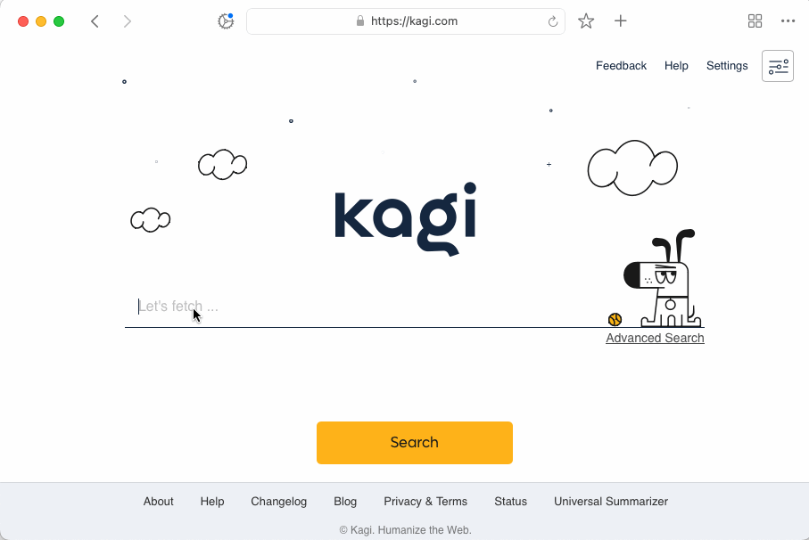
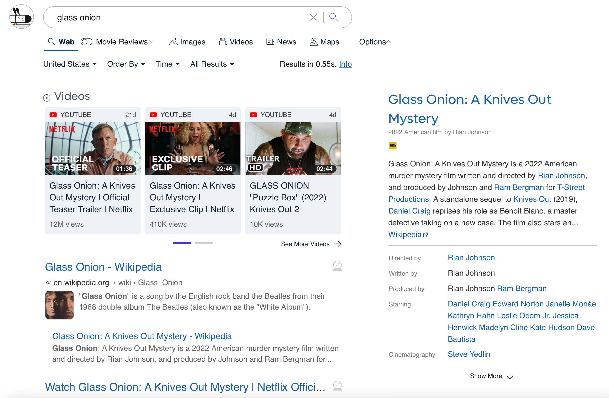
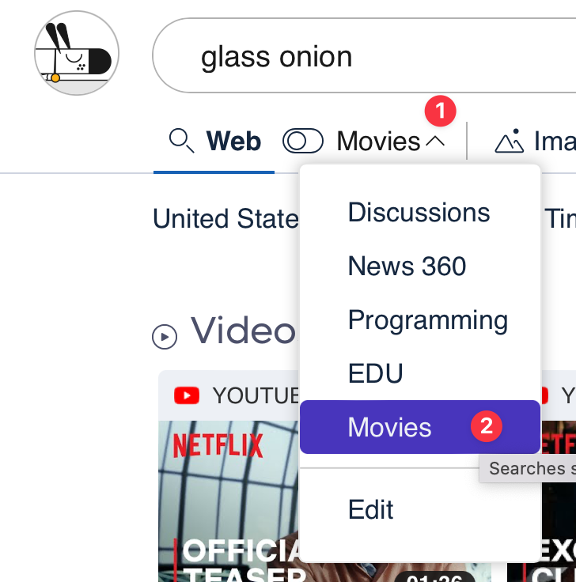
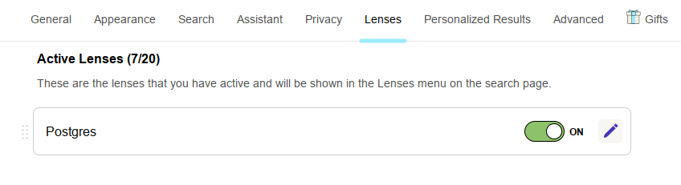
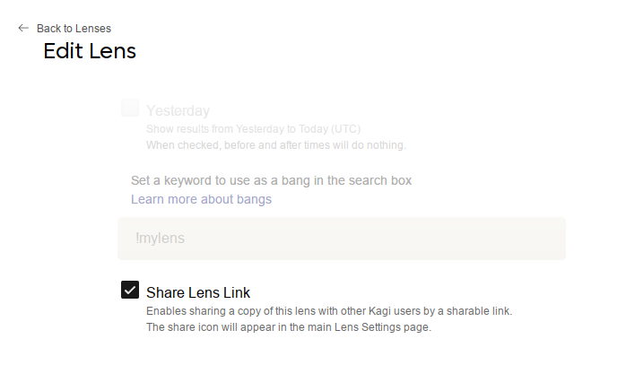
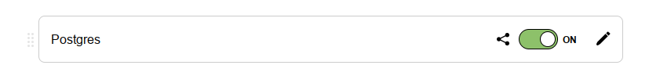

# Lenses

Kagi [Lenses](https://kagi.com/settings?p=lenses) allow you to customize your searches by specifying which websites (and other parameters) you see in your results. We provide a few Lenses to get you started, such as one to search only online discussions and forums.

Here's an example using the built-in Academic lens:

 

You can create your own Lenses where you specify parameters such as:

- Region
- Up to 10 included websites
- Up to 10 excluded websites
- Up to 5 included keywords
- Up to 5 excluded keywords
- File type
- Results before a given date
- Results after a given date

Lenses do not yet support image or video searches.

## Default Lenses

Kagi offers several prebuilt lenses. The following are available by default:

- **Forums**: search forums from around the web.
- **Programming**: official programming language websites and forums.
- **News 360**: offers a 360-degree perspective on news impacting the globe.
- **Fediverse Forums**: search Lemmy and kbin fediverse forums.
- **Usenet/Archive**: search Usenet Archives and Archive.org non-web collections.
- **Academic**: searches education (.edu) domains.
- **PDFs**: search for PDF files.
- **Kagi Documentation**: searches help.kagi.com, blog.kagi.com, kagifeedback.org, and orionfeedback.org.

The following lenses need to be activated from the [Lenses](https://kagi.com/settings?p=lenses) settings.

- **Cyber Security**: search cyber security news websites.
- **Small Web**: results that favor noncommercial domains and topics.
- **Recipes**: recipes without spam from high-quality (English) recipe sites.

## Lens Example

Let's say you love movie news and reviews. You can make a Lens that searches only the movie-related websites you find most useful.

1. Go to the [Lenses page](https://kagi.com/settings?p=lenses) and click the **Create New** button at the bottom of the page.
2. Fill in the "Create Lens" page with the details of how you want the Lens to constrain searches. Perhaps you live in the United States and you like certain movie-focused websites.

 

3. Click the **Save** button at the bottom of the page.
4. Back on the Lenses page, switch your new Movies Lens to **On**.

 

5. Do a search in Kagi for a movie title.

 

6. Once you see the search results, enable your Movies Lens.

 

7. You will see the search results constrained to specific websites based on the Lens.

 

Lenses are a powerful tool for making searches more useful. If you think about the types of things you search for often, you can probably create Lenses to make those searches more efficient and effective.

## Sharing Lenses

You can share a copy of your lens with other Kagi users.

To enable lens sharing, first find the lens you want to share in your [Active Lens list](https://kagi.com/settings?p=lenses), and click the pencil icon to edit the lens.

In the Edit Lens form, find the checkbox Share Lens Link.
Enable it, then press save at the bottom of the page.

When you return to your lens list, you will see a new sharing icon that you can click to copy a sharing URL to your clipboard.

You can send this link to anyone with a Kagi account.
When they open the link, they will be brought to the Create Lens form with all the options from your lens pre-filled.
They can make any edits they like before saving it to their account.

### How Sharing URLs Work

When users open your sharing URL, it will pull the latest settings from your lens at that moment.
This means you can make improvements or fixes to your lens without having to share a new URL.

*After* users have copied your lens, it will not receive updates from the original one.

Disabling the Share Lens option will invalidate the previously shared link.
Re-enabling the Share Lens option will generate a new link.
