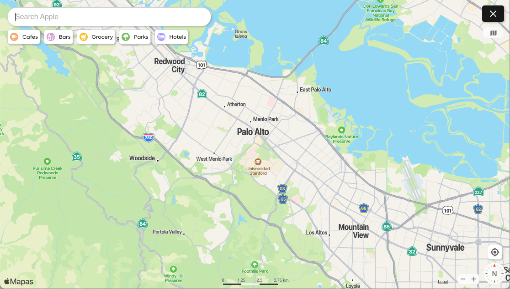
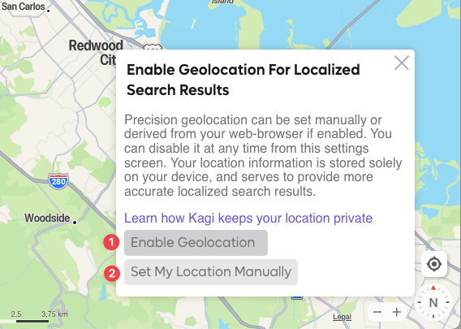
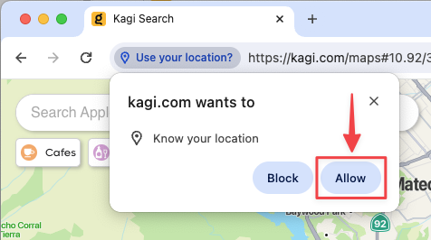

# Kagi Maps

[Kagi Maps](https://kagi.com/maps) is a powerful tool that simplifies the process of finding businesses, points of interest, and addresses. With Kagi Maps, you can easily search for locations, get driving or walking directions, and discover interesting stops along your route.

{width=675px data-zoomable}

## Kagi Maps Privacy

Unlike other competing Map services that track your location to serve you ads, Kagi does not track or store your search history or location data.

We (optionally) support two [methods for setting your location](#enabling_geolocation): setting it manually or automatic detection, but in both cases it will only be stored in your browser storage and not in our servers.

## Kagi Maps 3D View

If you are using the Kagi Basemap, you can tilt the map into a 3D view in two ways:

1. With a mouse: Right-click and hold while moving the mouse up or down.
2. On a touchscreen: Place two fingers horizontally on the screen and slide them up or down.

Both methods adjust the viewing angle, transforming the map from a top-down view to an angled, oblique perspective. This reveals buildings and trees in three dimensions, providing a more realistic representation of the urban landscape. Release the mouse or lift your fingers when you've reached your desired tilt angle.

## Enabling Geolocation {#enabling_geolocation}

By default, Kagi Maps uses your IP address to determine your approximate location and use it as the initial location of the map.

For a better experience while using Kagi Maps, we recommend sharing your geolocation with Kagi Maps. Your location will only be saved in your browser’s storage and will not be associated with your account. To do this, click or tap on the Geolocation button:

{width=500px data-zoomable}

You will be presented with two options to set your location:

1. The first one is to use your browser’s built-in geolocation function to automatically identify and share your real time location with Kagi Maps.
2. You can also set your location manually by clicking the **Set My Location Manually** button.

{width=500px data-zoomable}

If you opted to use your browser’s built-in geolocation, your browser might prompt you to give Kagi permission to detect your location, please click the **Allow** button:

{width=500px data-zoomable}

If you chose the **Set My Location Manually** option, you will be able to drag the map so that the blue dot is positioned in your location, then click on **Done**.

{width=500px data-zoomable}

## Changing Kagi Maps Unit System

Kagi Maps allows you to change the unit system used for displaying distances. You can choose between metric units (kilometers and meters) or imperial units (miles and feet). To change the unit system, simply click on the scale bar at the bottom of the screen.

{width=500px data-zoomable}

Clicking on the scale bar will toggle between metric and imperial units. The scale bar will update to reflect the selected unit system, and any distances shown in Kagi Maps, such as route lengths, will be displayed using the chosen units.

Changing the unit system can be helpful if you are more comfortable with a particular system or if you need to match the units used in other applications or documents.
