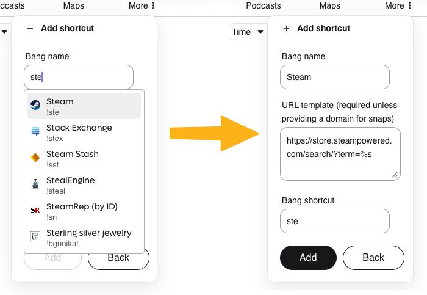
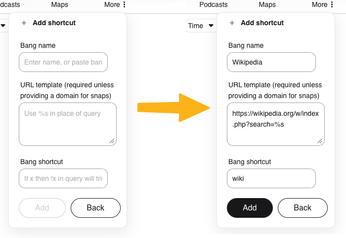
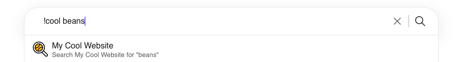
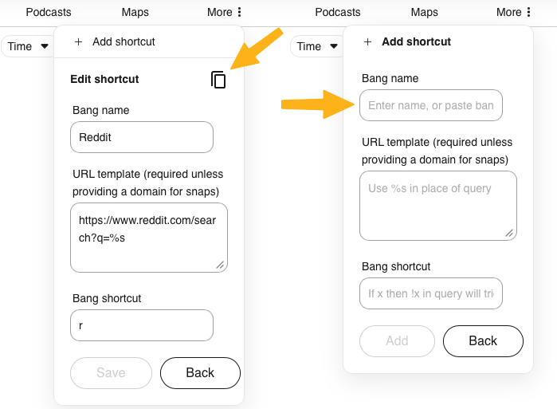

# Search Shortcuts

<video src="./media/kagi-shortcuts.mp4" width="720" type="video/mp4" autoplay muted loop playsinline disablepictureinpicture />

Search shortcuts allow you to redirect your query to other search engines or your favorite websites using custom Bangs. If you click these entries, your current search will be performed on the listed site.

## Customizing shortcuts

<video src="./media/kagi-shortcuts-customize.mp4" width="720" type="video/mp4" autoplay muted loop playsinline disablepictureinpicture />

By pressing ```Customize...```, you can make changes to the shortcut menu.

Using the toggle switch <svg width="32" height="17" style="display:inline;vertical-align:middle;" viewBox="0 0 32 17" fill="none" xmlns="http://www.w3.org/2000/svg">
    <rect x="0.5" y="0.5" width="31" height="16" rx="8" fill="#6C5EDC" stroke="black"/>
    <circle cx="23" cy="8" r="5.5" fill="white" stroke="black"/>
</svg> will change which shortcuts are visible.

You can delete a shortcut by pressing the trash can <svg width="14" height="14" style="display:inline;vertical-align:middle;" viewBox="0 0 14 14" fill="none" xmlns="http://www.w3.org/2000/svg"> <path fill-rule="evenodd" clip-rule="evenodd" d="M4 13.75C3.175 13.75 2.5 13.075 2.5 12.25L2 3H12L11.5 12.25C11.5 13.075 10.825 13.75 10 13.75H4ZM8.875 0.25L9.625 1H12.25V2.5H1.75V1H4.375L5.125 0.25H8.875ZM4 4.75H5V12.2556H4V4.75ZM6 4.75H7.99219V12.2556H6V4.75ZM9.01172 4.75H9.9987V12.2556H9.01172V4.75Z" fill="#FD6820"></path> </svg> that appears when hovering.

To reorder them, click and drag them either by their name or the drag icon. <svg width="8" height="13" style="display:inline;vertical-align:middle;" viewBox="0 0 8 13" fill="none" xmlns="http://www.w3.org/2000/svg"> <path d="M1.5 3C2.32843 3 3 2.32843 3 1.5C3 0.671573 2.32843 0 1.5 0C0.671573 0 0 0.671573 0 1.5C0 2.32843 0.671573 3 1.5 3Z M1.5 8C2.32843 8 3 7.32843 3 6.5C3 5.67157 2.32843 5 1.5 5C0.671573 5 0 5.67157 0 6.5C0 7.32843 0.671573 8 1.5 8Z M3 11.5C3 12.3284 2.32843 13 1.5 13C0.671573 13 0 12.3284 0 11.5C0 10.6716 0.671573 10 1.5 10C2.32843 10 3 10.6716 3 11.5Z M6.5 3C7.32843 3 8 2.32843 8 1.5C8 0.671573 7.32843 0 6.5 0C5.67157 0 5 0.671573 5 1.5C5 2.32843 5.67157 3 6.5 3Z M8 6.5C8 7.32843 7.32843 8 6.5 8C5.67157 8 5 7.32843 5 6.5C5 5.67157 5.67157 5 6.5 5C7.32843 5 8 5.67157 8 6.5Z M6.5 13C7.32843 13 8 12.3284 8 11.5C8 10.6716 7.32843 10 6.5 10C5.67157 10 5 10.6716 5 11.5C5 12.3284 5.67157 13 6.5 13Z" fill="currentColor"></path> </svg>

### Adding and editing shortcuts

Clicking ```Add shortcut``` in the ```Customize...```  menu will open a dialog where you can create new custom shortcuts. Clicking an existing shortcut will let you edit it.

#### Bang name

This field is the name of the shortcut that will be shown in the Shortcuts menu. It has an autocomplete that will fetch suggestions from our database of shortcuts:

{data-zoomable}

Picking an option from the autocomplete will fill in the rest of the form for you.
You can then make any changes you'd like.

If you have copied a shortcut, it can also be pasted in this field, and the form will be filled out automatically.

#### URL

{data-zoomable}

This field is the URL that your search will be sent to. Any spot in the URL that you write `%s` will be replaced by your query.

For example, if the URL is: `https://wikipedia.org/w/index.php?search=%s`

Then searching for "Steve Jobs" with this shortcut will send you to: <a href="https://wikipedia.org/w/index.php?search=Steve+Jobs">https://wikipedia.org/w/index.php?search=Steve+Jobs</a>

#### Bang shortcut

This field assigns a custom [Bang](bangs.md) to your shortcut, you can invoke the shortcut from anywhere you search.

{data-zoomable}

For example, if this field is set to "cool", you can invoke this shortcut by typing "!cool" in your search bar.

#### Sharing shortcuts

{data-zoomable}

To share a shortcut, opening the Edit dialog for your shortcut by clicking its name from the ```Customize...``` menu.

You can copy a shortcut's settings to your clipboard by pressing the copy button.
<svg width="24" height="24" style="display:inline;vertical-align:middle;" viewBox="0 0 24 24" fill="none" xmlns="http://www.w3.org/2000/svg">
    <rect x="8" y="6" width="12" height="16" rx="1" stroke="currentColor" stroke-width="2"></rect>
    <path d="M4 20V4C4 2.89543 4.89543 2 6 2H18" stroke="currentColor" stroke-width="2"></path>
</svg>

This will copy the shortcut as text, it will look something like this:

```
Reddit
https://www.reddit.com/search?q=%s
!r
```

You can send this text to your friends, and it can be pasted into the [Bang name](#bang-name) field when adding a shortcut. This will automatically fill out the form with those settings.
