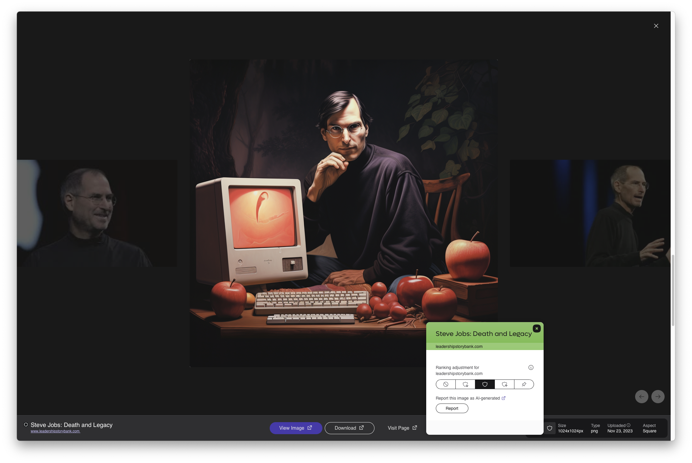
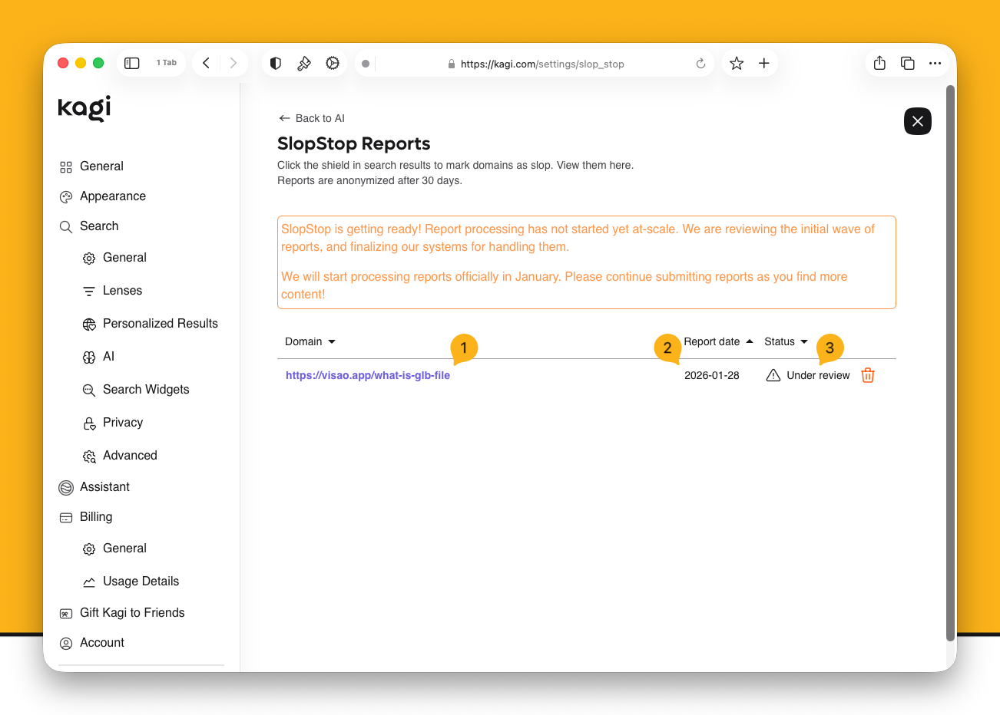

# SlopStop

SlopStop is Kagi’s community-driven feature for reporting low-quality, mass‑generated AI content (“AI slop”) found in web, image and video search results. 

Kagi Search already fights most SEO spam by downranking sites filled with ads and trackers. SlopStop adds a collaborative element: users can flag suspected AI slop, helping us identify domains and channels whose main purpose is to generate traffic with AI‑generated content.

## What is considered “Slop"?

- Web Pages
  - We assess the reported URL to determine if it is AI‑generated.
  - If the page is AI‑generated but the domain is mixed (not mostly AI), we flag the page as AI‑generated but do not downrank it.
  - If a domain is found to be mostly AI‑generated (typically more than 80% across its pages), that domain is flagged as AI slop and downranked in web search results.
  - Subdomains are evaluated independently (for example, `blog.example.com` vs `shop.example.com`).

- Images
  - If an image is AI‑generated, it is marked as AI and downranked by default in image search.
  - We then crawl the host domain to check whether it mostly hosts AI‑generated images. If yes, we flag the domain as AI slop and downrank its image results.
  - Users can filter these results using the `AI Images` dropdown in the Images search tab.

- Videos
  - If a video is AI‑generated, it is marked as AI and downranked by default in video search.
  - We evaluate the channel; if the majority of its content is AI‑generated, the channel is flagged as AI slop and downranked.
  - Users can filter these results using the `AI Videos` dropdown in the Videos search tab.

Downranking means flagged results can still appear, but lower than high‑quality original content. Removal is not the default.

:::info A key difference
Kagi supports AI tools that enhance creativity, but opposes those that undermine the authenticity and trust of human-made content. You can read more about our philosophy on AI [here](https://help.kagi.com/kagi/why-kagi/ai-philosophy.html).
:::

## Reporting content

You can report on a single page, image or video, with each report individually reviewed.
Multiple reports for the same domain or channel help speed up the review process.

Reviews are typically completed within a week and actions (flags and downranking) are applied once this is complete.

- In search results, click the shield icon next to the item and select `Report`.
- If you believe content has been incorrectly flagged, select `Report as not AI slop`.
- Any user can submit either type of report. A “not AI slop” report triggers re‑review, if accepted, we remove the slop flag and adjust ranking accordingly.

### Check your report status

- Go to **Settings** > **Search** > **AI** > **SlopStop Reports** to view:
  - The URL you reported.
  - The time the report was sent (UTC).
  - The current status: `Under review`, `AI slop`, or `Not AI slop`.

## FAQs

- Why mention “mostly AI”?
  - It clarifies that SlopStop targets domains/channels primarily disseminating AI‑generated content, not sites that responsibly use AI alongside original work.
- Does downranking hide results completely?
  - No. Downranking reduces visibility, results may still appear, especially for specific queries. There is a setting for completely hiding slop images and videos, disabled by default.
- Can I reverse a downranking by reporting “not AI slop”?
  - Your report triggers re‑review. If we determine the content/domain/channel is not AI slop, we remove the flag and ranking is automatically adjusted.