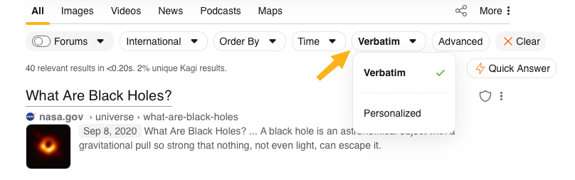
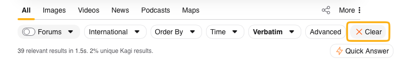

# Verbatim Search


Kagi will return all results to a search based on your settings, however, you may further refine search results by performing a ```Verbatim Search```.


```Verbatim Searches``` look for the exact phrase you type in the search box. As an example, *"What are black holes"* will normally find you many pages that explain what black holes are, but with a ```Verbatim Search```, you will only find pages with the specific phrase quoted verbatim in it. Not even find pages that contain *"What's a black hole"*.

This can be very useful to search for specific content, and can also significantly cut down the number of results, so much so that Kagi will remind you that you have ```Verbatim Search``` enabled if your search query has no results. 



You can enable ```Verbatim Search``` by expanding the ```Options``` dropdown.



Once enabled, it will remain enabled until you ```Clear``` the filter.