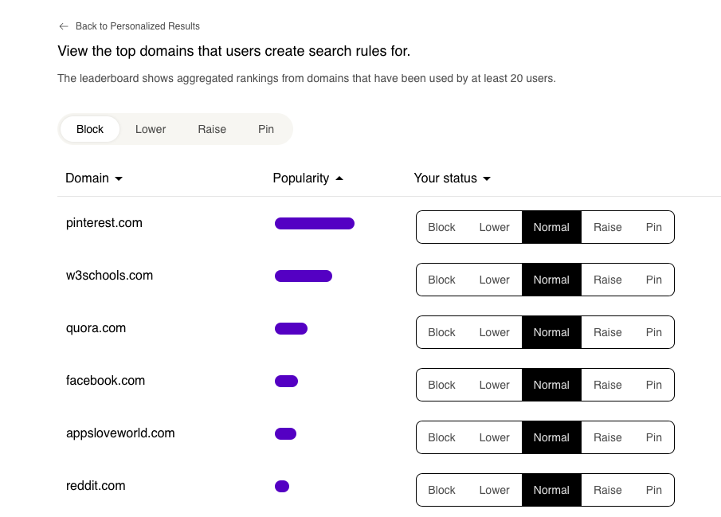
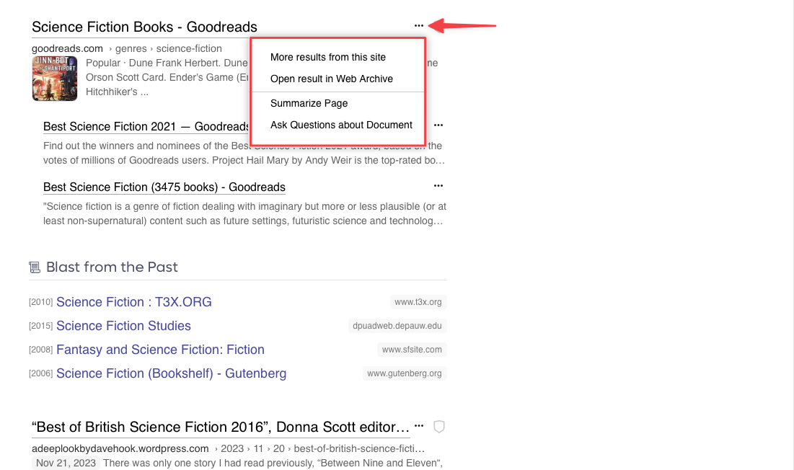

---
next:
  text: 'Lenses'
  link: '/kagi/features/lenses'
---

# Website Info & Personalized Results

To the right of each Kagi search result is a shield icon. Hovering over the icon or tapping it will access additional features related to the webpage for that result.

## Personalized Results

Midway down the information window for the search result, you can tweak how the website for the result is treated in future Kagi searches.

{width=675px data-zoomable}

Your options are to:

- **Block** the website
- **Lower** the ranking of the website
- Give the website a **Normal** ranking (the default)
- Make the website ranking **Higher**
- **Pin** the website to the top of search results

{width=675px data-zoomable}

You can see your Personalized Results for all websites in [Settings](https://kagi.com/settings?p=user_ranked).

## Domain Leaderboard

Wonder what are the most promoted and blocked domains among Kagi Search users?  

Check the [Personalization Leaderboard](https://kagi.com/stats?stat=leaderboard). We anonymously aggregate the rankings of domains that have been tagged by other Kagi users.

{width=675px data-zoomable}

## Website Information

At the bottom of the information window for the search result is useful data about the website for the result.

The information may include:

- How many ads and trackers were detected on the website
- The popularity ranking of the website
- Whether the website uses a secure HTTPs connection
- How fast the website responds to requests

{width=675px data-zoomable}

## Quick Actions Menu

Clicking on the three dots (...) to the right of each search result will bring a menu with 4 options:

- **More results from this site** will perform the same Kagi search again, but with results limited to the website of your initial result.
- **Open result in Web Archive** will show you the history of the webpage at the [Wayback Machine](https://archive.org/).
- **Summarize Page** will use [Universal Summarizer](../ai/summarize-page.md) to give you a summary of the webpage within the search results page.
- **Ask Questions about Document** will take you to [Kagi Assistant](../ai/assistant.md) and use the webpage as context for asking questions.

{width=675px data-zoomable}
