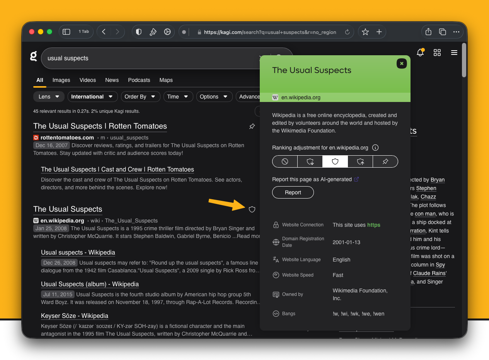
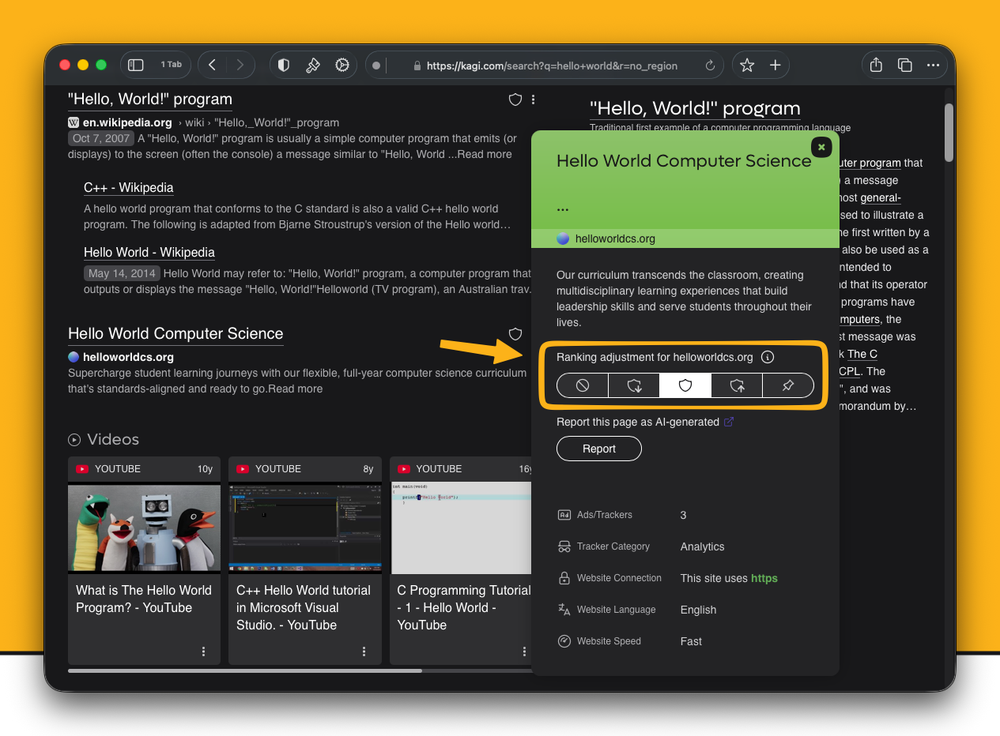
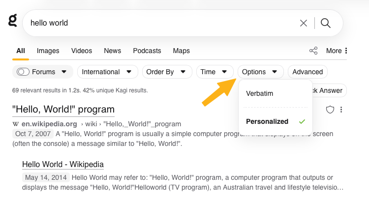
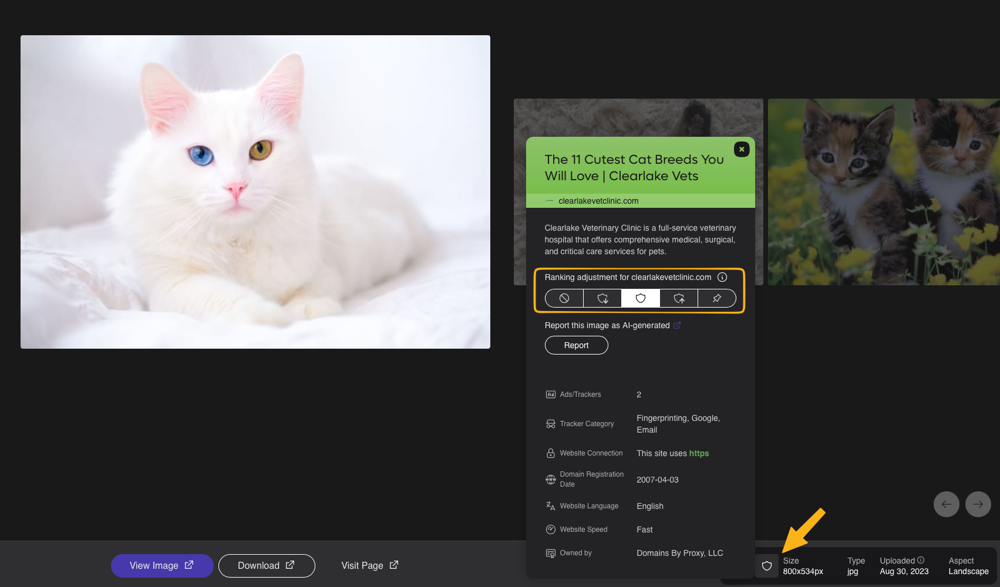
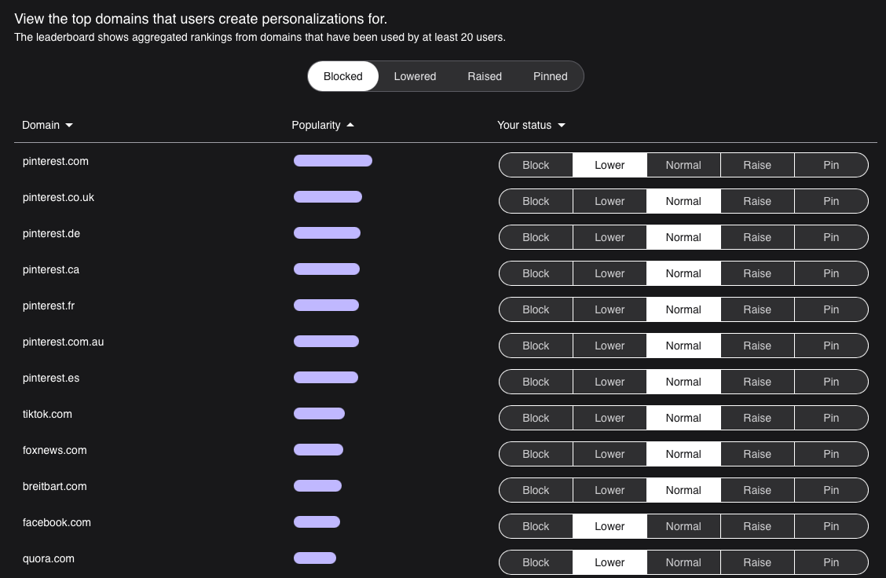
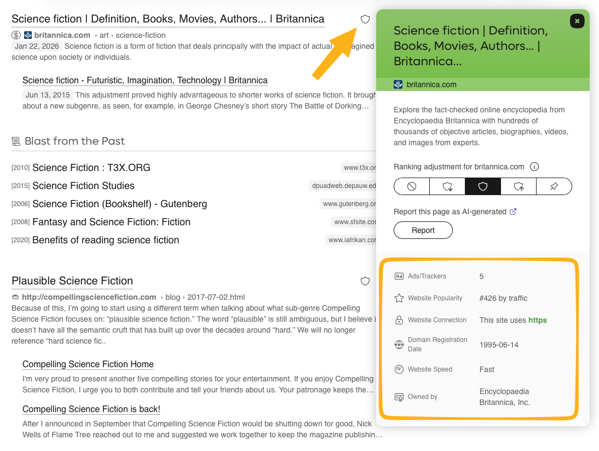
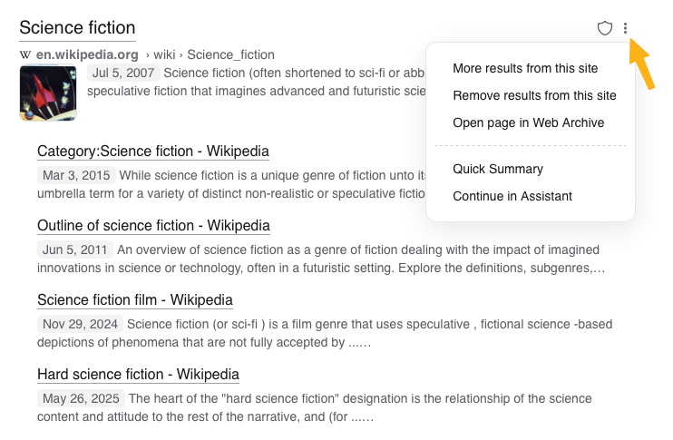

---
next:
  text: 'Lenses'
  link: '/kagi/features/lenses'
---

# Website Info & Personalized Results

 

<video src="./media/kagi-personalized-results.mp4" width="720" type="video/mp4" autoplay muted loop playsinline disablepictureinpicture />

To the right of each Kagi search result is a shield icon. Hovering over the icon or tapping it will access additional features related to the webpage for that result.

## Personalized Results

Midway down the information window for the search result, you can tweak how the website for the result is treated in future Kagi searches.

Your options are to:

- **Block** the website
- **Lower** the ranking of the website
- Give the website a **Normal** ranking (the default)
- Make the website ranking **Higher**
- **Pin** the website to the top of search results

{width=675px data-zoomable}

You can see your Personalized Results for all websites in [Settings](https://kagi.com/settings/user_ranked).

Personalization can also be disabled for a single search via unchecking the "Personalized" option in the "Options" menu.

{width=675px data-zoomable}

You can also apply Personalization in image search results by clicking the shield icon.

Kagi Search allows you to block entire domains as part of its ranking tools, but it doesn’t currently support advanced blocking methods like path wildcards (e.g., `*://example.com/path/*`) or regular expressions (e.g., `/example\.(net|org)/`) – for these advanced options, the [uBlacklist](https://github.com/iorate/ublacklist?tab=readme-ov-file#ublacklist) browser extension offers these capabilities and integrates with Kagi.

## Domain Leaderboard

{width=675px data-zoomable}

Wonder what are the most promoted and blocked domains among Kagi Search users?

Check the [Personalization Leaderboard](https://kagi.com/stats?stat=leaderboard). We anonymously aggregate the rankings of domains that have been tagged by other Kagi users.

## Website Information

{width=675px data-zoomable}

At the bottom of the information window for the search result is useful data about the website for the result.

The information may include:

- How many ads and trackers were detected on the website
- The popularity ranking of the website
- Whether the website uses a secure HTTPs connection
- How fast the website responds to requests

## Quick Actions Menu

{data-zoomable}

Clicking on the three dots (...) to the right of each search result will bring a menu with 4 options:

- **More results from this site** will perform the same Kagi search again, but with results limited to the website of your initial result.
- **Remove results from this site** will perform the same Kagi search again, but with results from that website removed.
- **Open page in Web Archive** will show you the history of the webpage at the [Wayback Machine](https://archive.org/).
- **Summarize page** will use [Universal Summarizer](../ai/summarize-page.md) to give you a summary of the webpage within the search results page.
- **Ask questions about page** will take you to [Kagi Assistant](../ai/assistant.md) and use the webpage as context for asking questions.
