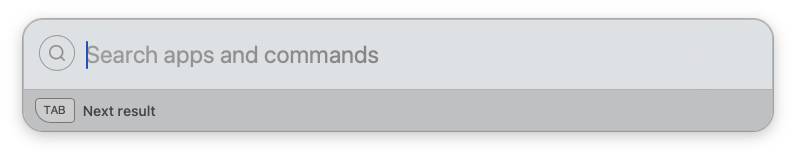
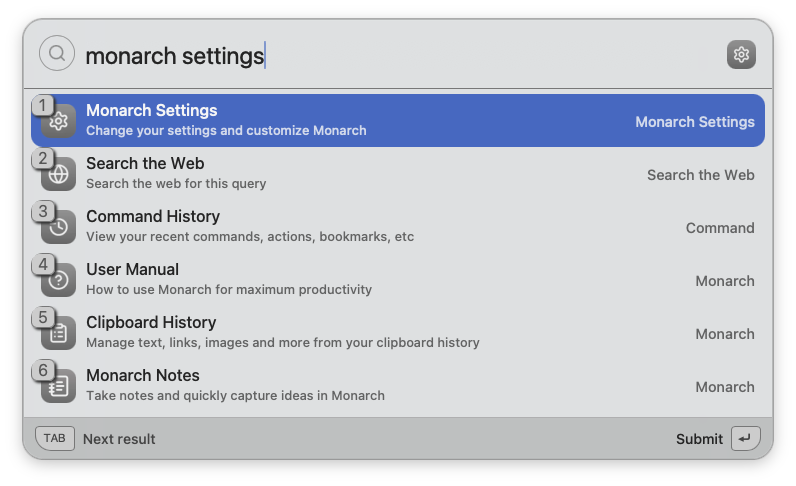
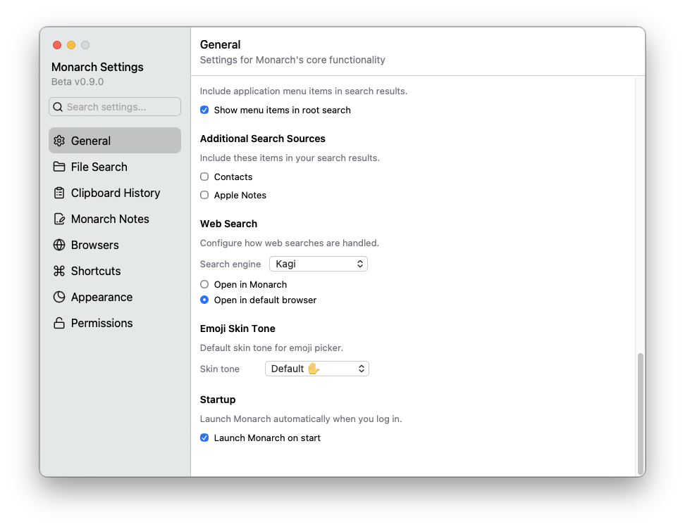
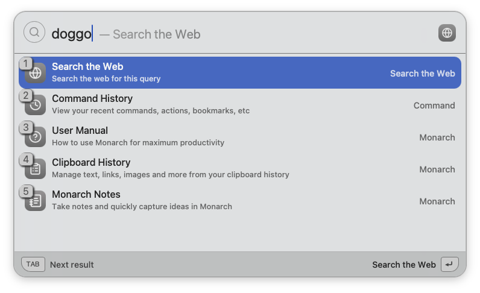
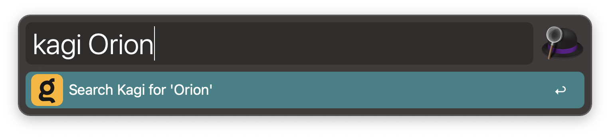
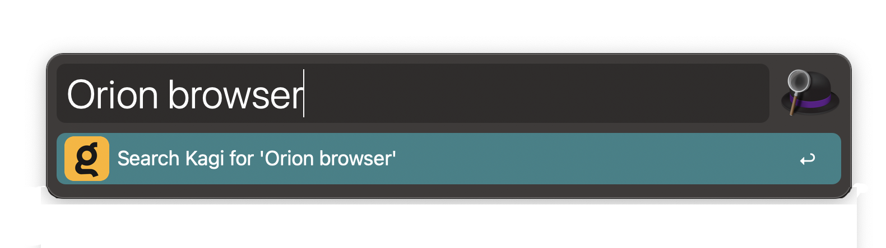

# Integrating Kagi with Other Applications

Kagi can be integrated with other applications to make it easy to quickly search the web from within those applications. If the application supports an [OpenSearch](https://github.com/dewitt/opensearch) description file, use https://kagi.com/opensearch.xml.

## BoltAI

[BoltAI](https://boltai.com) is a native AI app for Mac, it includes built-in support for using Kagi Search to provide context to the LLMs.
To set it up, launch BoltAI and navigate to **Settings** > **Plugins** > **Kagi Search**, then select the **Settings** tab and paste your [API key](https://kagi.com/settings/api).

**Note:** Email support@kagi.com to request access to the Search API beta.

## Monarch Launcher

[Monarch](https://www.monarchlauncher.com) is a productivity engine for macOS that allows you to perform tasks such as calculations, clipboard management, and web searches without leaving your current workflow. Kagi is available as a built-in search engine option in Monarch.

To configure Kagi as the default search engine in Monarch Launcher:

1. Activate Monarch Launcher.
{width=675px data-zoomable}

2. Type monarch settings and select Monarch Settings.
{width=675px data-zoomable}

3. Click General in the sidebar.
4. Under the Web Search section, select Kagi from the Search engine dropdown.
5. Optionally, choose whether to Open in Monarch or Open in default browser.

{width=675px data-zoomable}

You should now be able to search Kagi directly from Monarch Launcher by typing your query and selecting Search the Web.

{width=675px data-zoomable}

## Alfred

[Alfred](https://www.alfredapp.com/) is a productivity application for macOS that allows you to quickly search your computer and the web. Kagi can be added as a [custom search](https://www.alfredapp.com/help/features/web-search/#custom) so that you can launch a Kagi search from within Alfred.

To configure Kagi as a custom search in Alfred:

1. Open Alfred's preferences.
2. Click the **Features** icon.
3. Click the **Web Search** icon.
4. Click the **Add Custom Search** button.
5. Enter the following information:
    1. Enter your Kagi **Session Link** as the **Search URL**. You can obtain your Kagi **Session Link** from the [Account Settings](https://kagi.com/settings/user_details).
    2. Add `&q={query}` at the end of the **Session Link** after pasting it in Alfred.
    3. Enter **Search Kagi for '{query}'** as the **Title**.
    4. Enter **kagi** as the **Keyword**.
    5. Download a Kagi PNG logo of your choice from [Kagi Search Assets](https://kagi.com/assets) and save it to your computer.
    6. Drag and drop the Kagi PNG logo into the **Icon** field.

Your configuration should now look like this:

{width=675px data-zoomable}

6. Click **Test** in the **Validation** section to verify that the search works.
    1. Your default web browser should open and perform a Kagi search for the word **alfredapp**.
7. Click **Save** to save the custom search.

You should now have an entry for Kagi:

{width=675px data-zoomable}

Now you can search Kagi from within Alfred by typing **kagi** followed by your search terms. For example, to search Kagi for **Orion** you would activate Alfred and type **kagi Orion**.

{width=675px data-zoomable}

### Fallback Search

You can also configure Alfred to use Kagi as a [Fallback Search](https://www.alfredapp.com/help/features/default-results/fallback-searches/). Fallback searches occur when you search for a keyword in Alfred that doesn't match a result on your local computer.

To configure Kagi as a fallback search in Alfred:

1. Open Alfred's preferences.
2. Click the **Features** icon.
3. Click the **Default Results** icon.
4. Click the **Setup Fallback results** button.
5. Click the **+** button.
6. Navigate to **Custom Search**.
7. Click the **Search Kagi for {query}** search.

You should now see Kagi in the list:

{width=675px data-zoomable}

8. Drag the **Search Kagi for {query}** search to the top of the list, or any other position you prefer.
9. Click the **Save** button.

You should now have Kagi available as a fallback search:

<{width=675px data-zoomable}