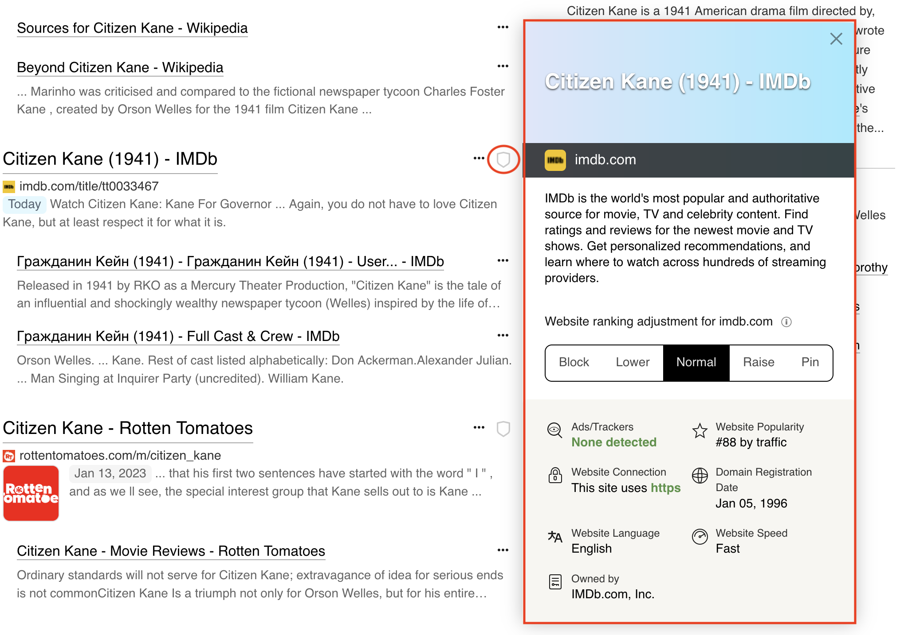
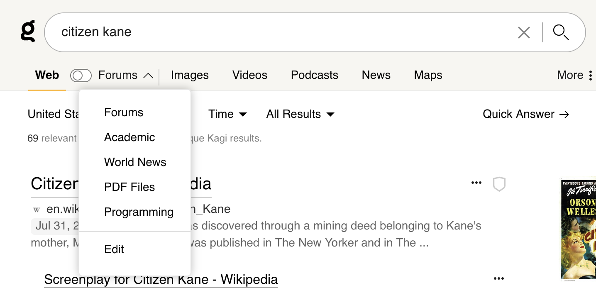
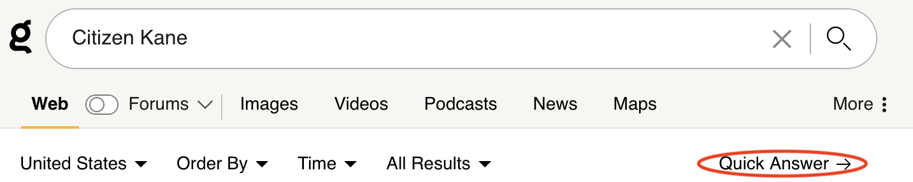
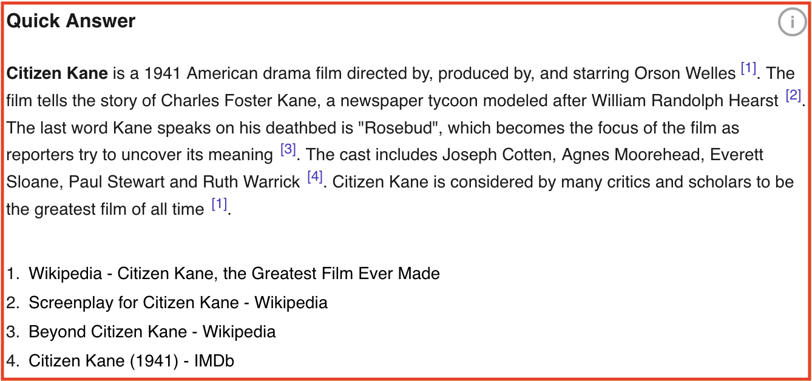

---
next:
  text: 'Setting Kagi as Your Default Search Engine'
  link: '/kagi/getting-started/setting-default'
---

# Quick Start

Kagi helps you find exactly what you're looking for online. It has a few more capabilities than the search engine you're used to so let's explore how to get the most out of them.

## Table of Contents

- [Personalize Results](#personalize-results)
- [Summarize Results](#summarize-results)
- [Summarize Page](#summarize-page)
- [Refining Search Results](#refining-search-results)
- [Sharing Search Results](#sharing-search-results)
- [Set Kagi as your default search engine](#set-kagi-as-your-default-search-engine)
- [Kagi member communities](#kagi-member-communities)

## Personalize Results

Kagi's personalization options lets you customize your results including eliminating websites that you find low quality or distracting or boosting those that you find more useful. Clicking the shield icon to the right of a search result reveals additional information and [personalization options](https://help.kagi.com/kagi/features/website-info-personalized-results.html) for that result. From here you can raise or lower the weighting for that website including blocking websites that you'd like eliminated from your search results. You can see some of the more popular modifications on the [Kagi Personalization Leaderboard](https://kagi.com/stats?stat=leaderboard).

 
 
 

## Refining Search Results

Just below the search box you can quickly filter for the types of results such as Images or Podcasts or you can use [Kagi Lenses.](https://help.kagi.com/kagi/features/lenses.html) Lenses are search filters and rules applied to search results. Built-in Lenses include Forums (results from the thousands of specialized online communities as well as Reddit), Academic (results from academic institutions), and Programming (coding forums and websites) and more. Custom Lenses can be created as well.

 
 
 

You can also use [Search operators ](https://help.kagi.com/kagi/features/search-operators.html) to tune your results.  For instance the filetype: operator can limit results to specific filetypes.  E.g. adding “filetype:xlsx” to your query will limit your results to only Microsoft Excel files.  A quick reference of search operators is available from anywhere on kagi.com by typing “?” [Note: make sure you’re not typing into a form or text box when entering “?” to bring up the reference window.]

 
 
 

## Summarize Results (Quick Answer)

Quick Answer (aka [Summarize Results](https://help.kagi.com/kagi/ai/summarize-results.html)) extracts and summarizes the important content from the search results including links to the source material.

 
 
 

Example:

 
 
 

## Summarize Page

Clicking the three dot icon next to a search result brings up page options. [Summarize Page](https://help.kagi.com/kagi/ai/summarize-page.html) provides a synopsis of the page.

 
 
 

Example:

 
 
 

## Sharing Search Results

You can [share your search results](https://help.kagi.com/kagi/features/share-results.html) with friends who may not be Kagi subscribers by using the “Share This Search” button at the bottom of a search result page or by selecting More > Share This Search.  This will copy a link to your clipboard which you can pass on to others.

 

## Set Kagi as your default search engine

Learn how to set Kagi as [default search engine in your browser](./setting-default.md), including using private session link to have it work in private browser windows without logging in.

## Kagi member communities

Kagi has a [vivid member community](../support-and-community/roadmap_feedback.md) that shares tips, advice and suggests new features. 
