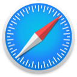

# Setting Kagi as Your Default Search Engine

For a better experience we recommend setting Kagi as your default in your browser.
Choose your browser below for instructions:

| **Orion** | **Chrome** | **Safari** | **Firefox** |
|---|---|---|---|
|  |  |  |  |
| [Mac](./setting-default/orion-mac.md) [iPhone / iPad](./setting-default/orion-iphone-ipad.md) | [Desktop / Mac](./setting-default/chromium-desktop.md) [iPhone / iPad](./setting-default/chromium-mobile.md) [Android](./setting-default/chromium-mobile.md) | [Mac](./setting-default/safari-mac.md) [iPhone / iPad](./setting-default/safari-iphone-ipad.md) | [Desktop / Mac](./setting-default/firefox-desktop.md) [iPhone / iPad](./setting-default/firefox-ios.md) [Android](./setting-default/firefox-android.md) |

| **Edge** | **Brave** | **Vivaldi** | **Firefox Focus** |
|---|---|---|---|
|  |  |  |  |
| [Desktop / Mac](./setting-default/chromium-desktop.md) [iPhone / iPad](./setting-default/edge-ios.md) [Android](./setting-default/chromium-mobile.md) | [Desktop / Mac](./setting-default/chromium-desktop.md) [iPhone / iPad](./setting-default/brave-ios.md) [Android](./setting-default/chromium-mobile.md) | [Desktop / Mac](./setting-default/vivaldi-desktop.md) [iPhone / iPad](./setting-default/vivaldi-ios.md) [Android](./setting-default/chromium-mobile.md) | [iPhone / iPad](./setting-default/firefox-focus-iphone-ipad.md) [Android](./setting-default/firefox-focus-android.md) |

## Custom Use {#custom_use}

If you want to manually set Kagi as a default search engine, use these settings:

- Kagi Search URL `https://kagi.com/search?q=%s`

- Kagi auto suggestions URL `https://kagi.com/api/autosuggest?q=%s`

- Kagi auto suggestions URL (Privacy Pass) `https://kagisuggest.com/api/autosuggest?q=%s`

- Reverse image search URL `https://kagi.com/reverse/upload`. 
    * For image search to work, you have to pass the image you are trying to reverse-search in a `file` POST parameter. For example, in Vivaldi to achieve this you have to set "POST parameters of image search" to `file={google:imageThumbnail}`
