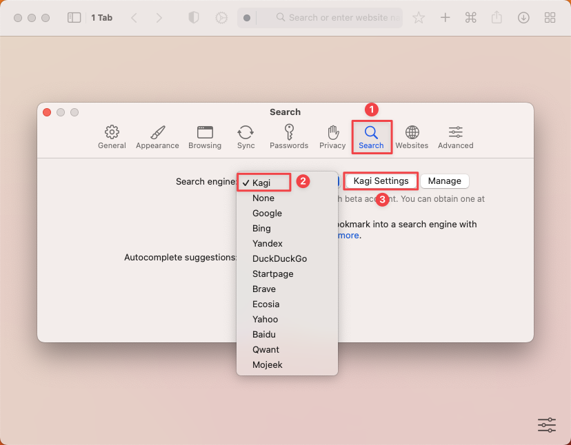
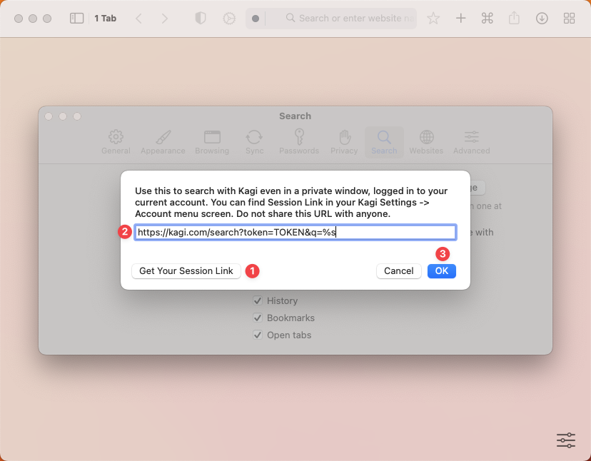
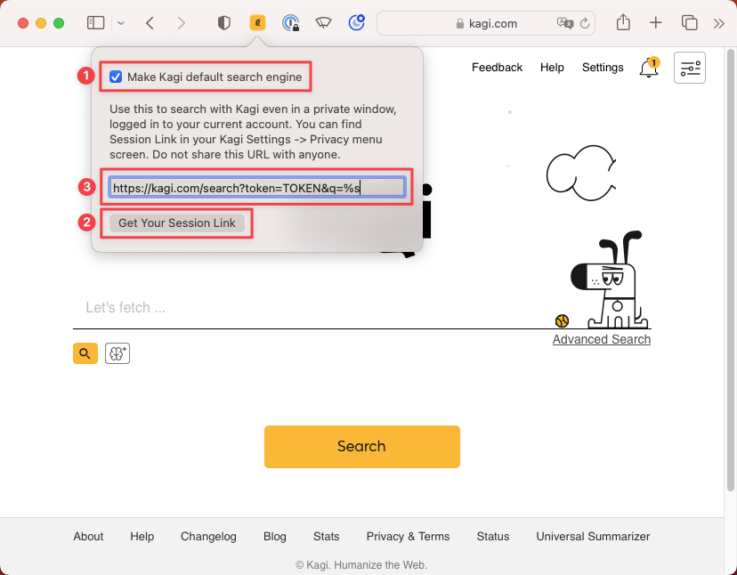

# Setting Kagi as Your Default Search Engine

## Table of Contents

- [Option 1: Use Orion browser by Kagi (currently for macOS/iOS only)](#orion)
- [Option 2: Using the Kagi Browser Extension](#browser_extension)
  - [Setting up the Extension](#setting_up_extension)
    - [Google Chrome](#setting_up_extension_google_chrome)
    - [Safari for Mac](#setting_up_extension_safari_mac)
	    - [Choosing a Search Engine to Redirect (Mac)](#choosing_a_search_engine_to_redirect_mac)
    - [Safari for iOS](#setting_up_extension_safari_ios)
	    - [Choosing a Search Engine to Redirect (iOS)](#choosing_a_search_engine_to_redirect_ios)
  - [Note for Safari Users: Browsing History](#safari_extension)
  - [Note for Brave Browser Users](#brave_extension)
  - [Note for Opera Browser Users](#opera_extension)
- [Option 3: Manual Configuration](#manual_configuration)
  - [Custom use](#custom_use)
  - [Private Session link (use Kagi in private windows without logging in)](#private_session)
  - [Chromium-Based Browsers (Chrome, Edge, Brave, Vivaldi, Arc...)](#chromium_browsers)
    - [Desktop](#chromium_desktop)
    - [Mobile (iOS/Android)](#chromium_mobile)
  - [Firefox-Based Browsers](#firefox_browsers)
    - [Desktop](#firefox_desktop)
    - [Android Mobile](#firefox_android_mobile)
    - [iOS](#firefox_ios)
  - [Safari](#safari)
    - [Desktop](#safari_desktop)
    - [iOS & iPadOS](#safari_ios_ipados)
  - [Firefox Focus](#firefox_focus)
    - [Android Mobile](#firefox_focus_android_mobile)
    - [iOS](#firefox_focus_ios)
  - [Custom Use](#custom_use)

## Option 1: Use Orion browser by Kagi (currently for macOS/iOS only) {#orion}

If you use Apple devices with macOS/iOS/iPadOS you can use Orion browser by Kagi. It has Kagi built-in and is the easiest option to start using Kagi.

[Download Orion](https://kagi.com/orion/).

You can also scan the QR Code below to download Orion on your iPhone or iPad:

{width=256px data-zoomable}

Tip: It is recommended you enter your private session link in Orion settings, as it will allow you to use Kagi in private windows and after clearing cookies. To do this, first go to **Orion** > **Settings**.

 

Next, go to the **Search** tab, select Kagi under **Search engine**, then click on **Kagi Settings**.

 

A modal will appear, click the **Get Your Session Link** button to get the link with your token and paste it in the text field, then click **OK**.

 

## Option 2: Using the Kagi Browser Extension {#browser_extension}

Kagi is available as an extension for all major browsers. The extension sets Kagi as the default search engine on some browsers/platforms and allows you to **search with Kagi even in a private window without logging in** (this can be also set manually with the use of a [private session link](#private_session)).

Extension download links:

- [Chromium-based browsers](https://chrome.google.com/webstore/detail/cdglnehniifkbagbbombnjghhcihifij) (Chrome, Edge, Brave, Vivaldi, Arc...)
  - After installing the extension make sure to [set Kagi as your default search engine](#chromium_browsers).
- [Firefox-based browsers](https://addons.mozilla.org/en-US/firefox/addon/kagi-search-for-firefox/)
  - If you use Firefox on Android, please know there are [many known limitations](https://github.com/kagisearch/browser_extensions/issues/3) with the extension, at this moment. That means you need to follow the [Firefox Android search setup](#firefox_android_mobile) above to search with Kagi.
  - After installing the extension, if your profile deletes cookies frequently, go to the extension settings (click the puzzle piece in the top right corner of the browser window) for Kagi and enter your [private session token URL](#private_session) to be logged in automatically even when cookies have been deleted.
  - If you run into a problem of not being logged in to Kagi on incognito sessions, try manually setting your session token. If that doesn't work, try disallowing it on Incognito, saving the session token manually, and then re-allowing it again.
- [Safari for macOS/iOS](https://apps.apple.com/app/kagi-search-for-safari/id1622835804)
  - You can also scan the QR code below to download the extension on your iPhone or iPad:
{width=256px data-zoomable}
- The [xSearch](https://apps.apple.com/app/xsearch-for-safari/id1579902068), [QueryDial](https://apps.apple.com/app/querydial/id6478811925) and [HyperWeb](https://apps.apple.com/app/hyperweb/id1581824571) extensions for Safari also support Kagi

If you are a macOS, iOS, or iPadOS user, you can complement your Kagi experience with the free [Orion](https://browser.kagi.com) web browser, produced by the same team that built Kagi Search.

### Setting up the Extension {#setting_up_extension}

 

#### Setting up the Kagi Extension in Google Chrome {#setting_up_extension_google_chrome}

 

<video src="./media/kagi_extension_google_chrome.mp4" width="720" type="video/mp4" autoplay muted loop playsinline disablepictureinpicture />

 

To enhance your browsing experience with Kagi, follow these steps to set Kagi as your default search engine in Google Chrome:

1. Launch Google Chrome.
2. Install the Kagi Search extension from the [Chrome Web Store](https://chromewebstore.google.com/detail/kagi-search-for-chrome/cdglnehniifkbagbbombnjghhcihifij) by clicking the **Add to Chrome** button.
3. You will be prompted to confirm you want to add the extension. To confirm, click on **Add extension**.
4. Click the **puzzle-piece** icon in Chrome’s toolbar (this is the Extensions menu), then click the **Pin** icon next to *Kagi Search for Chrome*.
5. Finally, click the **Kagi** icon in Chrome’s toolbar. If you see a message saying *No Kagi session found*, click the **Let’s go!** link (you may need to log into Kagi if you haven’t already).

 

#### Setting up the Kagi Extension in Safari for Mac {#setting_up_extension_safari_mac}

To set up the Kagi extension for Safari on macOS click on the extension icon in Safari's toolbar and then:
- Make sure the **Make Kagi Default Search Engine** checkbox is checked to search Kagi from the address bar.
- Use the **Get Your Session Link** button to get the link with your personal token.
- Paste the Session Link in the text field. This will allow you to use Kagi Search in private windows.

 

##### Choosing a Search Engine to Redirect (Mac) {#choosing_a_search_engine_to_redirect_mac}

By default, the Kagi Search extension for Safari will redirect searches from any search engine to Kagi. For a better experience, we recommend selecting a single search engine to redirect (DuckDuckGo or Ecosia are recommended options as they have better privacy policies than other alternatives). You can accomplish this by following these steps:

1. Open **Safari**.
2. In the menu bar, go to **Safari** > **Settings**.
3. Click on the **Search** tab.
4. In the **Search engine** dropdown, select the search engine you want to redirect to Kagi (DuckDuckGo or Ecosia are recommended).
5. Close the Settings window.
6. In Safari’s toolbar, click on the **Kagi extension icon**.
7. In the **Engine to redirect** dropdown, select the same search engine you chose in step 4.

**Note:** If you set DuckDuckGo as default and experience issues with [Bangs](../features/bangs.md) we recommend switching to Ecosia instead.

#### Setting up the Kagi Extension in Safari for iOS {#setting_up_extension_safari_ios}

Set Kagi as your default search engine in Safari by installing the [Kagi for Safari](https://apps.apple.com/app/kagi-search-for-safari/id1622835804) extension.

 

<video src="./media/install_kagi_for_safari_ios.mp4" width="450" type="video/mp4" autoplay muted loop playsinline disablepictureinpicture />

 

Follow these steps to set up the Kagi for Safari extension:

1. Install [Kagi for Safari](https://apps.apple.com/app/kagi-search-for-safari/id1622835804) from the App Store. You can also scan the QR code below with your iPhone or iPad camera to go directly to the download page:
{width=256px data-zoomable}
2. Open the **Settings** app and navigate to **Safari** > **Extensions** > **Kagi for Safari**.
3. Enable the **Allow Extension** and **Allow in Private Browsing** toggles.
4. Under Permissions, set **kagi.com** and **Other Websites** to **Allow**.
5. Open **Safari** and visit [kagi.com](https://kagi.com/).
6. Tap the **AA** icon in the address bar and select **Kagi for Safari**.
7. If prompted with *The extension 'Kagi for Safari' would like to access kagi.com*, tap **Always Allow**, then confirm by tapping **Always Allow on Every Website**.

##### Choosing a Search Engine to Redirect (iOS) {#choosing_a_search_engine_to_redirect_ios}

By default, the Kagi Search extension for Safari will redirect searches from any search engine to Kagi. For a better experience, we recommend selecting a single search engine to redirect (DuckDuckGo or Ecosia are recommended options as they have better privacy policies than other alternatives). You can accomplish this by following these steps:

1. Open the **Settings** app.
2. Tap on **Safari**.
3. Tap on **Search Engine**.
4. Select the search engine you want to redirect to Kagi (DuckDuckGo or Ecosia are recommended).
5. Open **Safari**.
6. Tap the **aA** or **puzzle piece** icon in the address bar.
7. Tap on **Kagi for Safari**.
8. In the **Engine to redirect** dropdown, select the same search engine you chose in step 4.
9. Tap on **Done**.

**Note:** If you set DuckDuckGo as default and experience issues with [Bangs](../features/bangs.md) we recommend switching to Ecosia instead.

### Note for Safari Users: Browsing History {#safari_extension}

When you install the Kagi Search browser extension in Safari, you will see the extension requires access to your browsing history. This access is needed so the extension can intercept queries sent to other search engines and instead send them to Kagi Search.

No data from your browsing history is sent to Kagi Search beyond the search queries you make while running the extension. All queries made to Kagi Search are anonymized, never being tied to your specific Kagi Search account.

### Note for Brave Users: Settings Update {#brave_extension}

In addition to installing the Kagi Browser Extension, Brave users must also make a settings change in the Brave web browser:

1. Go to **Settings** > **Search engine** ([link](brave://settings/?search=index+other+search)).
2. Turn on the "Index other search engines" option.

### Note for Opera Users: No Longer Compatible {#opera_extension}

Opera is no longer compatible as it is restricting users from using alternative search engines. If you are an Opera user you can [reach out to Opera](https://opera.atlassian.net/servicedesk/customer/portal/9) and request them to add Kagi to their list of search engines.

## Option 3: Manual Configuration {#manual_configuration}

You can configure your web browser manually to use Kagi as its default search engine.

If you are interested in using Kagi in private (incognito) browser windows, be sure to check our section on [private session tokens​](#private_session).

### Custom Use {#custom_use}

If you want to manually set Kagi as a default search engine, use these settings:

- Kagi Search URL `https://kagi.com/search?q=%s`

- Kagi auto suggestions URL `https://kagi.com/api/autosuggest?q=%s`

### Private Session Link {#private_session}

To use Kagi Search inside a private browser window without logging in, you can use the Session Link feature found in your [Account Settings](https://kagi.com/settings?p=user_details).

The session link will include a special token that will allow you to log into Kagi even in a private browsing window.

Read more about [Session Link](../privacy/private-browser-sessions.md)

### Chromium-Based Browsers (Chrome, Edge, Brave, Vivaldi, Arc...) {#chromium_browsers}

Unfortunately, as [this github issue](https://github.com/kagisearch/browser_extensions/issues/2) is tracking, there is a limitation with Chromium-based browsers, which don't allow extensions to set default search engines. As such, you need to do it manually.

#### Desktop {#chromium_desktop}

1. Right-click the Chrome address bar and choose **Manage Search Engines and Site Search**
2. In the **Site Search** section about halfway down, click the **Add** button at its upper right and fill in these details:
    - **Search engine:** Kagi Search
    - **Keyword:** kagi
    - **Query URL:** `https://kagi.com/search?q=%s` if you're not planning to use Kagi in private search. If you are, then use `https://kagi.com/search?token=TOKEN&q=%s` (replace TOKEN with the token found in your [private session link​](#private_session))
3. Find Kagi again in the Site Search section. You may have to click **Additional sites** at the bottom if you don't see it right away.
3. Click the three dots next to the Kagi entry in the list.
4. Click **Make default**.

Note: Opera is no longer compatible as it is restricting users from using alternative search engines. If you are an Opera user you can [reach out to Opera](https://opera.atlassian.net/servicedesk/customer/portal/9) and request them to add Kagi to their list of search engines.

 

#### Mobile (iOS/Android) {#chromium_mobile}

1. Open [https://kagi.com](https://kagi.com), log in, and submit a search.
2. Open your browser’s settings. Choose **Search engine**.
3. Select **Kagi Search** from the Recently Visited section.

If you want to have Kagi Search easily available on Android after configuring Chrome, follow these steps:

1. Go to the Home screen
2. Tap and hold anywhere to show options
3. Tap on Widgets
4. Find the Chrome widgets in the list
5. Select and add the Search widget

### Firefox-Based Browsers {#firefox_browsers}

#### Desktop {#firefox_desktop}

1. Open [https://kagi.com](https://kagi.com), then right-click the browser address/search bar and select **Add Kagi Search**.
2. Open this URL in your search bar: [about:preferences#search](about:preferences#search)
3. Scroll to **Default Search Engine** and select **Kagi** from the dropdown.

To set up a private session link in Firefox:

1. Enter about:config in the address bar and press enter
2. Add a new preference called `browser.urlbar.update2.engineAliasRefresh`, of type `Boolean` and value `true`. (This will enable the button to add a new search engine in about:preferences#search)
3. Open this URL in your search bar: [about:preferences#search](about:preferences#search)
4. Click the "Add" button below the table under the heading "Search Shortcuts"
5. Enter the following values:
    - **Search engine name:** `Kagi Search`
    - **Engine URL:** `https://kagi.com/search?token=TOKEN&q=%s` (replace TOKEN with the token found in your [private session link​](#private_session))
    - **Alias:** `kagi`
6. Select the new "Kagi Search" as your default search engine using the dropdown at the top of this page.

There is currently no way to manually set the 'Search suggestion API' for a search engine in Firefox desktop.
Installing [the extension](#browser_extension) does allow you to use suggestions.

#### Android Mobile {#firefox_android_mobile}

1. Tap the three-dot menu button.

2. Tap **Settings**.
3. In the **General** section, tap **Search**.
4. Tap **Add search engine**.
5. A list of additional predefined search engines will be displayed.
6. Tap the **Other** radio button to add a search engine and do the following:
    - in the **Name** field, enter **Kagi**.
    - In the **Search string to use** field, enter `https://kagi.com/search?q=%s`
    - In the **Search suggestion API (optional)** field, enter `https://kagi.com/api/autosuggest?q=%s` 
    - Tap the confirmation button in the top right corner of the screen.

If your browser is configured to default to private browsing, this will require you to log back in to Kagi each time your tabs are closed. To get around this, in the **Search string to use** field, use your [session link](https://kagi.com/settings?p=user_details) and append `&q=%s` at the end.

#### iOS {#firefox_ios}

1. Tap the menu button, then **Settings** > **Search** > **Add Search Engine**.
1. Enter the following:
    - **Title**: `Kagi`
    - **URL**: `https://kagi.com/search?q=%s`
1. Tap **Save**.
1. Under **Default Search Engine**, select **Kagi**.

### Safari {#safari}

#### Desktop {#safari_desktop}

1. Install the [Kagi Search for Safari extension](https://apps.apple.com/app/kagi-search-for-safari/id1622835804).
2. Activate the extension in **Safari** > **Preferences** > **Extensions**.
3. Enjoy Kagi search from your Safari address bar!

If you are a macOS, iOS, or iPadOS user, we strongly recommend using Kagi with the free [Orion](https://browser.kagi.com/) web browser, produced by the same team that built Kagi.

#### iOS & iPadOS {#safari_ios_ipados}

Use the [Orion iOS/iPadOS web browser](https://browser.kagi.com), which has native support for Kagi Search.

If you prefer to use Safari, you can use the [Kagi Search for Safari extension](https://apps.apple.com/app/kagi-search-for-safari/id1622835804).

### Firefox Focus {#firefox_focus}

#### Android Mobile {#firefox_focus_android_mobile}

1. Tap the menu button, then **Settings** > **Search** > **Search Engine** > **Add another search engine**.
1. Enter the following:
    - **Search engine name**: `Kagi`
    - **Search string to use**: (use your [session link](https://kagi.com/settings?p=user_details) and append `&q=%s` at the end)
1. Tap **Save**.

#### iOS {#firefox_focus_ios}

1. Tap the menu button, then **Settings** > **Search Engine** > **Add Another Search Engine**.
1. Enter the following:
    - **Name to display**: `Kagi`
    - **Search string to use**: (use your [session link](https://kagi.com/settings?p=user_details) and append `&q=%s` at the end)
1. Tap **Save**.
