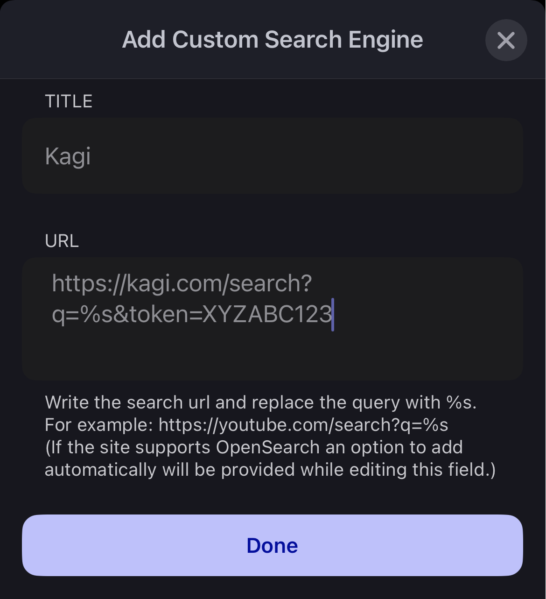
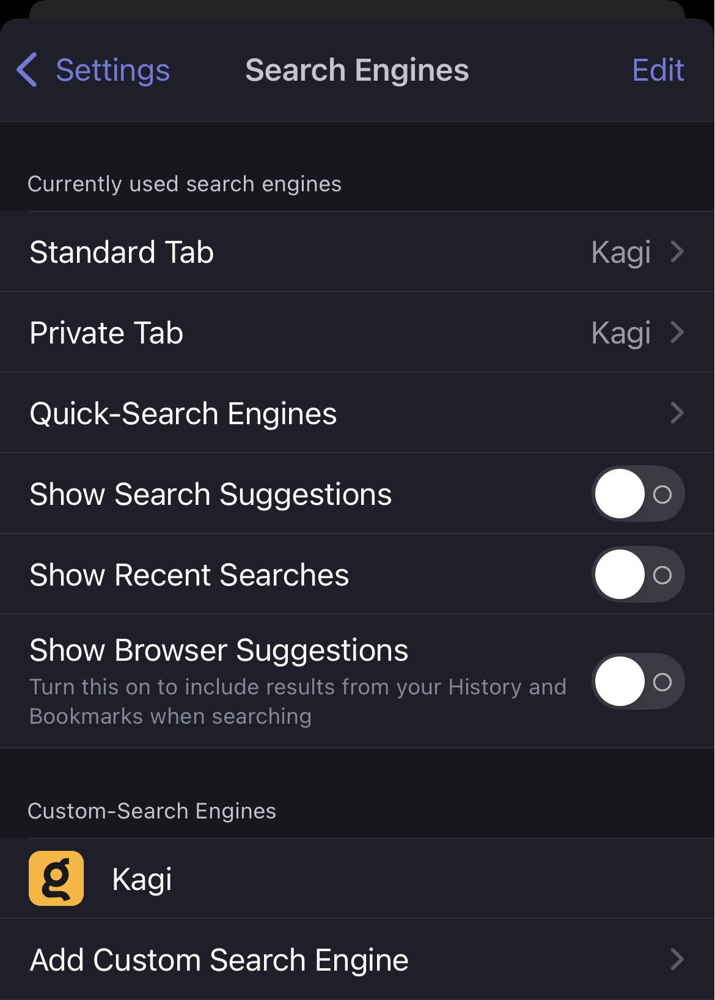

> Not your browser/OS? Return to [the hub page](../../../kagi/getting-started/setting-default.md) for setting Kagi as the default search engine.
# Setting Kagi as the default search engine on Brave on iOS

Based on user experiences, the best way to add Kagi as the default search engine in Brave on iOS is as follows:

1. Go to https://kagi.com
2. Find your [Session link](./../../privacy/private-browser-sessions.md) in the Control Center. 
3. By default, the session link is `https://kagi.com/search?token=XYZABC123`
4. Edit it so that the link is `https://kagi.com/search?q=%s&token=XYZABC123`, and copy it to your clipboard
5. On your iOS device, go to **Brave** -> **Settings** -> **Search Engines** -> **Add Custom Search Engine**, and paste the search URL you copied in step 4.
6. Tap **Done**.
 

You are now able to add Kagi as the default search engine for Standard and Private tabs.

 
