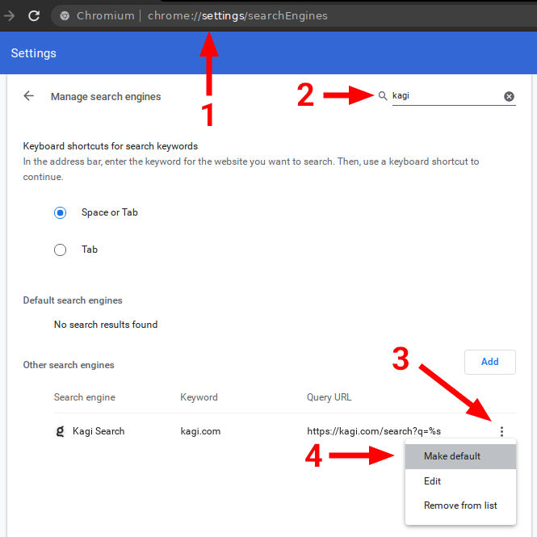

# Setting Kagi as Default on Chromium-based Browsers (Desktop)

## Kagi Search Extension (Recommended)

The easiest way to set Kagi as default on Chromium based browsers is by installing our [browser extension](https://chromewebstore.google.com/detail/kagi-search/cdglnehniifkbagbbombnjghhcihifij).

### Setting up the Kagi Extension in Google Chrome

 

<video src="./media/kagi_extension_google_chrome.mp4" width="720" type="video/mp4" autoplay muted loop playsinline disablepictureinpicture />

 

To enhance your browsing experience with Kagi, follow these steps to set Kagi as your default search engine in Google Chrome:

1. Launch Google Chrome.
2. Install the Kagi Search extension from the [Chrome Web Store](https://chromewebstore.google.com/detail/kagi-search-for-chrome/cdglnehniifkbagbbombnjghhcihifij) by clicking the **Add to Chrome** button.
3. You will be prompted to confirm you want to add the extension. To confirm, click on **Add extension**.
4. Click the **puzzle-piece** icon in Chrome’s toolbar (this is the Extensions menu), then click the **Pin** icon next to *Kagi Search for Chrome*.
5. Finally, click the **Kagi** icon in Chrome’s toolbar. If you see a message saying *No Kagi session found*, click the **Let’s go!** link (you may need to log into Kagi if you haven’t already).

## Manual Configuration (Advanced)

1. Right-click the Chrome address bar and choose **Manage Search Engines and Site Search**
2. In the **Site Search** section about halfway down, click the **Add** button at its upper right and fill in these details:
	- **Search engine:** Kagi Search
	- **Keyword:** kagi
	- **Query URL:** `https://kagi.com/search?q=%s` if you're not planning to use Kagi in private search. If you are, then use `https://kagi.com/search?token=TOKEN&q=%s` (replace TOKEN with the token found in your [private session link​](./../../privacy/private-browser-sessions))
3. Find Kagi again in the Site Search section. You may have to click **Additional sites** at the bottom if you don't see it right away.
3. Click the three dots next to the Kagi entry in the list.
4. Click **Make default**.

Note: Opera is no longer compatible as it is restricting users from using alternative search engines. If you are an Opera user you can [reach out to Opera](https://opera.atlassian.net/servicedesk/customer/portal/9) and request them to add Kagi to their list of search engines.

 
