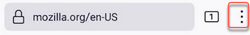

# Setting Kagi as Default on Firefox (Android)

1. Tap the three-dot menu button.

2. Tap **Settings**.
3. In the **General** section, tap **Search**.
4. Tap **Add search engine**.
5. A list of additional predefined search engines will be displayed.
6. Tap the **Other** radio button to add a search engine and do the following:
	- in the **Name** field, enter **Kagi**.
	- In the **Search string to use** field, enter `https://kagi.com/search?q=%s`
	- In the **Search suggestion API (optional)** field, enter `https://kagi.com/api/autosuggest?q=%s` 
	- Tap the confirmation button in the top right corner of the screen.

If your browser is configured to default to private browsing, this will require you to log back in to Kagi each time your tabs are closed. To get around this, in the **Search string to use** field, use your [session link](https://kagi.com/settings?p=user_details) and append `&q=%s` at the end.
