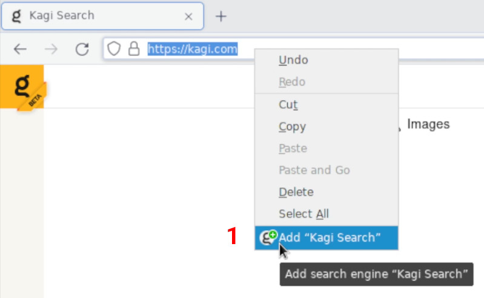
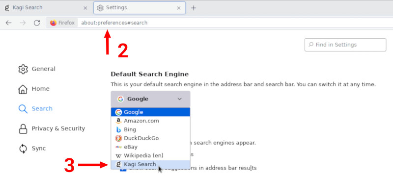

# Setting Kagi as Default on Firefox (Desktop)

## Kagi Search Extension (Recommended)

The easiest way to set Kagi as default on Firefox is by installing our [browser extension](https://addons.mozilla.org/en-US/firefox/addon/kagi-search-for-firefox/).

## Manual Configuration

1. Open [https://kagi.com](https://kagi.com), then right-click the browser address/search bar and select **Add Kagi Search**.
2. Open this URL in your search bar: [about:preferences#search](about:preferences#search)
3. Scroll to **Default Search Engine** and select **Kagi** from the dropdown.

To set up a private session link in Firefox:

1. Enter about:config in the address bar and press enter
2. Add a new preference called `browser.urlbar.update2.engineAliasRefresh`, of type `Boolean` and value `true`. (This will enable the button to add a new search engine in about:preferences#search)
3. Open this URL in your search bar: [about:preferences#search](about:preferences#search)
4. Click the "Add" button below the table under the heading "Search Shortcuts"
5. Enter the following values:
	- **Search engine name:** `Kagi Search`
	- **Engine URL:** `https://kagi.com/search?token=TOKEN&q=%s` (replace TOKEN with the token found in your [private session link​](./../../privacy/private-browser-sessions))
	- **Alias:** `kagi`
6. Select the new "Kagi Search" as your default search engine using the dropdown at the top of this page.

There is currently no way to manually set the 'Search suggestion API' for a search engine in Firefox desktop.
Installing [the extension](#browser_extension) does allow you to use suggestions.
