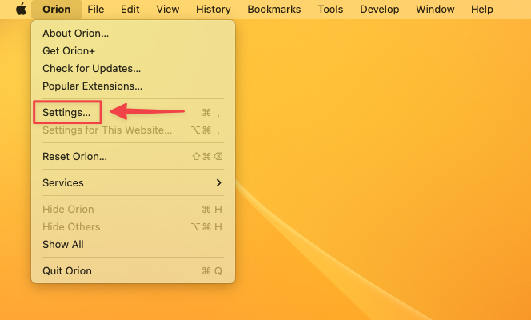
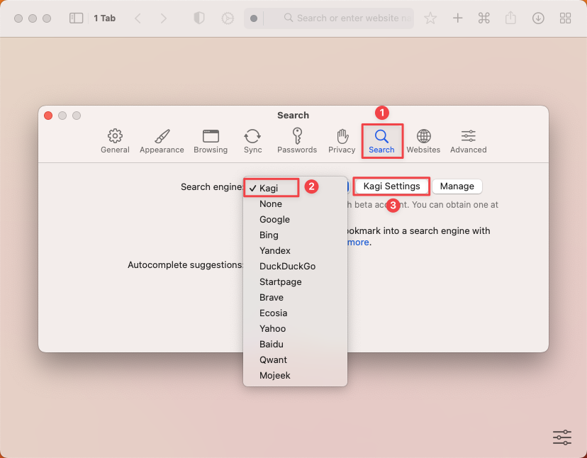
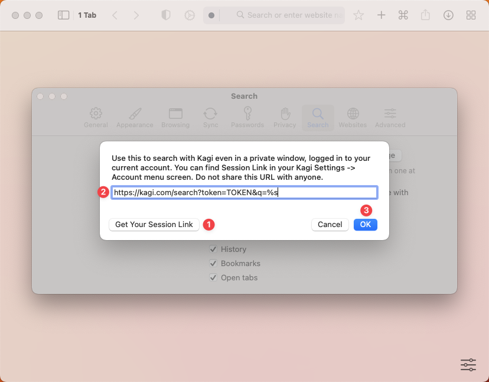

> Not your browser/OS? Return to [the hub page](../../../kagi/getting-started/setting-default.md) for setting Kagi as the default search engine.
# Setting Kagi as Default on Orion (Mac)

Orion already includes Kagi. Pick it once in Settings and you are ready to search.

1. **Open Orion**, then choose **Orion › Settings**.  
   

2. Go to the **Search** tab and select **Kagi** under **Search engine**.  
   

3. **(Optional)** Click **Kagi Settings**, then in the pop-up choose **Get Your Session Link**, paste the link into the field, and press **OK**. **This keeps you signed in when using private windows or after clearing cookies.**  
   

