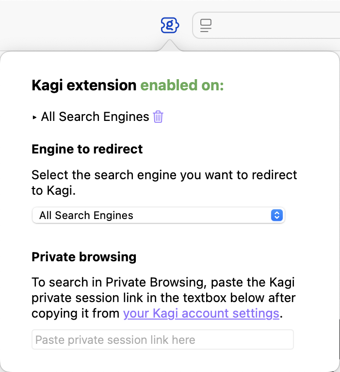

> Not your browser/OS? Return to [the hub page](../../../kagi/getting-started/setting-default.md) for setting Kagi as the default search engine.
# Setting Kagi as Default on Safari (Mac)

 

<video src="./media/kagi_extension_safari_mac.mp4" width="720" type="video/mp4" autoplay muted loop playsinline disablepictureinpicture />

 

## Install the Kagi for Safari extension (Mac)

1. Install the [Kagi for Safari](https://apps.apple.com/app/kagi-search-for-safari/id1622835804) extension.
2. Enable the extension in **Safari** > **Settings** > **Extensions**.

## Setting up the Kagi for Safari extension (Mac) {#setting_up_extension_safari_mac}

To set up the Kagi extension for Safari on macOS:

1. Visit your [Account Settings](https://kagi.com/settings/user_details) page and **copy the Session Link**.
2. Open **Safari**.
3. Click on the **Kagi extension icon** in Safari's toolbar.
4. If you receive a prompt saying **The extension "Kagi for Safari" would like to access kagi.com.**,
	- Click on **Always Allow on Every Website**.
5. Click the **extension icon** again.
6. **Paste the Session Link** in the Private Browsing section. This will allow you to use Kagi Search in private windows.

 

## Choosing a Search Engine to Redirect (Mac) {#choosing_a_search_engine_to_redirect_mac}

By default, the Kagi Search extension for Safari will redirect searches from any search engine to Kagi. For a better experience, we recommend selecting a single search engine to redirect (DuckDuckGo or Ecosia are recommended options as they have better privacy policies than other alternatives). You can accomplish this by following these steps:

1. Open **Safari**.
2. In the menu bar, go to **Safari** > **Settings**.
3. Click on the **Search** tab.
4. In the **Search engine** dropdown, select the search engine you want to redirect to Kagi (DuckDuckGo or Ecosia are recommended).
5. Close the Settings window.
6. In Safari’s toolbar, click on the **Kagi extension icon**.
7. In the **Engine to redirect** dropdown, select the same search engine you chose in step 4.

**Note:** If you set DuckDuckGo as default and experience issues with [Bangs](../../features/bangs.md), we recommend switching to Ecosia instead.
