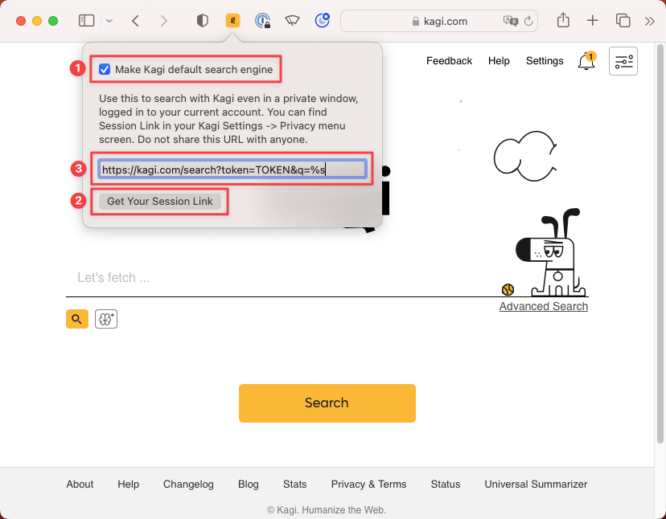

# Setting Kagi as Default on Safari (Mac)

1. Install the [Kagi Search for Safari extension](https://apps.apple.com/app/kagi-search-for-safari/id1622835804).
2. Activate the extension in **Safari** > **Preferences** > **Extensions**.
3. Enjoy Kagi search from your Safari address bar!

If you are a macOS, iOS, or iPadOS user, we strongly recommend using Kagi with the free [Orion](https://browser.kagi.com/) web browser, produced by the same team that built Kagi.

## Setting up the Kagi Extension in Safari for Mac {#setting_up_extension_safari_mac}

To set up the Kagi extension for Safari on macOS click on the extension icon in Safari's toolbar and then:
- Make sure the **Make Kagi Default Search Engine** checkbox is checked to search Kagi from the address bar.
- Use the **Get Your Session Link** button to get the link with your personal token.
- Paste the Session Link in the text field. This will allow you to use Kagi Search in private windows.

 

## Choosing a Search Engine to Redirect (Mac) {#choosing_a_search_engine_to_redirect_mac}

By default, the Kagi Search extension for Safari will redirect searches from any search engine to Kagi. For a better experience, we recommend selecting a single search engine to redirect (DuckDuckGo or Ecosia are recommended options as they have better privacy policies than other alternatives). You can accomplish this by following these steps:

1. Open **Safari**.
2. In the menu bar, go to **Safari** > **Settings**.
3. Click on the **Search** tab.
4. In the **Search engine** dropdown, select the search engine you want to redirect to Kagi (DuckDuckGo or Ecosia are recommended).
5. Close the Settings window.
6. In Safari’s toolbar, click on the **Kagi extension icon**.
7. In the **Engine to redirect** dropdown, select the same search engine you chose in step 4.

**Note:** If you set DuckDuckGo as default and experience issues with [Bangs](../../features/bangs.md) we recommend switching to Ecosia instead.
