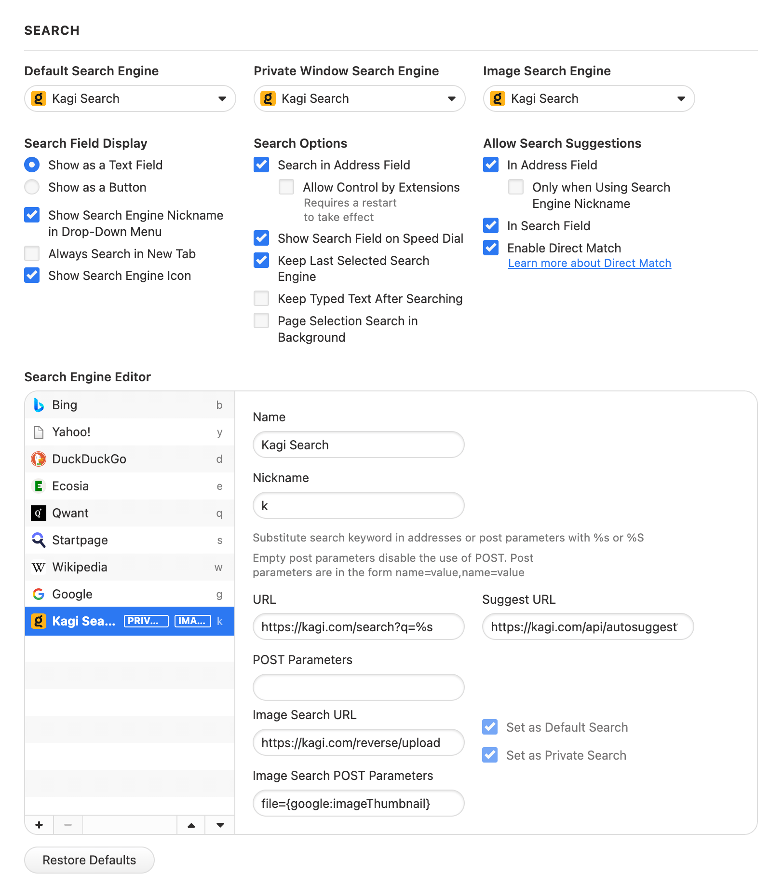

> Not your browser/OS? Return to [the hub page](../../../kagi/getting-started/setting-default.md) for setting Kagi as the default search engine.
# Setting Kagi as Default on Vivaldi (Desktop)

## Manual Configuration (Advanced)

1. Type `vivaldi:settings/search/` in the address bar to get to the search settings
2. In the **Search Engine Editor** halfway down, click the "+" button at the bottom of the list to add a new search engine, and fill in these details:
    - **Name:** Kagi Search
    - **Nickname:** k
    - **URL:** `https://kagi.com/search?q=%s` if you're not planning to use Kagi in private search. If you are, then use `https://kagi.com/search?token=TOKEN&q=%s` (replace TOKEN with the token found in your [private session link​](./../../privacy/private-browser-sessions))
    - **Suggest URL:** `https://kagi.com/api/autosuggest?q=%s`
    - **Image Search URL:** `https://kagi.com/reverse/upload`
    - **Image Search POST Parameters:** `file={google:imageThumbnail}`
3. Tick the box marked "Set as Default Search" (and, if you want it, "Set as Private Search")

Then, scroll to the top of this page.

1. Ensure that all three of the dropdowns are set to "Kagi Search"
2. Under "Allow Search Suggestions", tick "in address field" and "in search field"

 
