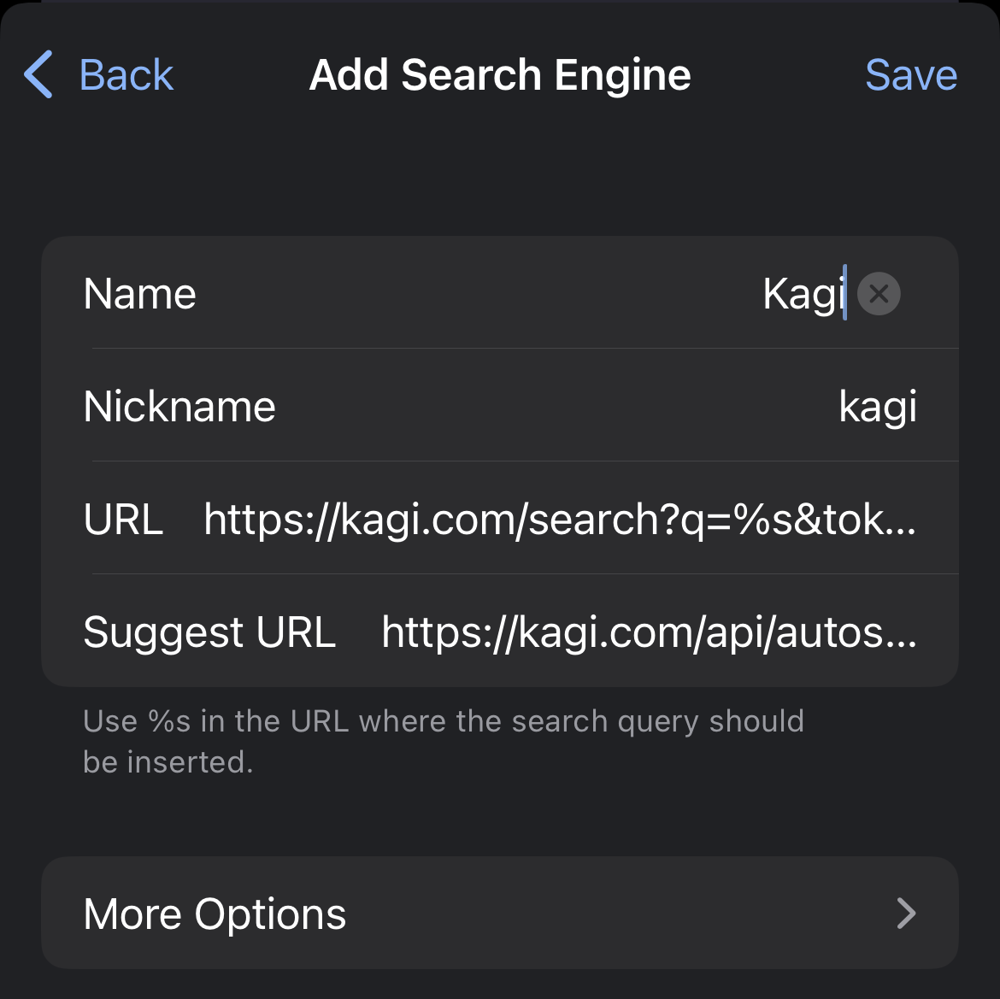
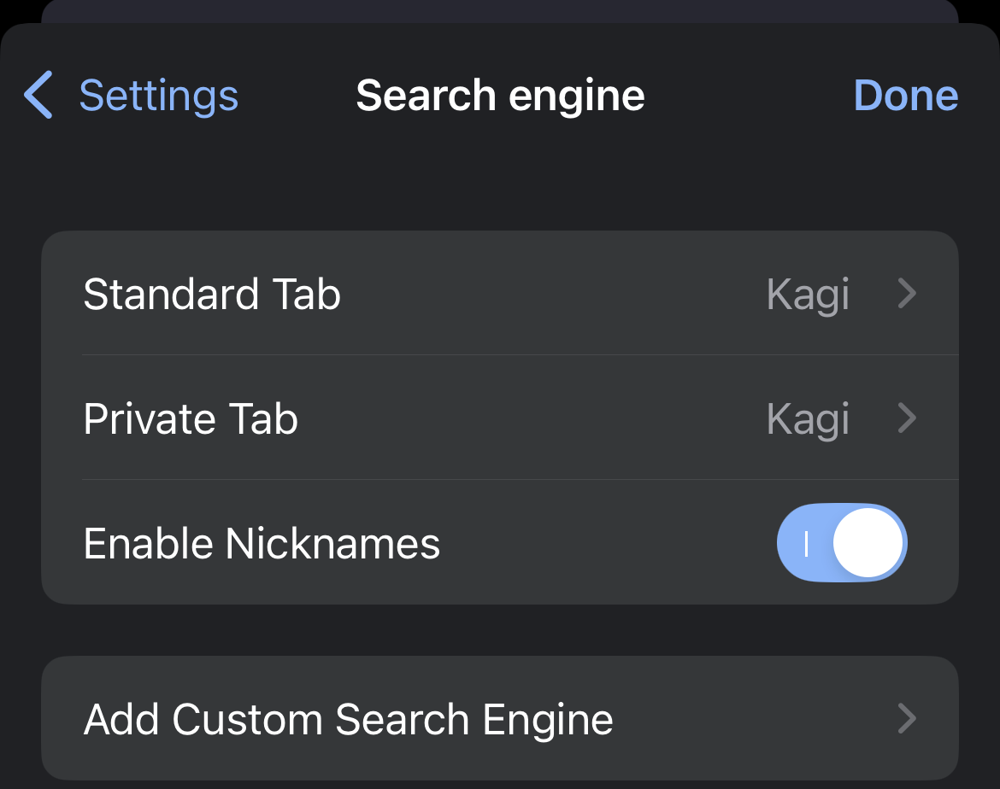

> Not your browser/OS? Return to [the hub page](../../../kagi/getting-started/setting-default.md) for setting Kagi as the default search engine.

# Setting Kagi as the default search engine on Vivaldi on iOS

1. Obtain your Session link:
- Go to https://kagi.com.
- Find your [Session link](./../../privacy/private-browser-sessions.md) in the Control Center. 
- By default, the session link is `https://kagi.com/search?token=XYZABC123`.
- Edit it so that the link is `https://kagi.com/search?q=%s&token=XYZABC123`, and copy it to your clipboard.
2. Add Kagi as a search engine to Vivaldi:
- **Settings** -> **Search engine** -> **Add Custom Search Engine**
- The name and nickname can be anything you want. For the URL, paste the link with your token that you created in the previous step.
 
- If you want search suggestions, add `https://kagi.com/api/autosuggest?q=%s` as the Suggest URL.
- Tap **Done** in the top-right corner.
- Go back to the Search engine menu and set Kagi as the search engine for your desired purpose (Standard tabs, Private tabs, or both).
 
- Done!
