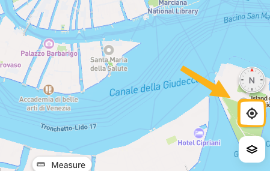
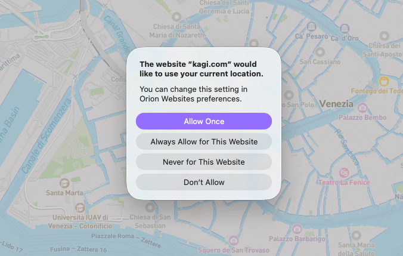

# Kagi Maps

 

<video src="./media/kagi_maps.mp4" width="720" type="video/mp4" autoplay muted loop playsinline disablepictureinpicture />

[Kagi Maps](https://kagi.com/maps) is a powerful tool that simplifies the process of finding businesses, points of interest, and addresses. With Kagi Maps, you can easily search for locations and discover interesting stops.

#### Available on:

- [Kagi Maps Website](https://kagi.com/maps)
- iOS and Android apps coming soon.

::: warning Note
Kagi Maps got a full rework in Q2 2025 and might lack some features such as directions, or ability to manually set your location.
In the meantime, be sure to look at the suggestions for features on our [Feedback Forum](https://kagifeedback.org/t/feature-maps?sort=latest).
:::

## Privacy

Unlike other competing Map services that track your location to serve you ads, Kagi does not track or store your search history or location data.

## 3D View

<video src="./media/kagi-maps-3d-view.mp4" width="720" type="video/mp4" autoplay muted loop playsinline disablepictureinpicture />

If you are using the Kagi Basemap, you can tilt the map into a 3D view in two ways:

1. **With a mouse**: Right-click and hold while moving the mouse up or down.
2. **On a touchscreen**: Place two fingers horizontally on the screen and slide them up or down.

Both methods adjust the viewing angle, transforming the map from a top-down view to an angled, oblique perspective. This reveals buildings and trees in three dimensions, providing a more realistic representation of the urban landscape. Release the mouse or lift your fingers when you've reached your desired tilt angle.

## Layer View

<video src="./media/kagi-maps-layers.mp4" width="720" type="video/mp4" autoplay muted loop playsinline disablepictureinpicture />

You can choose different layer views depending on your needs. These layers include:

- **Day**: Daytime view of the globe.
- **Night**: A darker view of the globe, useful for viewing at night and for population density.
- **Satellite**: Satellite view.
- **OSM**: View the map in the style of OpenStreetMap.
- **Popular Areas**: A heat map showing locally owned businesses. Corporate chains are excluded.

## Enabling Geolocation {#enabling_geolocation}

By default, Kagi Maps uses your IP address to determine your approximate location and use it as the initial location of the map.

For a better experience while using Kagi Maps, we recommend sharing your geolocation with Kagi Maps. Your location will only be saved in your browser’s storage and will not be associated with your account. To do this, click or tap on the Geolocation button:

{data-zoomable}

Your browser will prompt you to grant Kagi Maps permission to access your location using its built-in geolocation system. 

{data-zoomable}

Depending on your browser, you may see options such as:

- **Allow Once**: Share your location only once
- **Always Allow for This Website**: Automatically allow location access whenever you visit Kagi Maps in the future
- **Never for This Website** and **Don't Allow**: Deny access

Choose the option that best fits your privacy preferences. If you want to minimize ongoing access, select "Allow Once" If you’re comfortable with Kagi Maps accessing your location whenever you use the site, choose "Always Allow for This Website"

## Control Panel

Kagi Maps includes a Control Panel that allows you to customize your map experience to better suit your needs. You can access the Control Panel from the main map interface using the icon in the top right.

The Control Panel currently offers the following options:

- **Additional Wikipedia POIs**  
  Enable this to display extra geospatial Wikipedia articles that are considered more controversial or historic (such as plane crashes, riots, or shipwrecks). This feature is opt-in and can be toggled on or off.

- **Distance Units**  
  Choose between Metric and Imperial units for navigation and the map’s scalebar. By default, Kagi Maps uses the metric system, but you can switch to imperial if you prefer.

- **Show Local Businesses Only (beta)**  
  Toggle this option to filter out most chain stores and major brands, showing primarily local points of interest on the map. Note that this does not affect search results, it only changes which POIs are displayed on the map itself.

- **Filter POIs**  
  Toggle this option to remove specific POIs on the map.
  Note that this does not affect search results, it only changes which POIs are displayed on the map itself.

- **Animations**  
  Toggle this option off to disable panning and zooming animations when selecting a POI.

- **Zooming in on a Selected POI**  
  Choose the level of zoom when selecting a POI, ranging from far to 3D view.

These settings help you tailor Kagi Maps to your preferences, whether you want a more local experience or need to adjust measurement units for your region.

::: info Note
Many more customization options are planned for future releases.
:::
