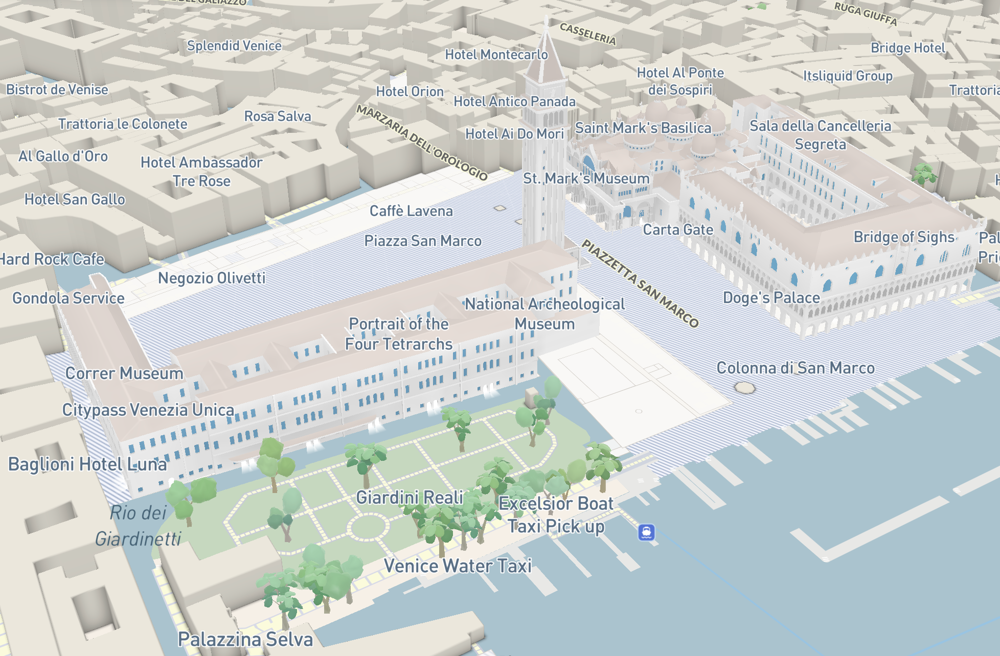
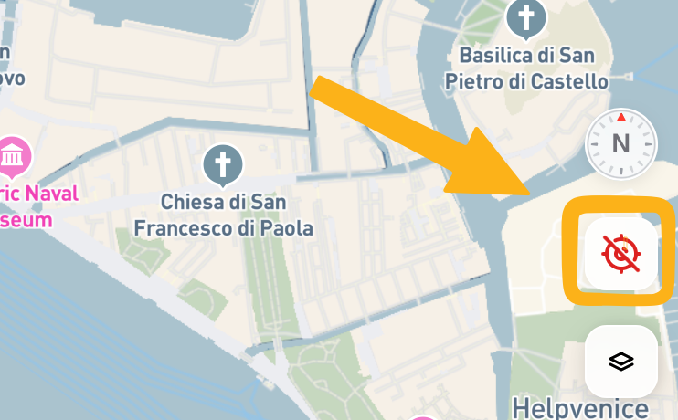
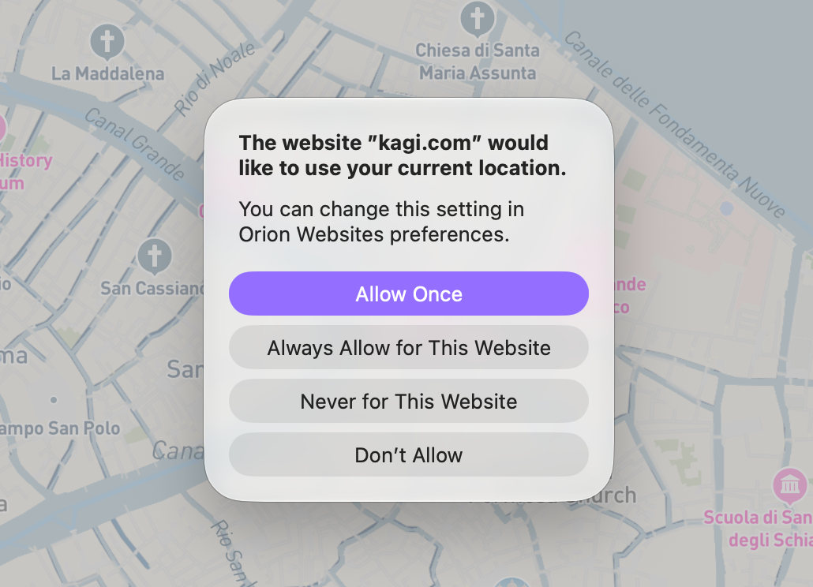

# Kagi Maps

 

<video src="./media/kagi-maps-hero.mp4" width="720" type="video/mp4" autoplay muted loop playsinline disablepictureinpicture />

[Kagi Maps](https://kagi.com/maps) is a powerful tool that simplifies the process of finding businesses, points of interest, and addresses. With Kagi Maps, you can easily search for locations and discover interesting stops.

#### Available on:

- [Kagi Maps Website](https://kagi.com/maps)
- iOS and Android apps coming soon.

## Privacy

Unlike other competing Map services that track your location to serve you ads, Kagi does not track or store your search history or location data.

## 3D View

<!-- last-verified: 2026-07-13 -->
{data-zoomable}

If you are using the Kagi Basemap, you can tilt the map into a 3D view in two ways:

1. **With a mouse**: Right-click and hold while moving the mouse up or down.
2. **On a touchscreen**: Place two fingers horizontally on the screen and slide them up or down.

Both methods adjust the viewing angle, transforming the map from a top-down view to an angled, oblique perspective. This reveals buildings and trees in three dimensions, providing a more realistic representation of the urban landscape. Release the mouse or lift your fingers when you've reached your desired tilt angle.

## Basemap & Overlays

<!-- last-verified: 2026-07-13 -->

Kagi Maps lets you choose a basemap style and layer additional overlays on top of it, depending on your needs.

**Basemap**

- `Day`: Daytime view of the globe.
- `Night`: A darker view of the globe, useful for viewing at night and for population density.
- `Satellite`: Satellite view.
- `OSM`: View the map in the style of OpenStreetMap. This mode shows raw map data and does not support overlays.

**Overlays**

Layer additional information on top of your basemap, grouped into categories such as:

- Terrain: shading and elevation lines, such as `Hillshade` and `Contour`.
- Live Data: real-time layers, such as `Traffic` and `Popular areas`, a heat map showing locally owned businesses (corporate chains are excluded).
- 3D Details: individual 3D elements you can toggle, such as `Trees`, `Buildings`, and `Landmarks`.

## Enabling Geolocation {#enabling_geolocation}

<!-- last-verified: 2026-07-13 -->

By default, Kagi Maps uses your IP address to determine your approximate location and use it as the initial location of the map.

For a better experience while using Kagi Maps, we recommend sharing your geolocation with Kagi Maps. Your location will only be saved in your browser’s storage and will not be associated with your account. To do this, click or tap on the Geolocation button:

{data-zoomable}

Your browser will prompt you to grant Kagi Maps permission to access your location using its built-in geolocation system. 

{data-zoomable}

Depending on your browser, you may see options such as:

- **Allow Once**: Share your location only once
- **Always Allow for This Website**: Automatically allow location access whenever you visit Kagi Maps in the future
- **Never for This Website** and **Don't Allow**: Deny access

Choose the option that best fits your privacy preferences. If you want to minimize ongoing access, select "Allow Once" If you’re comfortable with Kagi Maps accessing your location whenever you use the site, choose "Always Allow for This Website"

## Control Center

Kagi Maps includes a Control Center that allows you to customize your map experience to better suit your needs. You can access the Control Center from the map's toolbar.

The Control Center is organized into three groups of settings:

**Preferences**

- `Distance Units`: Choose between Metric and Imperial units for navigation and the map's scalebar. By default, Kagi Maps uses the metric system, but you can switch to imperial if you prefer.
- `Animations`: Toggle this option off to disable the flying animation when the map moves to a search result.
- `Zoom controls`: Choose how close the map gets after clicking on a point of interest, ranging from a wider view up to a fully tilted 3D angle.

**Map Display**

- `Wikipedia markers`: Enable this to display extra geospatial Wikipedia articles that are considered more controversial or historic (such as plane crashes, riots, or shipwrecks). This feature is opt-in and can be toggled on or off.
- `Independent business` (beta): Toggle this option to prioritize local and independent venues over corporate chains on the map. Note that this does not affect search results, it only changes which POIs are displayed on the map itself.

**Categories**

Choose which types of points of interest appear on the map, grouped into categories such as Food & Drink, Shopping, and Transport. Expand a category to toggle individual subtypes on or off, such as Restaurants or Cafés & Bakeries within Food & Drink. Note that this does not affect search results, it only changes which POIs are displayed on the map itself.

::: info Note
Many more customization options are planned for future releases.
:::
