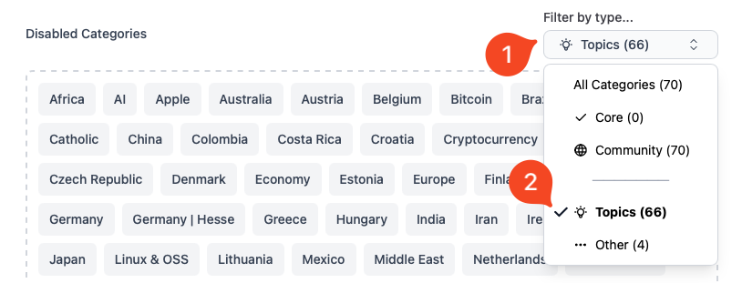
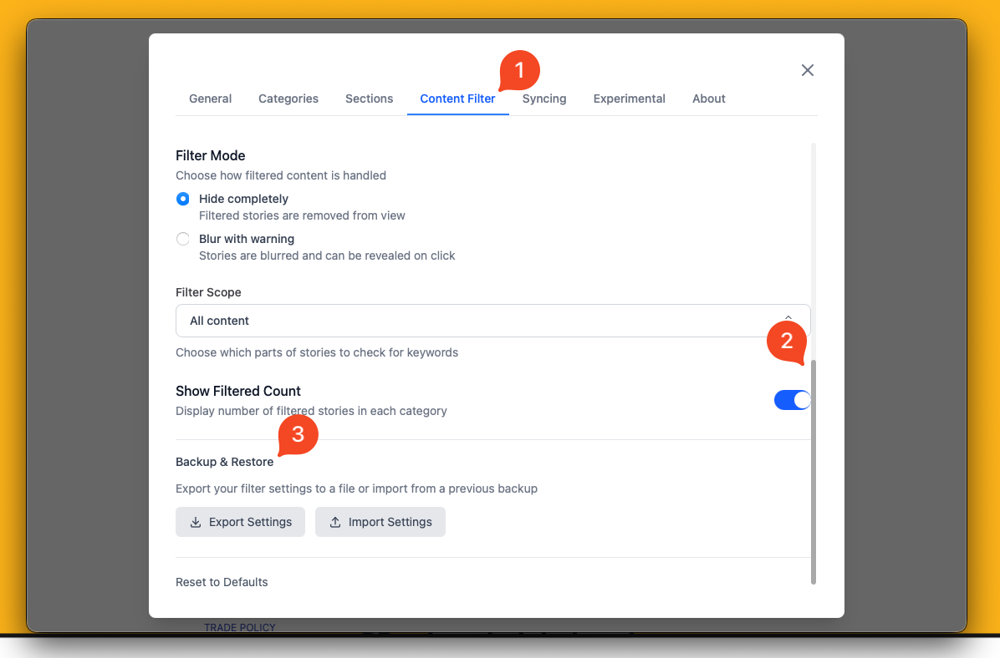
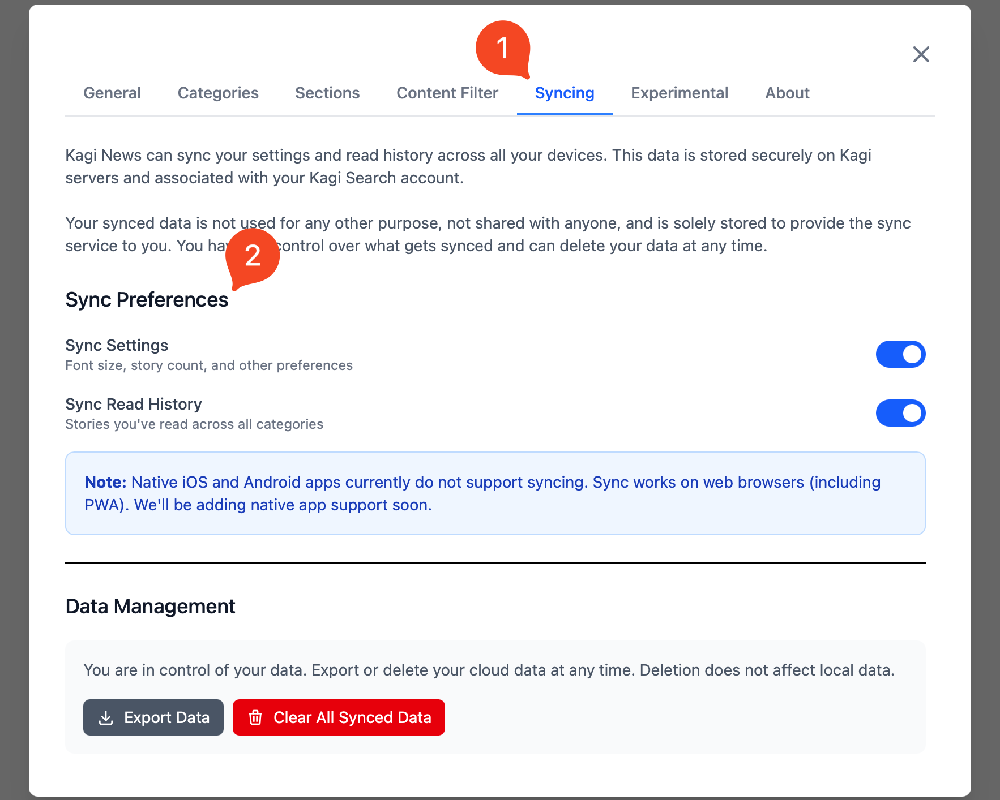

# Kagi News

 

<video src="./media/news.mp4" width="720" type="video/mp4" autoplay muted loop playsinline disablepictureinpicture />

**Kagi News** is a comprehensive daily press review service that delivers global news with a focus on privacy and community curation.

It marks a shift in the way we consume news, moving from attention-grabbing ad-driven content to a more mindful, privacy-respecting approach to staying informed. 

You can read our [blog post](https://blog.kagi.com/kagi-news) for more information about the vision behind Kagi News.

#### Available on:
- [Kagi News Website](https://news.kagi.com/)
- [iPhone/iPad](https://apps.apple.com/us/app/kagi-news/id6748314243)
- [Android](https://play.google.com/store/apps/details?id=com.kagi.news)

## Features

- **Single daily updates** to help you stay informed without information overload.
- **Ad and tracking-free experience**, news are based on relevance, not revenue.
- **Diverse perspectives are prioritized**, giving you a rounded understanding of events.
- **Customize which news categories you want to follow** based on your interests.
- **Choose how deeply you want to dive** into each article with adjustable depth control.
- **Content Filtering** to filter out topics or words.
- **Cloud Syncing** to have your settings and read history available across devices.
- **Community-driven and open-source**, ensuring transparency in news selection.
- **Built-in translation capabilities** to read news in your preferred language.
- **Respectful of publishers** by using public RSS feeds rather than scraping content.

---

#### Refresh Time

Kagi News refreshes worldwide once a day at around **noon UTC**, it may take a while for the news to refresh (around 30 minutes) as the articles get summarized and translated in each language.

## Privacy

Kagi News does not track or monetize your attention. 

We don’t know which articles you’ve visited (cloud sync is entirely optional, and you can delete synced data at any time) nor does the source: all requests to the RSS feeds are proxied by us.

## Language Settings

<video src="./media/kagi_news_translation.mp4" width="720" type="video/mp4" autoplay muted loop playsinline disablepictureinpicture />

You can change your language preferences in **Settings** > **General** > **Language & Region**. 

#### Interface Language
- **Default**: Sets the UI language (buttons, menus and interface text) to your browser's language. 
This only affects the UI of Kagi News and not articles.

#### Content Language
- **Default**: Most categories are in the language of your browser, while news in country categories will remain in its original language.
- **Source**: All content is displayed in the original language of the article.
- **Custom**: After choosing a main language and other languages that you speak, articles in those languages will be shown without translation, while others will be translated to your main language.

:::details Current list of available languages
- English
- Portuguese
- Brazilian Portuguese
- Italian
- French
- Spanish
- German
- Dutch
- Simplified Chinese
- Traditional Chinese
- Japanese
- Hindi
- Ukrainian
- Arabic
- Hebrew
- Catalan
- Finnish
- Korean
- Luxembourgish
- Norwegian Bokmål
- Polish
- Russian
- Swedish
- Thai
- Turkish
:::

## Categories

<video src="./media/kagi_news_categories.mp4" width="720" type="video/mp4" autoplay muted loop playsinline disablepictureinpicture />

Articles are sorted into Categories based on one or more topic or other charateristic (such as the country) with a few enabled by default.
You can change or toggle these categories by going to **Settings** > **Categories**. They can be reordered by holding and dragging.

{data-zoomable}

Categories can also be filtered by type (core, community or topics for example).

## Article Sections

{data-zoomable}

When you open a news article, by default all sections of an article (such as summary, images and technical details) are enabled. If you’d like to make your reading experience more succint, you can reorder or disable sections by navigating to **Settings** > **Sections**.

::: details Sections as of October 2025
- Summary
- Primary Image
- Sources
- Highlights
- Quotes
- Secondary Image
- Perspectives
- Historical background
- Humanitarian impact
- Technical details
- Business angle
- Scientific significance
- Travel advisory
- Performance statistics
- League standings
- Design principles
- User experience impact
- Gameplay mechanics
- Industry impact
- Technical specifications
- Timeline of events
- International reactions
- Quick questions
- Action items
- Did you know?
:::

## Content Filter

<video src="./media/kagi_news_filters.mp4" width="720" type="video/mp4" autoplay muted loop playsinline disablepictureinpicture />

You can customize your news feed by filtering out unwanted topics using the provided presets for common topics, or by using custom keywords such as a celebrity's name or a specific topic. When you apply a filter, you can see a list of the filtered keywords in the "Active Filters" area.

{data-zoomable}

Filters can be backed up or restored by scrolling to the bottom of the Content Filter page and clicking the Export / Import button.

:::warning Note:
Native iPhone/iPad and Android apps currently do not support content filters. Filters work on the web version (including PWA). 
We'll be adding native app support soon.
:::

## Syncing

{data-zoomable}

You can optionally choose to have your Settings and Reading History saved securely on our servers by navigating to **Settings** > **Sync**.  

Currently we sync:
- **Settings** (Font size, story count, and other preferences).
- **Read History** (Stories you've read across all categories).

:::warning Note:
Native iPhone/iPad and Android apps currently do not support syncing. Sync works on the web version (including PWA). 
We'll be adding native app support soon.
:::

## Contributing to Sources

News sources are community-curated and open source.

By contributing, you help ensure Kagi News provides diverse, high quality journalism from sources the community trusts. Anyone can propose news sources for inclusion.
:::info GitHub Repository
News sources, community-curated feeds and front-end code can be found in our public [GitHub repository](https://github.com/kagisearch/kite-public).
:::