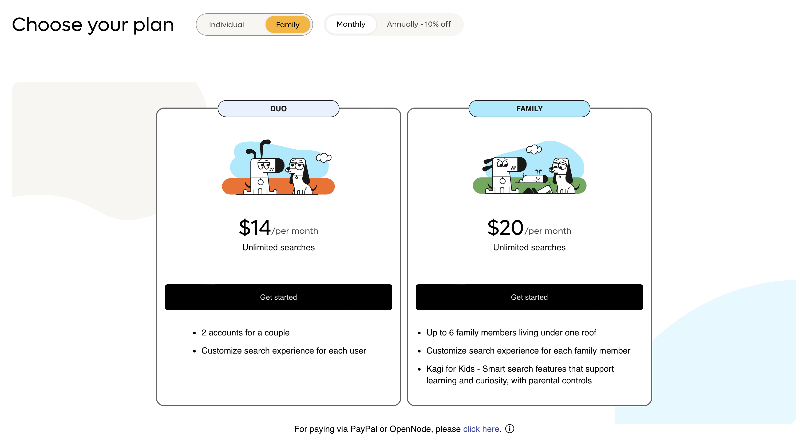

# Family Plan

> **Important Notice:** Effective April 11th, 2024, Kagi will begin collecting applicable sales tax/VAT on all new subscription purchases to comply with global tax regulations. For existing members, sales tax/VAT will be applied to your next renewal after April 21st, 2024. Please visit the [FAQ](../faq/sales-tax-vat.md) for more information.

Since the inception, Kagi has been driven by the idea of humanizing the web, especially for families and kids. Our commitment to this cause was the inspiration behind the creation of Kagi. Many of our staff are parents working together to build a better search and web future for our children. We strive to provide a search engine that prioritizes the well-being of your loved ones, particularly the most vulnerable ones like children, by offering an ad-free and safe browsing experience. We offer two different group plans based on your specific needs.

The Kagi Family Plan is perfect for families wanting to search smarter, emphasizing learning over consumption while respecting your family's privacy.  With a simple, affordable pricing model and powerful features, the Kagi Family Plan makes it easy to get the most out of Kagi Search as a family.

**Table of Contents**

- [How to Use the Kagi Family Plan](#using)
- [Logging in for Kids](#kidslogin)
- [Unique Features](#features)
  - [Kid-Friendly Search Experience](#kidfriendly)
  - [Parental Controls](#parental)
  - [Quick Answers](#ai)
  - [Lenses](#lenses)
  - [Personalized Results](#pr)
  - [New Illustrations](#illustrations)
- [Story behind the Poop Avatar](#poopavatar)

## How to Use the Kagi Family Plan {#using}

To sign up for the Family Plan, select the plan that fits your family's size and needs at Kagi [account creation](https://kagi.com/onboarding?p=choose_plan&plan=family).

<em>Select Family Plan at account creation</em>

If you have an existing Kagi account and want to upgrade to the Family plan, everything you need to do is cancel your existing plan, and then resubscribe to the Family plan (any credit left over will be pro-rated).

Adding family members is easy, you can [invite them via email](https://kagi.com/settings?p=account_members) through Kagi. For kids, you can use a username, and an adult will help them log in by getting a verification email.

<em>Invite family members to the plan</em>

The [Family Plan dashboard](https://kagi.com/settings?p=account_members) gives you a complete picture of your family's members

<em>Manage family members</em>

The [Billing screen](https://kagi.com/settings?p=billing) has the overview of the plan and allows you to update payment info or cancel the subscription.

<em>Billing screen</em>

## Logging in for Kids {#kidslogin}

To log-in kid accounts, just proceed to normal login on their device. Kids enter just their username and password is not needed.

A verification email will be sent to the account owner. They can just click the link in the email to automatically log in the kid account, or enter the provided numerical code.

## Unique Features {#features}

The Kagi Family Plan has unique features that make it perfect for families.

### Kid-Friendly Search Experience {#kidfriendly}

The Kagi Family Plan also includes a kid-friendly search experience that uses strict content filters to ensure children are not exposed to harmful content. Kid’s profile simplifies the search experience with larger text, icons, and content adjusted for kids.

### Parental Controls {#parental}

The Kagi Family Plan comes with parental controls that let parents manage their children's search experience.

<em>Restrict content</em>

Kagi allows parents to toggle whether kids will have access to the search results on the entire web or a restricted set of sites (whitelist) only through “lenses.”

Safe search filters exclude adult material from the search results.

### Quick Answers {#ai}

We are featuring state of the art AI tools that can improve the quality of consumed information for kids. AI tools can be beneficial for getting quick answers to common questions, but it's important to remember that they're not always accurate. We encourage you to talk with kids about the potential risks and benefits of AI question-answering tools. It's important for kids to understand how these tools work and how to use them safely and responsibly in a way to nurture curiosity.

We added appropriate warnings for AI tools around the interface and a particular content-moderation filter to ensure AI output does not contain harmful content.

<em>Instant answers for kids powered by AI</em>

### Lenses {#lenses}

Lenses are a subset of search results that are restricted to a subset of whitelisted sites (up to 10 per lens). You can create and share multiple lenses, such as having a lens for Education, School work, or Entertainment and assign the default one to be used for searches. We allow you to export and import lenses to share with other community parents.

<em>Manage Lenses</em>

Parents can create lenses for children to ensure they have access to the resources they need while keeping them safe from inappropriate content.

<em>Create a lens</em>

### Personalized Results {#pr}

In addition to lenses, we include the ability for parents to completely block (ban) websites from showing in the results, or to promote useful sites. Up to 1,000 websites can be curated in this way.

<em>Granular control over what appears in the search results</em>

### New Illustrations {#illustrations}

Our mascot Doggo now has a lady friend, and we introduced several new and delightful illustrations throughout the interface.

<em>Lady Doggo</em>

## Story behind the Poop Avatar {#poopavatar}

Our selection of avatars for kids includes a poop avatar (which most kids find really funny), and there's a reason why we made this choice that goes deeper than what meets the eye.

<em>Poop Avatar</em>

In the day and age of smartphones, social media, and instant gratification, it's more important than ever to teach kids about identity, privacy, and online safety. That's why we've made a conscious decision to include a poop avatar in our selection of avatars for kids. We aim to educate kids about responsible technology use in an engaging, lighthearted way that inspires learning through fun.

It is an opportunity to teach kids that they are not their online avatar and help them develop a healthy sense of identity and self-esteem. Online avatars  are often designed to be cute, funny, or attention-grabbing, but they don't necessarily reflect who the child is as a person.

When kids start using online identities at a young age, it's important to help them understand that their avatar is just a representation of themselves online, and that it doesn't define who they are in real life. This can help prevent them from feeling too attached to their online persona and from feeling hurt or embarrassed if they receive negative feedback or criticism online.

Teaching kids that they are not their online avatar can also help them understand the importance of privacy and security online. Kids need to learn how to protect their personal information and avoid sharing too much about themselves online, and understanding that their avatar is not a true reflection of who they are can help them understand why it's important to be cautious about what they share.

At Kagi, we believe that it's important to provide kids with a fun and engaging online experience while also teaching them important lessons about humanity, identity, privacy, and online safety. Our poop avatar is just one example of how we try to make online searching and learning more fun for kids, while also encouraging them to be thoughtful and responsible digital citizens.
