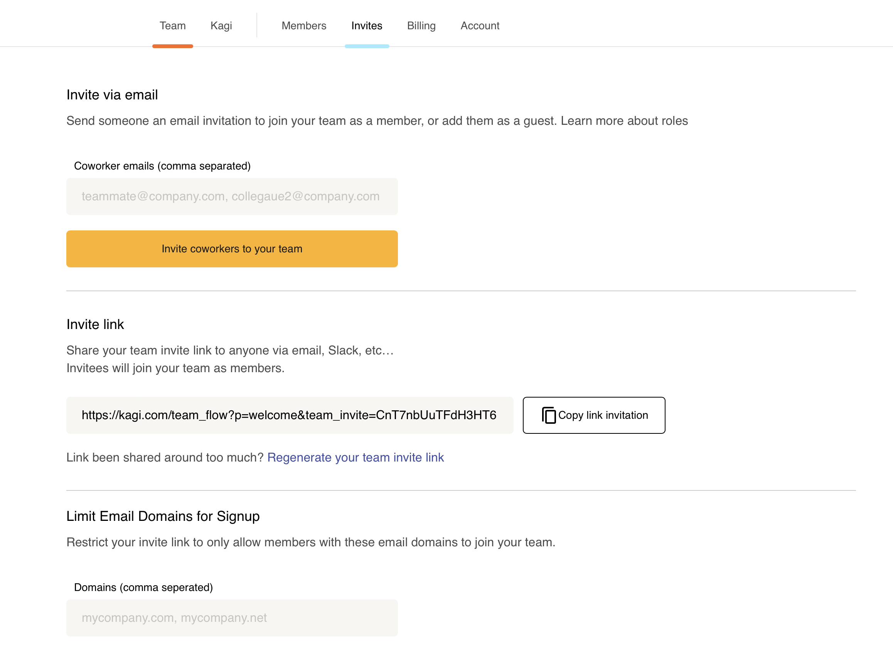
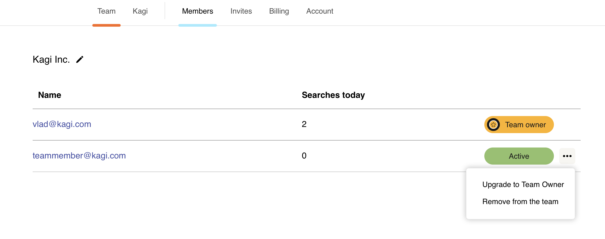

# Kagi for Business

Kagi Team plan is created for businesses, organizations and teams. Kagi Team plan is currently in invite only beta.

If you are interested in a plan for your team please inquire by emailing [support@kagi.com](mailto:support@kagi.com).

Main features:
- User management dashboard
- Control access by IP address
- Team members can share settings and Kagi tweaks between them
- Access to Kagi Search API
- Learn more about [Team plan features](../features/team-plan-features.md)

Price:
- $19/mo for unlimited users + search cost (2.5 cents per search)

## Adding Team Members

Since the Kagi Team Plan is pay-per-use, you can add as many team members as you want and only pay for those that are actively searching.

From the [Invites tab](https://kagi.com/settings?p=invites) there are two ways to add new team members.

1. Send the new members an email through Kagi.
2. Generate an invite link and share with the new members.

You can also limit the domains used to sign up to your team to your company’s domain or reset the invite link if necessary.

## Removing Team Members

From the [Members tab](https://kagi.com/settings?p=members) you can remove team members by selecting the ellipsis (...) next to the user and selecting "Remove from the team".

## Upgrade Team Members

From the [Members tab](https://kagi.com/settings?p=members) you can upgrade a team member to Team Owner role by selecting the ellipsis (...) next to the user and selecting "Upgrade to Team Owner".

## Managing Usage

From the [Billing tab](https://kagi.com/settings?p=billing) you can see your team's usage, the usage history and the amount due. You may also download the invoice or export daily usage data (count of searches).

## Managing Billing

To manage your Kagi [Premium plan](plan-types.md) billing, go to your [Billing settings](https://kagi.com/settings?p=billing).

Once in Billing settings, click the **Manage Billing** button. This button will take you to a webpage for Stripe, our payment processor.

From that Stripe page, you can:

- Change your payment method
- Change your billing information
- See your invoices
- Switch between monthly and annual billing (use the **Update plan** button)

## Canceling the Team Plan

If you want to cancel your Team Plan, you can do so in your Kagi account's [Billing settings](https://kagi.com/settings?p=billing):

1. Once in Billing settings, click/tap the **Manage Billing** button. This will take you to a webpage for Stripe, our payment processor.
2. Click/tap the **Cancel plan** button.
3. On the next webpage, click/tap another **Cancel plan** button to confirm the cancellation.

No refunds or credits are available for canceled Team plans.

## Features

See [Team plan features](../features/team-plan-features.md).
