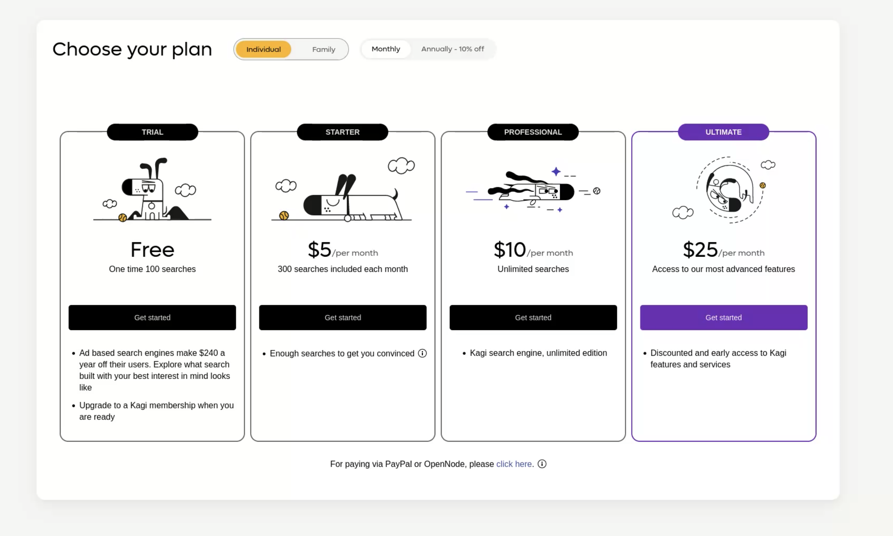

---
next:
  text: 'Premium Plans'
  link: '/kagi/plans/premium-plan'
---

# Plan Types

> **Important Notice:** Our pricing changed on September 21st, please refer to our [blog post for a longer discussion.](https://blog.kagi.com/unlimited-searches-for-10)

Kagi offers several individual subscriptions plans.

* The **Trial** plan is limited to 100 total searches. This plan is suited for those interested in exploring Kagi and curious about paid search engines.  
* The **Starter** plan offers 300 searches for USD $5 per month. This plan is suited for users who are new to paid search engines and are looking to own their search experience.
* The **Professional** plan offers unlimited searches for USD $10 per month. This plan is suited for internet professionals and developers who are prolific and advanced search users.
* The [**Ultimate**](./ultimate-plan.md) plan offers unlimited searches, exclusive and early access to Kagi features and services for USD $25 per month and offers the most power to the user.
  * Note: Starting September 21st, we’re giving Ultimate Plan users access to the closed beta of the [next generation of tools](../ai/assistant.md) that Kagi is bringing to the web.

We also offer [Family plans](./family-plan.md) for two or more people.

## How searches are counted

* [Bangs](../features/bangs.md) and search suggestions (while typing) are never counted as searches.
* Reloading the same search within a short time (~2 minutes) does not count as an additional search.
* Each [lens](../features/lenses.md) and content type (e.g. images, news) is considered a separate search.
* Loading more results counts as an additional search.

Note that searches do not roll over to the next month; the number of available searches resets each month. Months are counted starting from the date of subscription, and are not necessarily aligned with the months of the year.

## Legacy Subscribers and Early Adopters

For any existing subscribers and early adopters who are interested in how legacy accounts will be used and maintained please refer to the blog post [Unlimited Kagi searches for $10 per month](https://blog.kagi.com/unlimited-searches-for-10).

## Why Tiered Pricing

This tiered pricing system is easy to understand and ensures Kagi’s financial sustainability for the future so that we can continue to provide you with the tools to own your search experience as we pursue our mission to humanize the web.

## Pick The Right Plan

### Start Simple

We understand picking the right plan can be challenging and while we have expertise in this area and are prepared to help we suggest starting with the simple Starter plan. It is very unlikely you will exceed the allotted searches for this plan unless you are in the top 1% of searching users. To be in the top 1% you would likely need to depend on search on a daily basis for your livelihood. As a reminder the Starter plan is USD $5/month with 300 searches included.

### Upgrade to Unlimited Searches

If you find that you are consistently running out of searches at the end of each month because you have the Starter plan and need more than 300 searches it is time to consider the Professional plan. This plan is priced at USD $10/month and you get unlimited searches!

### Consider the Ultimate Plan for Advanced Features

If you are interested in taking advantage of all the advanced features that Kagi is building then it is time to upgrade to the Ultimate plan. This gives you access to exclusive and early access to Kagi features and services.
  * Note: Starting September 21st, we’re giving Ultimate Plan users access to the closed beta of the [next generation of tools](../ai/assistant.md) that Kagi is bringing to the web.

### Understand Your Consumption

Kagi has a feature to check your [current search usage](https://kagi.com/settings?p=consumption) if you are interested in really taking apart your consumption.
