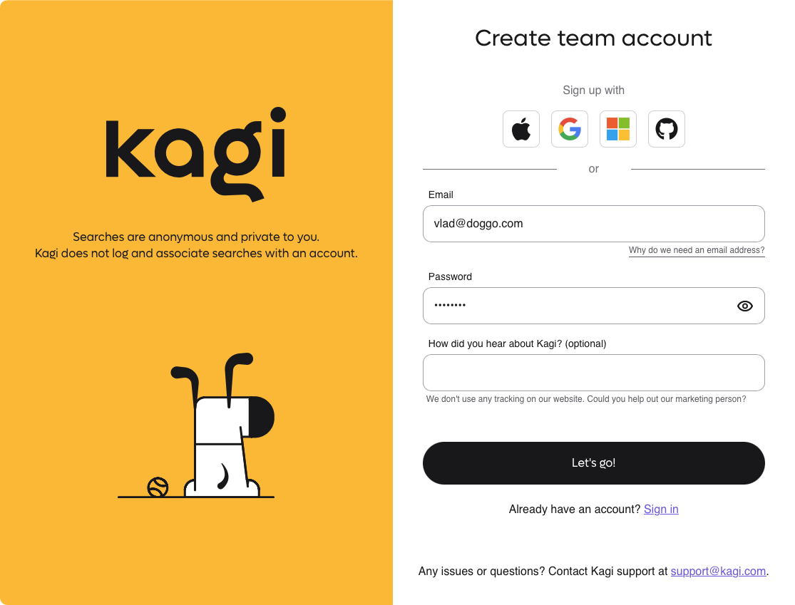
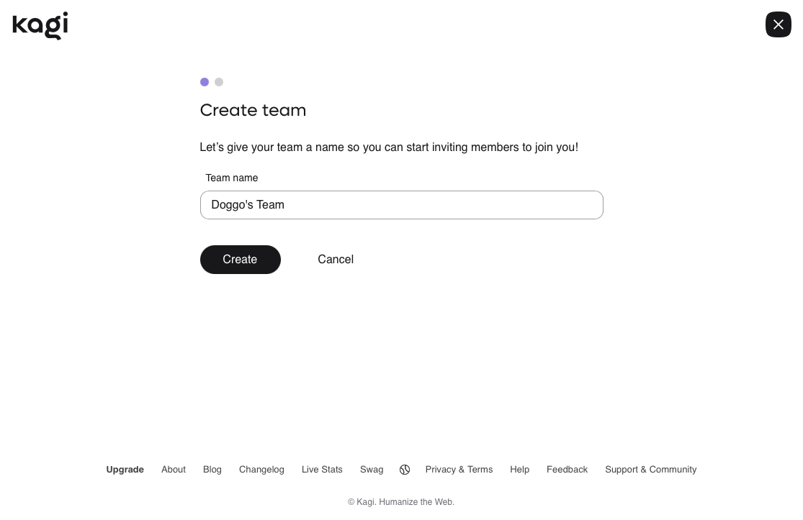
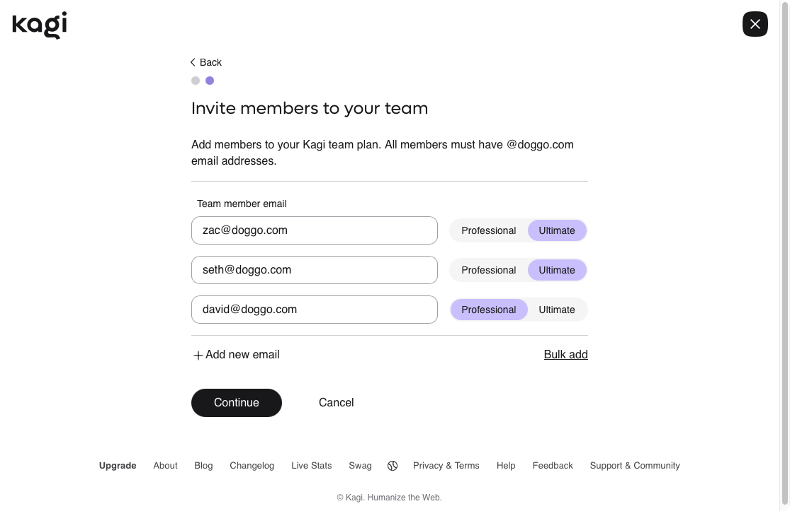
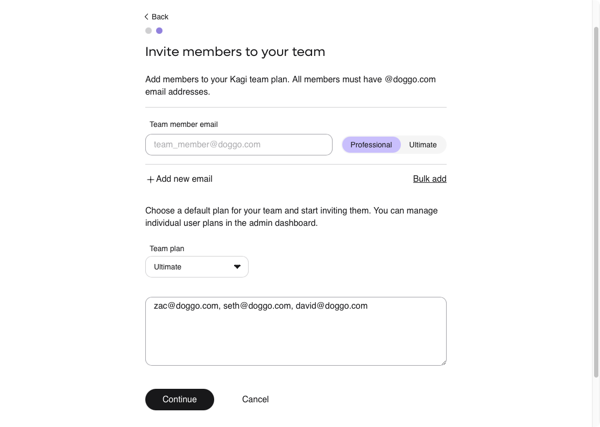
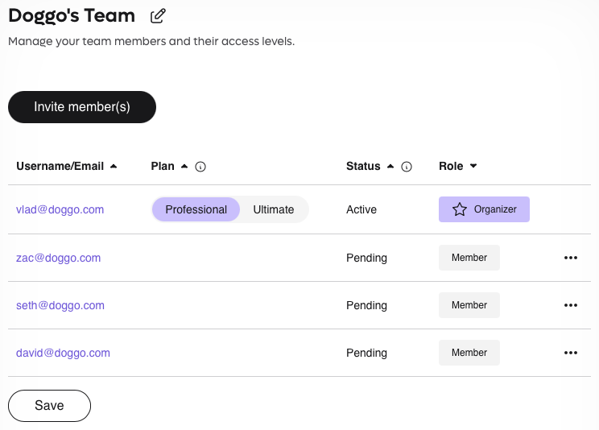
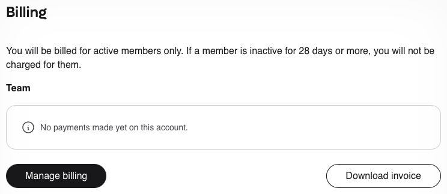
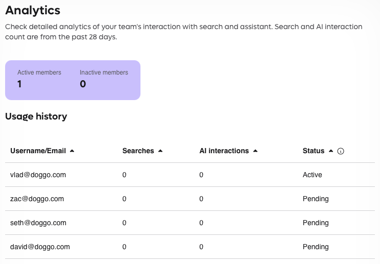
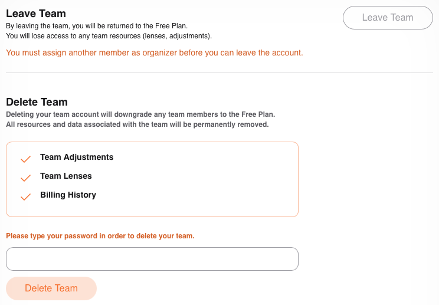
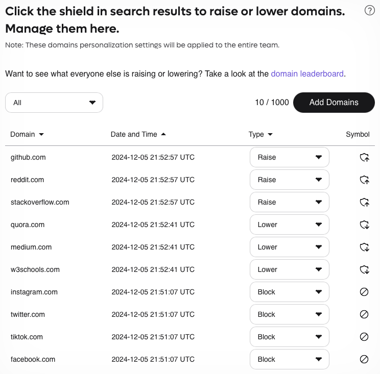
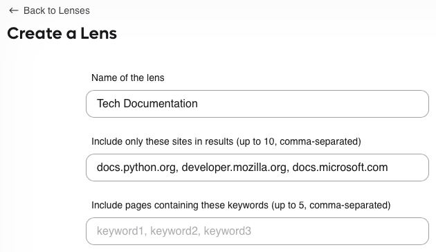

# Kagi Team plans

Our [Kagi Team plans](https://kagi.com/pricing?plan=team) empower organizations with premium, ad-free search capabilities while maintaining complete privacy and control.
Choose between Professional and Ultimate tiers for your team members, unlocking powerful tools like [The Assistant](../ai/assistant.md) for LLM-powered research,
[Summarizer](../ai/summarize-page.md) for quick content analysis, and shared search customizations—all managed through a centralized billing and administration portal.

**Key benefits**:
- Flexible per-member plan assignment
- Pay only for active users
- Centralized billing and management
- Shared search customizations ([Personalized Results](../features/website-info-personalized-results.md#personalized-results) and [Lenses](../features/lenses.md))
- Kagi’s unique [privacy](../privacy/privacy-protection.md) and security
- Access to [The Assistant](../ai/assistant.md), which brings premium LLM models in an easy-to-use interface (Ultimate tier).

## Getting started

### Step 1: Sign up

{data-zoomable}

1. Visit the [Team plan pricing](https://kagi.com/pricing?plan=team) page and click **Get Started**
2. Enter your business email address (free email providers are not supported)
3. Create your password

### Step 2: Create team

{data-zoomable}

1. Enter your team name
2. Click **Create** to continue

### Step 3: Invite team members

You can add members individually or in bulk:

**Individual invites**:

{data-zoomable}

1. Enter the team member's email (must match your domain)
2. Select Professional or Ultimate plan
3. Click **Add new email** for additional members

**Bulk invites**:

{data-zoomable}

1. Click **Bulk Add**
2. Select the plan type from the dropdown
3. Enter emails (comma-separated or in different lines)
4. Click **Continue**

### Step 4: Payment setup
Complete payment setup through our secure Stripe integration. You'll be charged for:
- The Admin account
- Any invited members

Our Team plans are paid monthly in advance.

## Team management

### Roles and permissions

**Admin**:
- Full billing access
- Can manage all roles
- Can delete the team

**Manager**:
- Can manage other managers and members
- No billing access

**Member**:
- Access to assigned features

### Member status
- **Active**: Currently using Kagi
- **Pending**: Invite not yet accepted
- **Inactive**: No usage in previous billing cycle

### Managing members

{data-zoomable}

From the Members tab, Admins and Managers can:
- View member status
- Change member roles
- Remove members
- Adjust plan types (Professional/Ultimate)

### Billing management

{data-zoomable}

Admins can:
- Manage payment methods
- Download invoices

### Analytics dashboard

{data-zoomable}

The Analytics page provides valuable insights into your team's Kagi usage:

**Usage overview**:
- Real-time count of active and inactive members
- 28-day usage metrics for each team member
- Search and AI interaction statistics

**Features**:
- Sortable data columns
- Member status tracking (Active/Pending/Inactive)
- Individual usage breakdown
- Performance trends

### Account settings

{data-zoomable}

The Account page provides the following options:

**For team members**:
- View current role and permissions
- Leave team option
- Access team-wide resources

**For organizers**:
- Team deletion capability
- Organization settings management
- Domain management

**Important**: Deleting a team will:
- Return all members to Trial status
- Remove all shared resources (Lenses and Personalized Results)
- Cancel team-wide customizations

## Team collaboration

### Personalized results

{data-zoomable}

Domain preferences set through the [Personalized Results](../features/website-info-personalized-results.md#personalized-results) feature are automatically shared team-wide:
- Blocked domains
- Lowered domains
- Raised domains
- Pinned domains

### Team lenses

{data-zoomable}

Team members can share custom search configurations by using our [Lenses](../features/lenses.md) feature:
1. Create a [new Lens](https://kagi.com/settings/?p=create_lens)
2. Click on **Advanced Options**
3. Check **Share with Team**
4. **Save** to make available to all members

## Billing details

### Payment structure
- Monthly billing with centralized payment management
- Single consolidated invoice for all team members
- Secure payment processing through Stripe

### Pricing
- Professional tier: $10/month per member. Includes unlimited searches, and access to [FastGPT](../ai/fastgpt.md), [Summarizer](../ai/summarize-page.md) and [Kagi Translate](../ai/translate.md)
- Ultimate tier: $25/month per member. Includes everything in Professional plus access to [The Assistant](../ai/assistant.md).
- Flexible assignment: Mix and match tiers for different team members

### Active member billing
We optimize your costs by only charging for active usage:
- Active members are billed monthly in advance
- Team admin is automatically considered active upon team creation
- New team members become active only when they first use Kagi
- Members become inactive after one full billing cycle without usage
- Inactive members can resume usage at any time with no additional setup

### Mid-month changes
- Plan changes are calculated immediately
- Adjustments (credits or charges) appear on your next monthly invoice
- Pro-rated charges apply for mid-month plan changes

### Initial setup
Your first invoice includes:
- Team admin subscription
- Pre-payment for invited members

After the first month, you'll only be charged for:
- Team admin
- Members who actively use Kagi services

## FAQ

**Q: Can I mix Professional and Ultimate plans?**  
A: Yes, each team member can be assigned either plan type.

**Q: When do inactive members get billed?**  
A: Inactive members aren't billed after the second month. Billing resumes upon next usage.

**Q: What happens to existing individual accounts?**  
A: When joining a team, individual subscriptions are cancelled and merged into the team plan.

Need additional help? Contact our support team at support@kagi.com.
