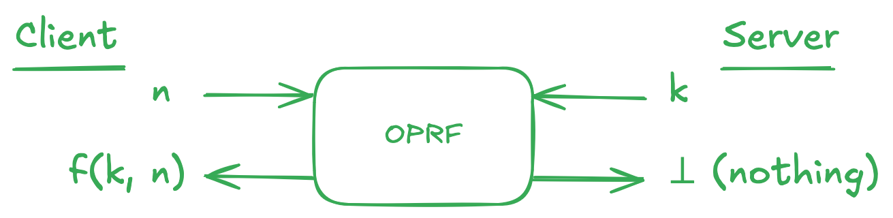
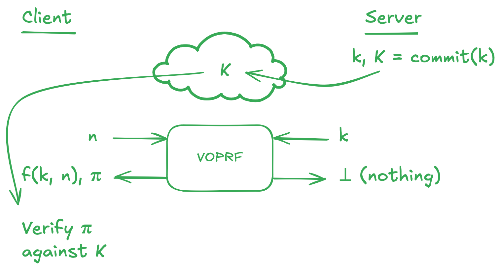

# How does Privacy Pass work?

The Privacy Pass protocol promises an authentication mechanism that allows users to prove their right to access without identifying themselves to the server. How is this achieved, specifically? As we've described in our original [blog post](https://blog.kagi.com/kagi-privacy-pass), Privacy Pass consists of two protocols: **token generation** and **token redemption**. At the core of these, lies a cryptographic primitive called an **oblivious pseudorandom function** (OPRF). Let's see how this all works!

## Pseudorandom functions

Imagine you wanted to sample 256 bits (values 0 or 1) at random, how would you go about it? One traditional approach would be that of flipping 256 times a fair coin, and recording every head or tail, writing down 0 when the coin lands on head and 1 when it lands on tails. This process can be turned into a mathematical *function* $f$, a map that takes an input value $n$ and assigns a corresponding output $f(n)$. For example, you could define a function mapping positive integer numbers $n = 1, 2, 3...$ into random values by sampling random strings of 256 bits for every integer for which you ever need to know the value of $f(n)$, and storing them into a table:

| $n$ | $f(n)$ |
| --- | --- |
| 1   | 001011111101110010101110100000... |
| 2   | 100110011110111010101110111110... |
| 3   | 011101011110100010110010010111... |
| ... | ... |

While this process works in theory, it has a big drawback in practice: it costs a lot of storage to save the table! Furthermore, this process being truly random means that the function can only be replicated by storing a copy of the table somewhere. After all, the likelihood of generating the same table twice at random is astronomically low.

Due to these reasons, cryptographers defined the notion of a **pseudorandom function** (PRF). These are functions that are hard to distinguish from random. Mathematically, pseudorandom functions take two inputs, one being a *secret key* $k$, and the other being the input for which we want a random output assigned: $n$, in the example above. The promise of a pseudorandom function is that given a short and random secret key $k$, the function $f(k, n)$ is computationally indistinguishable from random. For example, this means that even seeing $f(k, 1), f(k, 2), \dots, f(k, 1000)$ gives you no meaningful chance of learning what the value of $f(k, 1001)$ will be other than blindly guessing, unless you explicitly know $k$ and can compute $f(k, 1001)$.

Pseudorandom functions resolve the drawbacks of random functions. Indeed, you can now "store" a copy of the table by keeping a copy of the short secret key $k$. This also makes backing up or sharing this table as simple as backing up or sharing $k$.

## Authenticating using a pseudorandom function

Armed with a pseudorandom function, we can now build an authentication system based on tokens. In such a system, the service provider first chooses a secret key $k$ for a PRF. During **token generation**, the user approaches the provider, pays for the service, and provides 1000 random integers $n_{1}, \dots, n_{1000}$ of their choice, from a large enough set. The service provider would then return to the user the values $y_1 = f(k, n_1), \dots, y_{1000} = f(k, n_{1000})$. These values are then used to define 1000 tokens of the form $t_i = (n_i, y_i)$ for $i = 1, 2, \dots, 1000$.

Whenever a user wants to access the service, they engage in **token redemption**. They first produce a token $t_i = (n_i, y_i)$ to the server. The server checks whether $y_i = f(k, n_i)$ or not. If the values match, the server can be pretty sure that the user is legitimate: since guessing a correct input-output of the PRF is extremely unlikely, this must mean that such value was computed by the server, who knows $k$, during token generation with a paying user.

This already potentially allows for an anonymous authentication system, since the user only needs to identify themselves personally (say, by paying with a credit card) during token generation, and not during token redemption. *However, there is a catch:* the user must trust the server not to secretly keep track of who received what tokens! This is not a strong enough guarantee when looked using the lens of cryptography. Something more is needed: obliviousness.

## Oblivious PRFs

An **oblivious PRF** (OPRF), is a cryptographic protocol belonging to the family of [secure two-party computation](https://en.wikipedia.org/wiki/Secure_two-party_computation) protocols. These are protocols that allow two parties to compute functions over secret inputs and only learn the function's output. Since this sounds a little vague, let's look at OPRFs in particular.

Consider the PRF-based authentication scheme described above. During an OPRF execution, the client is trying to protect the secrecy of the values $n_i$ which will become part of an authentication token, while the server is trying to protect the secrecy of the PRF key $k$. By the end of the exchange, the client should learn the value of $f(k, n_i)$, while the server should learn nothing.

{width=700px data-zoomable}

With an OPRF in place, the client can rest assured that during the token generation phase, the server cannot track what tokens were given to what user. Unfortunately, there is still one way the server could cheat, and this is by using a different key $k$ for every user. Luckily, there is also a solution to this problem: we can ask the server to publish a _public key_, that is a public commitment $K$ to the secret key $k$, and force them to provide a [zero-knowledge proof](https://en.wikipedia.org/wiki/Zero-knowledge_proof) $\pi$ that during token generation they used the value of $k$ corresponding to the public commitment $K$. A protocol allowing this is called a **verifiable OPRF** (VOPRF). 

{width=700px data-zoomable}

With VOPRFs, we can finally safely generate authentication tokens, making sure that the server can't keep track of users by either directly taking note of the tokens given out, or indirectly using different PRF keys with different users. This means that at the point of token redemption, the server will only be able to tell that the token presented by the user is valid, and won't be able to link them to a specific generation phase.

## Privacy Pass

Privacy Pass supports two kinds of authentication tokens, which differ in who can verify their validity: privately verifiable tokens based on VOPRFs, and publicly verifiableca tokens based on blind RSA signatures. Since Kagi is the only party generating and verifying the validity of tokens, we adopted privately verifiable tokens (PrVT). These also benefit from a "batching" technique that allows for cheaper and faster server-side computation during token generation.

The functioning of PrVTs is described in [Section 5 of RFC 9578](https://www.rfc-editor.org/rfc/rfc9578.html#name-issuance-protocol-for-priva). In essence, authentication via PrVT corresponds to the protocol described above. **Token generation** corresponds to performing a VOPRF evaluation, using the VOPRF described in [RFC 9497](https://www.rfc-editor.org/info/rfc9497). This is a variant of the "2HashDH-NIZK" VOPRF, introduced in [Section 3 of JKK14](https://link.springer.com/chapter/10.1007/978-3-662-45608-8_13). Mathematically, it is a verifiable oblivious evaluation of the PRF given by $f(k, n) = H_2(n, H_1(n)^k)$. Here, $H_1$ and $H_2$ are cryptographic hash functions, and the output of $H_1$ lives in an elliptic curve.

## Verifiability of Kagi's Deployment

As part of our deployment of Privacy Pass, we have open-sourced our implementation of Privacy Pass on Chrome and Firefox. The core library can be found at https://github.com/kagisearch/privacypass-lib, and the code of the browser extensions is available at https://github.com/kagisearch/privacypass-extension.

Kagi publishes the VOPRF public key at `https://kagi.com/pp/wwwa`. To see its value, you can run the following cURL command:

```bash
curl -H "X-Kagi-PrivacyPass-Client: true" -i https://kagi.com/pp/wwwa
```

You will find Kagi's public key in the `WWW-Authenticate` response header, under the `token-key` value. We rotate this key monthly, as a way of automatically deprecating tokens that were generated too long ago. 

Inside `WWW-Authenticate` you will also find a `challenge` value. This encodes information about who is issuing the token (Kagi), and what service it is for (Kagi). While this seems tautological, Privacy Pass was designed to be compatible with cross-provider deployments, where there exists many independent token issuers, client attesters (who verify whether someone is a legitimate user), and service providers (or "origins") accepting such tokens. 

This brings us to the subtle issue of Kagi's _deployment model_. The fact that Kagi plays all three roles in the Privacy Pass [architecture](https://www.rfc-editor.org/rfc/rfc9576) (Issuer, Attester, Origin) could raise questions. After all, RFC 9576 [does warn](https://www.rfc-editor.org/rfc/rfc9576#name-shared-origin-attester-issu) that when all three roles are played by the same party, "attestation mechanisms that can uniquely identify a Client, e.g., requiring that Clients authenticate with some type of application-layer account, are not appropriate, as they could lead to unlinkability violations."

What's going on here? Are we being disingenuous in our efforts? No, of course not. RFCs are typically written using very cautious wording. Unfortunately, in this case, this is quite vague, since the potential unlinkability violations are application-dependent. Let's think about how Kagi operates. In order to generate Privacy Pass tokens, Kagi requires you to have an unlimited-search account. Furthermore, we only provide a limited number of Privacy Pass tokens per month to users. To achieve this, we keep a counter of how many times each user has engaged in token generation. These two data points mean that whenever we see a valid Privacy Pass token being redeemed by a user, we implicitly know that the user has access to an unlimited-search account and that, at some point during the last two months, they have engaged in token generation. Since not all of our users satisfy those requirements, to some extent presenting a valid token does say something about you. The good news is that the more users using Privacy Pass, the harder it would be for Kagi to guess what user is performing a search.

Could this work differently? One could imagine a scenario where Kagi partnered with a non-colluding third-party token issuer-attester. This issuer could keep track of token redemptions per user, as Kagi currently does. Then, during token redemption, Kagi could tell that the token comes from a user validated by the issuer, but would not know how many users generated tokens in the last months, increasing the uncertainty over who is performing the search.

There are likely a few ways to increase the level of anonymity that Privacy Pass provides to Kagi users, with various degrees of difficulty in implementation. At Kagi, we take privacy seriously. We are constantly improving and exploring additional ways to make Kagi even more private, and are always open for feedback through this. This commitment is reflected in our [privacy policy](https://kagi.com/privacy) and in our effort to adopt Privacy Pass early on. Privacy-enhancing technology can appear arcane to the layperson. We hope that this in-depth tour of OPRFs and Privacy Pass can help to make this cutting-edge technology a little less obscure.
