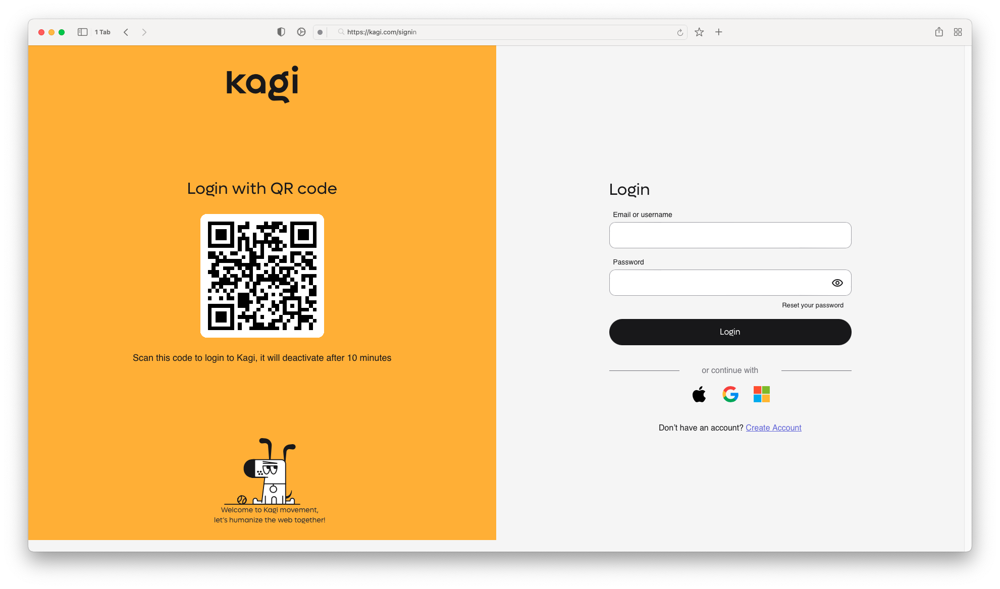

# Log in with QR code

{data-zoomable}

Logging in to Kagi on a new device is now easier than ever. When you visit the Kagi homepage on a new device, you will have the option to scan a QR code with your phone. This will log you in automatically without having to enter your credentials again.

This feature is especially useful when using devices without a keyboard such as:
- Gaming consoles
- Smart TVs
- Streaming players

It's also handy when using temporary or shared devices such as:
- Public computers while traveling
- Work or school computers
- Devices when visiting family or friends

Just remember to log out after using temporary or shared devices to ensure your account stays secure.

Scanning the QR code to log in also helps protect you from keyloggers, since you won't need to type in your username and password.
