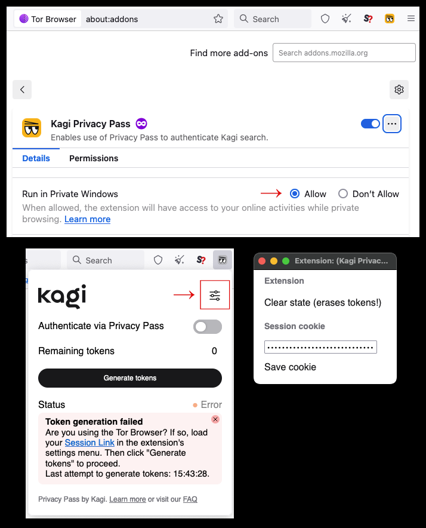
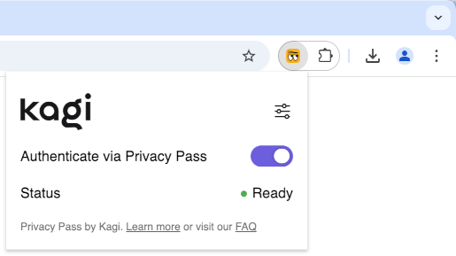
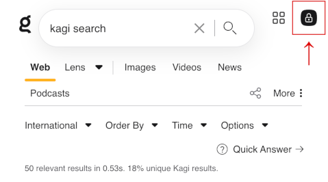

# Kagi Privacy Pass

## What is Kagi Privacy Pass?

**Privacy Pass** is a powerful privacy feature that allows you to use Kagi Search without revealing your identity. When enabled, it lets you perform searches anonymously while still verifying that you're a valid Kagi subscriber. Think of it as a digital token system - similar to getting tokens at an arcade, where once you have them, you can use the services without showing your ID each time.

## How does it work?

When you enable Privacy Pass, instead of logging in with your Kagi account for each search, you use special cryptographic tokens. These tokens prove you have the right to use Kagi's services without revealing who you are. This means your searches can't be linked back to your account or to each other, providing an additional layer of privacy. Learn more about the technical details in the [blog post](https://blog.kagi.com/kagi-privacy-pass).

## Getting started

To start using Privacy Pass, you'll need an active Kagi membership (Professional, Ultimate, Family, or Team plan). This feature is currently not available for Starter plan subscribers.

To generate Privacy Pass tokens, you will need to follow the instructions below in a non-private/non-incognito window, or refer to the instructions for the Tor Browser.

Select your browser for set up instructions:

Orion browser

**macOS**

To use Privacy Pass in [Orion for Mac](https://kagi.com/orion/#download_sec), ensure you have version 0.99.131 or later. Then follow these steps:

1. First, make sure you're logged into your Kagi account, this is needed to generate Privacy Pass tokens.
2. From your menu bar, go to **Orion** > **Settings** > **Search**.
3. Make sure Kagi is selected as your search engine.
4. Enable the **Show Kagi Privacy Pass on Toolbar** checkbox.
5. Click the Kagi Privacy Pass extension icon in the toolbar.
6. Make sure the **Authenticate via Privacy Pass** toggle is enabled.

<video src="./media/kagi_privacy_pass_orion_mac.mp4" width="720" type="video/mp4" autoplay muted loop playsinline disablepictureinpicture />

**iOS/iPadOS**

To use Privacy Pass in [Orion for iOS](https://apps.apple.com/us/app/orion-browser-by-kagi/id1484498200), ensure you have version 1.3.17 or later. Then follow these steps:

1. First, make sure you're logged into your Kagi account, this is needed to generate Privacy Pass tokens.
2. Tap the three dots at the bottom right corner and select **Settings**.
3. Tap on **Search**.
4. Enable the **Show Kagi Privacy Pass in Main Menu** toggle.
5. Tap **Done**.
2. Tap the three dots at the bottom right corner and select **Kagi Privacy Pass**.
3. Make sure **Authenticate via Privacy Pass** is enabled.

<video src="./media/kagi_privacy_pass_orion_ios.mp4" width="450" type="video/mp4" autoplay muted loop playsinline disablepictureinpicture />

Google Chrome / Microsoft Edge / Brave / Vivaldi / Opera

1. First, make sure you're logged into your Kagi account, this is needed to generate Privacy Pass tokens.
2. Install the [Kagi Privacy Pass extension](https://chromewebstore.google.com/detail/kagi-privacy-pass/mendokngpagmkejfpmeellpppjgbpdaj?hl=en-US)
3. For easy access, pin the extension to your browser’s toolbar.

<video src="./media/kagi_privacy_pass_chrome.mp4" width="720" type="video/mp4" autoplay muted loop playsinline disablepictureinpicture />

Firefox

1. First, make sure you're logged into your Kagi account, this is needed to generate Privacy Pass tokens.
2. Install the [Privacy Pass extension](https://addons.mozilla.org/en-US/firefox/addon/kagi-privacy-pass/)
3. For easy access, pin the extension to your browser’s toolbar.

<video src="./media/kagi_privacy_pass_firefox.mp4" width="720" type="video/mp4" autoplay muted loop playsinline disablepictureinpicture />

Tor Browser and "incognito-mode-only" users

1. First, obtain a Kagi Session Link following these [instructions](https://help.kagi.com/kagi/privacy/private-browser-sessions.html).
2. Install the [Privacy Pass extension](https://addons.mozilla.org/en-US/firefox/addon/kagi-privacy-pass/), making sure to allow the extension to run in private windows/incognito mode.
3. For easy access, pin the extension to your browser’s toolbar.
4. Open the extension popup, and click the settings icon.
5. Paste your Session Link into the "Session cookie" field, then click on "Save cookie".
6. Back to the extension popup, click "Generate tokens".

{width=700px data-zoomable}

Kagi Android App

To use Privacy Pass in the [Kagi app for Android](https://play.google.com/store/apps/details?id=com.kagi.search&hl=en), ensure you have version 0.29 or later. Then follow these steps:

1. First, make sure you're logged into your Kagi account, this is needed to generate Privacy Pass tokens.
2. From your homescreen, tap and hold the Kagi app icon.
3. Select Privacy Pass.
4. To add the Privacy Pass shortcut to your home screen, press and hold the Privacy Pass option.

<video src="./media/kagi_privacy_pass_android_app.mp4" width="450" type="video/mp4" autoplay muted loop playsinline disablepictureinpicture />

Safari

Due to restrictions imposed by Apple, Privacy Pass is not supported in Safari at this time.

If you're looking for a native WebKit-based browsing experience with Privacy Pass support, try [Orion](https://kagi.com/orion/) - it includes Privacy Pass integration out of the box along with zero telemetry, ad-blocking, and many other privacy-focused features.

## Using Privacy Pass

After installation, Privacy Pass is automatically enabled. You can easily turn it on or off by clicking the extension icon in your browser's toolbar and toggling the **Authenticate via Privacy Pass** option.

{width=700px data-zoomable}

When enabled, you'll notice that certain settings and features such as custom bangs and lenses, as well as personalized results, aren't available - this is intentional to maintain your anonymity.
                
{width=700px data-zoomable}

The extension will automatically manage your tokens, generating new ones when needed. You can always switch back to normal authentication by turning off the "Authenticate via Privacy Pass" toggle in the extension popup.

## Important notes

- The extension will fetch 500 tokens at a time.

- There's a monthly limit of 2,000 tokens per account to prevent abuse. If you need more tokens in exceptional cases, please contact us at support@kagi.com.

- When using Privacy Pass, search personalizations will not be available, as they increase the likelihood of deanonymization.

- At launch, Privacy Pass will only be used to authenticate Kagi Search. Soon to follow (in the next few weeks), we plan to expand support for Kagi Privacy Pass to:
  - Kagi Assistant
  - Kagi Translate and Kagi Maps
  - Summarize page and Ask questions about page

- When manually setting Kagi as your default search engine, replace the default autosuggest URL with this privacy-enhanced alternative: `https://kagisuggest.com/api/autosuggest?q=%s`
   - Using this domain prevents browsers from automatically sending your Kagi login cookies with autosuggest requests, which the Privacy Pass extension cannot intercept.

## Troubleshooting

If you see a "Generate more tokens" button, it usually means the extension couldn't generate tokens automatically. This can happen if you were:
- Not logged into your Kagi account
- Offline when the extension tried to generate tokens
- Have reached your monthly token limit

Also check the [Kagi privacy pass FAQ](https://blog.kagi.com/kagi-privacy-pass#faq).

Simply ensure you're logged in and online, then click the "Generate more tokens" button to try again. If you continue experiencing issues, please reach out to our support team at support@kagi.com.
