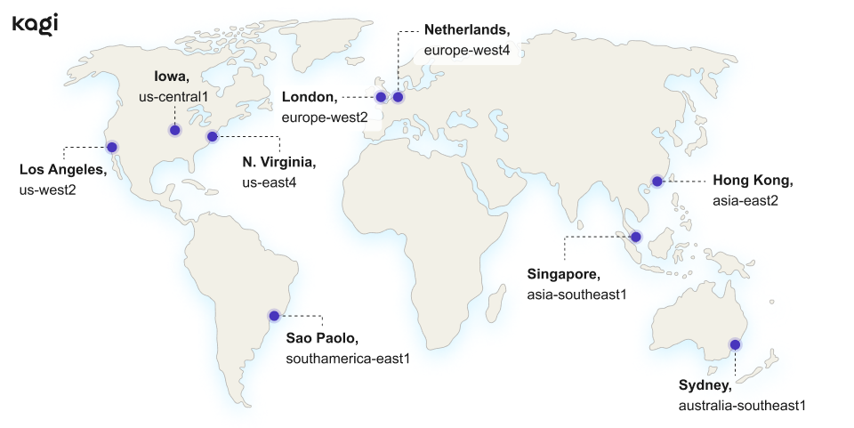

# Search Speed

We’re obsessed with increasing speed and lowering latency, and we currently use three approaches.

First, we optimized our technology stack to increase code execution speed and decrease connection latency.

Second, we reduced data transfer between Kagi and the browser, in some cases as much as 20x less compared to some of our competitors. Having no ads and no bulky JavaScript frameworks really helps.

Third, our infrastructure is global, so you’ll always connect automatically to the Kagi node closest to you.

| Product | SERP Size | CO2 | Load Time |
| --- | --- | --- | --- |
| Kagi | 0.76 MB | 0.43 g | 0.4 s |
| Ecosia | 1.55 MB | 0.89 g | 1.2 s |
| Bing | 1.94 MB | 1.11 g | 0.8 s |
| Google | 2.43 MB | 1.39 g | 2.4 s |
| DuckDuckGo | 2.48 MB | 1.42 g | 2.1 s |

*Data from [ecoping.earth](https://ecoping.earth). Read about the [methodology](https://sustainablewebdesign.org/calculating-digital-emissions/).*

**Benchmark update Jun 3 2024**

After loading on IDLE, most search engines continue to load additional content and send requests (Kagi does not).

We make fewer requests, we load less data, the page load is faster, and so on.

(the results aren't 100% accurate. Each time you reload the page, the numbers change slightly, but not by much)

## Data Center Locations

{data-zoomable}

Our data centers are strategically positioned across the globe in the following locations:
- North Virginia (US)
- Los Angeles (US)
- Iowa (US)
- London
- Netherlands
- Hong Kong
- Singapore
- São Paulo
- Sydney
