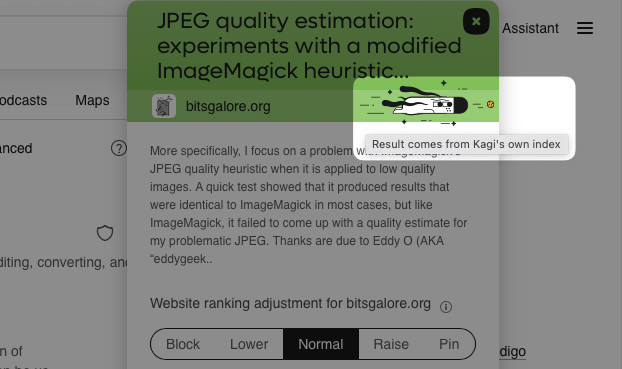

# Small Web in search results

One of the things that makes Kagi unique is our initiative to surface recent results from the [Small Web](https://blog.kagi.com/small-web) (a curated list of personal blogs and websites, as well as YouTube channels). Check the web interface for browsing [Kagi Small Web](https://kagi.com/smallweb).

## Small Web purpose
Small Web surfaces authentic content from independent creators who regularly share their expertise, experiences, and insights through their personal blogs and websites. By focusing on genuine, non-commercial content, it helps you discover thoughtful perspectives from individual voices across the internet, enhancing the diversity and quality of your search results.

## Identifying Small Web content in your search results
When clicking the shield icon next to any search result, Small Web content is distinguished by an image of Doggo appearing in the details window.

{width=622px data-zoomable}

## Surfacing content from the Small Web
We are commited to surfacing content from the Small Web in our search results, which makes Kagi uniquely different to any other search engine out there. It is not only part of our mission to humanize the web but we genuinly feel that this improves the quality of search results and discoverability of high quality, relevant content.

## Evergreen content
While our focus with Small Web is on the recent content, we also have an index for evergreen content. High-quality evergreen content continues to appear in relevant searches, weighted appropriately based on search context and user needs.

## Related Repository
Visit the [Kagi Small Web Repository](https://github.com/kagisearch/smallweb) on GitHub to explore and contribute to the lists of small web sites and YouTube channels that Kagi uses to surface unique, recent content. You can suggest new feeds, recommend changes, and help expand the small web community there.
