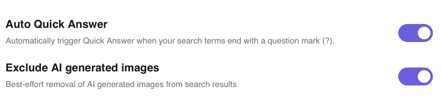

# AI Search Settings

These are settings that affect AI interactions in search.

- **Auto Quick Answer** — Automatically trigger [Quick Answer](../ai/quick-answer.md) when your search terms end with a question mark (?). 
- **Exclude AI-generated images** — Toggle the removal of AI-generated images from image search results.
