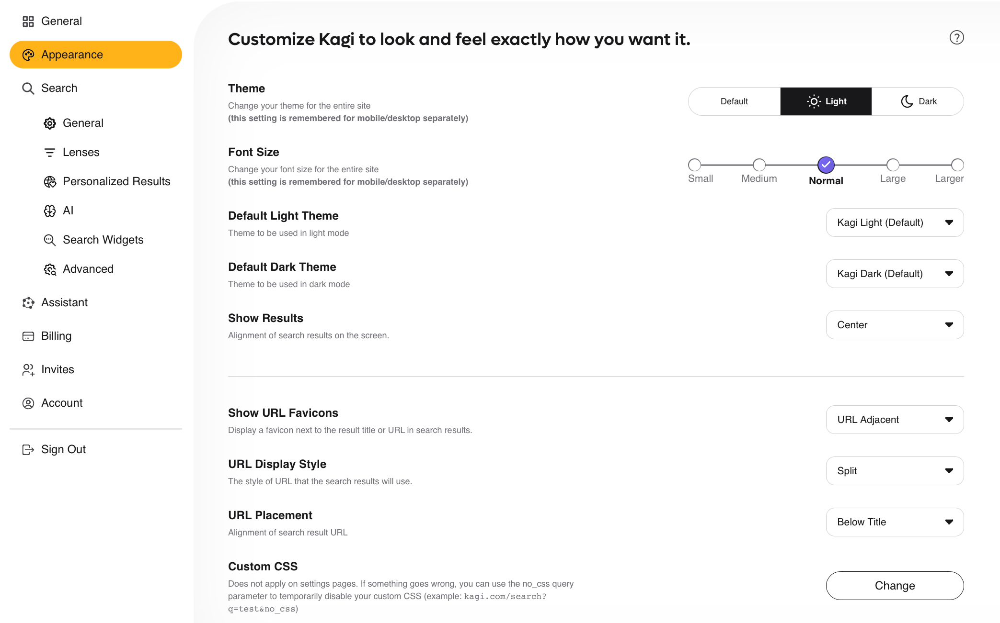
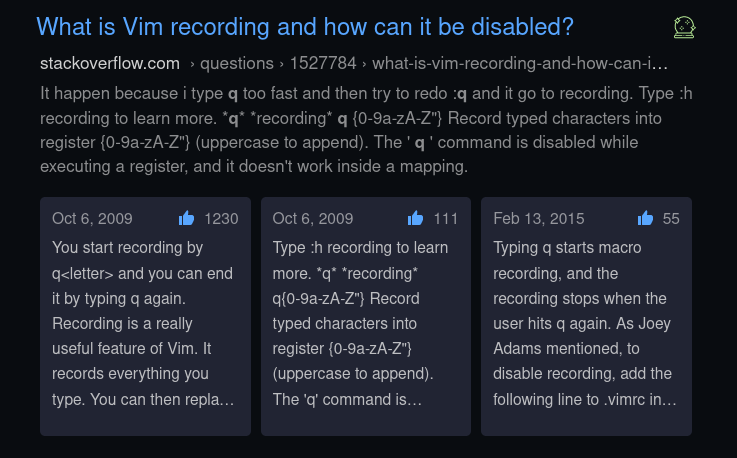

# Appearance Settings

These settings control various visual options.

## Overview

- **Theme** — Change your theme between System Default, Light, or Dark. This setting is stored for mobile and desktop separately.
- **Font Size** — Change your font size between Small, Medium, Normal, Large, or Larger. This setting is stored for mobile and desktop separately.
- **Default Light Theme** — Choose between Kagi Light (Default) and Old School Light for the Default Light Theme.
- **Default Dark Theme** — Choose between Kagi Dark (Default) and Old School Dark for the Default Light Theme.
- **Show Results** — Choose between showing results aligned to the left or center of your screen.
- **Show URL Favicons** — Choose whether to display a favicon next to the result title, the result title, or not at all.
- **URL Display Style** - Choose whether the URL is displayed in full or as split into smaller parts (e.g. help.kagi.com > kagi > index.html)
-  **URL Placement** - Choose whether the URL is placed below or above the result title.
- **Custom CSS** — Access settings to [customize the CSS](../features/custom-css.md) of Kagi search and landing pages.

## Customizing Display

In some cases you may want to apply custom CSS, a common example is removing the summary boxes at the top of search results.

This can be accomplished from within the [Custom CSS](https://kagi.com/settings?p=custom_css) editor.

In the editor add following contents:
<code>.searchResultAnswers {
  display: none;
}</code>

Once entered click "Apply Custom CSS" and refresh search results.
